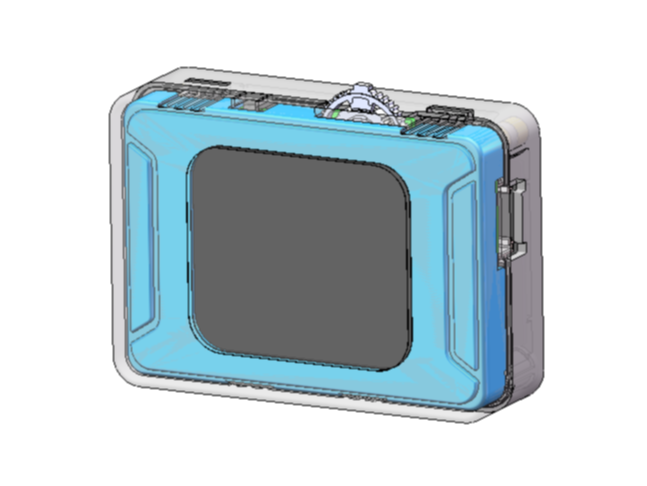
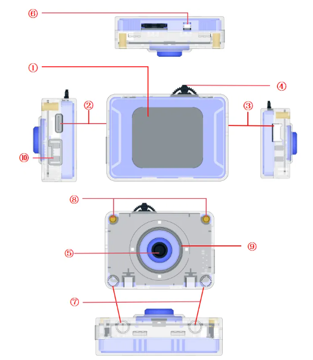

# Introduction
<!-- 这是一张图片，ocr 内容为： -->

The AI Vision Sensor features a built-in K210 and ESP32‑S3 dual-core processor, combining high-performance AI computing with wireless communication capabilities. It can stably achieve AI intelligent interaction and WiFi wireless image transmission, meeting the needs of complex scenarios such as visual recognition, real-time data feedback, and intelligent interaction. The module integrates Grove and LPF2 standard interfaces on both sides, offering strong hardware compatibility and direct connection to EV3, SPIKE, Arduino, micro:bit, and ICBricks 2.0, enabling rapid expansion and interaction. Users can intuitively switch working modes and communication protocols via the rotary switch on the top of the module, making operation simple and efficient, greatly reducing debugging and usage barriers. It is suitable for AI education, intelligent robotics, and IoT visual projects, among various application scenarios.

## Structure
<!-- 这是一张图片，ocr 内容为： -->

| **No.** | **Component** | **Description** |
| :---: | :---: | :---: |
| ① | LCD Display | Displays the UI interface and camera view |
| ② | USB-C Port | For power supply and firmware updates |
| ③ | Grove Port | Power supply and signal transmission |
| ④ | Dial Button | Left/right toggle and press operations for switching and activating functions |
| ⑤ | Camera | Captures images |
| ⑥ | Reset Button | Reboots the module |
| ⑦ | Building Block Ports | For connecting LEGO-compatible pins |
| ⑧ | M3 Mounting Holes | For assembly with M3 standard screws |
| ⑨ | Fill Light | Provides auxiliary lighting to adjust ambient brightness |
| ⑩ | LPF2 | Power supply and signal transmission |

## Specifications
| Item | Description   |
| :---: | :---: |
| Product Name | ICreateRobot AI Vision Sensor |
| Product Code   | B0210010 |
| Dimensions   | 56 × 40 × 21 mm |
| Weight   |  28 ± 1 g   |
| Control Chips |  Kendryte K210 + ESP32-S3   |
| Camera | 2-megapixel camera |
| Communication Interface | I²C / UART / SPIKE |
| I²C Rate   | 100 kbps |
| UART Baud Rate | 115200 |
| Operating Temperature | 0 – 50 ℃ |
| Power Supply |  5V / 1A   |

