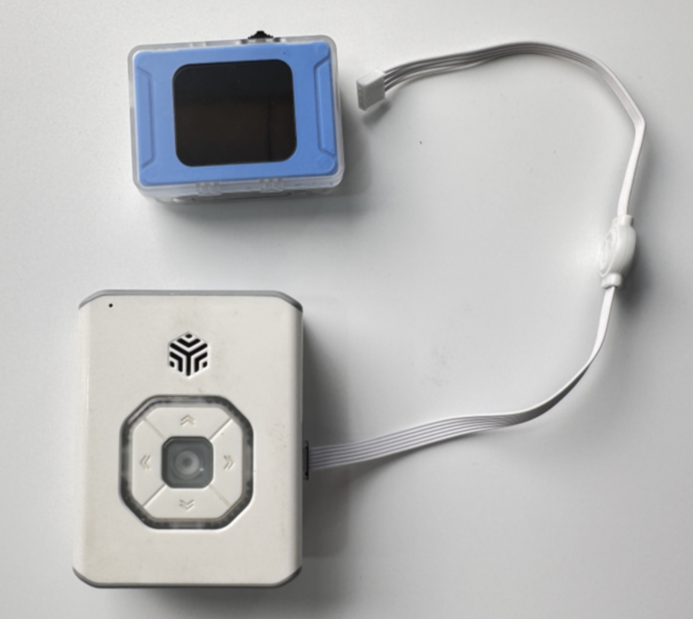
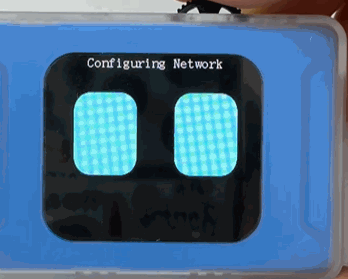
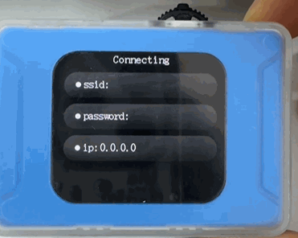

# Quick Start
## Power On
### Power Supply  
**Instructions:**

+ The vision sensor requires an external device for power supply.
+ The external device can be connected via USB or the Grove port, providing 5V–1A power to the sensor.

** Demonstration:**

| <!-- 这是一张图片，ocr 内容为： -->
 | <!-- 这是一张图片，ocr 内容为： -->
 |
| :---: | :---: |
| Computer USB power supply | ICBricks 2.0 main controller power supply |

###  Power-On State
**Instructions:**

+ Once powered by an external device, the vision sensor will automatically turn on.
+ During startup, the display will show the text “ICreateRobot AI Vision” and the fill light will turn green.
+ After a successful startup, the system will default to the mode selection interface. Rotate the wheel left or right to select the desired mode, and press the wheel to enter and use the selected mode.

<!-- 这是一张图片，ocr 内容为： -->

## Basic Operation
### AI Vision Mode  
After a successful startup, on the mode selection interface, rotate the wheel left or right to select the AI Vision Mode. Press the wheel to enter this mode. Rotate the wheel left or right to choose different AI functions (the name of each function will be displayed in the title bar at the bottom of the interface). For detailed usage, refer to the Visual Mode documentation.  

<!-- 这是一张图片，ocr 内容为： -->

### AI Chat Mode  
After a successful startup, on the mode selection interface, rotate the wheel left or right to select the AI Chat Mode. Press the wheel to enter this mode. In this mode, you can interact using voice commands. For detailed usage, refer to the Dialogue Mode documentation.  

<!-- 这是一张图片，ocr 内容为： -->

### WiFi Stream  
After a successful startup, on the mode selection interface, rotate the wheel left or right to select WiFi Stream. Press the wheel to enter this mode. In this mode, you can perform WiFi video transmission. For detailed usage, refer to the WiFi Video Transmission documentation.  

<!-- 这是一张图片，ocr 内容为： -->

### Settings  
After a successful startup, on the mode selection interface, rotate the wheel left or right to select Settings. Press the wheel to enter the Settings. The settings interface allows you to change language, port protocols, addresses, and more. For detailed usage, refer to the Settings documentation.  

<!-- 这是一张图片，ocr 内容为： -->

