# Quick Start - EV3
## Software Preparation  
LEGO Mindstorms Education EV3 is a professional robotics education kit designed for classroom teaching and team learning, launched by LEGO Education as the third-generation product in the LEGO MINDSTORMS series. During use, it is necessary to first add the required extensions for the vision module in the programming software. Only after creating the corresponding program for the vision module can it be used interactively. See below for detailed preparation steps.

### Getting the Software
 Access [LEGO Mindstorms Education EV3](https://education.lego.com/en-us/downloads/retiredproducts/mindstorms-ev3-lab/software/), obtain the version suitable for your computer system, and download and install it.  

<!-- 这是一张图片，ocr 内容为： -->
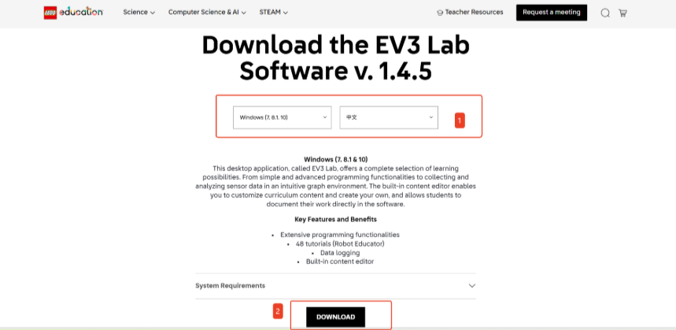

### Getting the Extension
For the LEGO Mindstorms Education EV3 programming platform, we've developed a dedicated K210 extension specifically designed for EV3. You can add this extension to your programming platform by [clicking here](https://github.com/ICreateRobot/AI-Vision-Sensor-) to get it.

### Adding the Extension
The following steps describe how to add the extension to the LEGO Mindstorms Education EV3 programming platform.

Step 1: Click the` "Import Module" `option from the toolbar.

<!-- 这是一张图片，ocr 内容为： -->
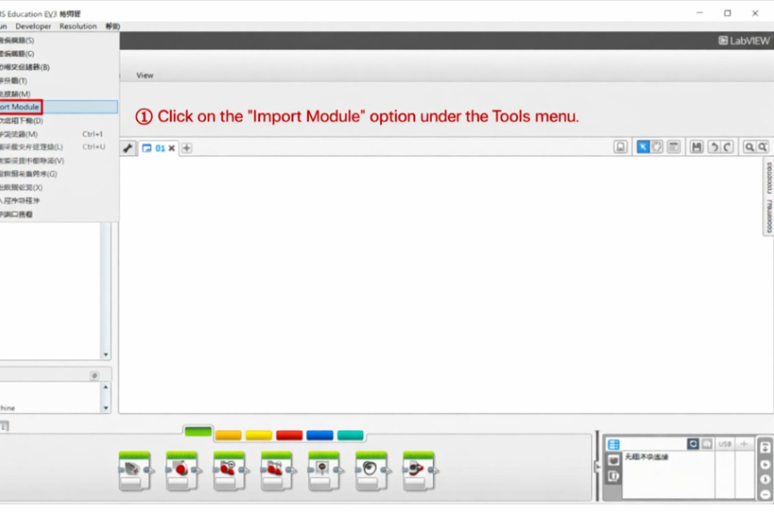

Step 2: Click` "Browse" `.

<!-- 这是一张图片，ocr 内容为： -->
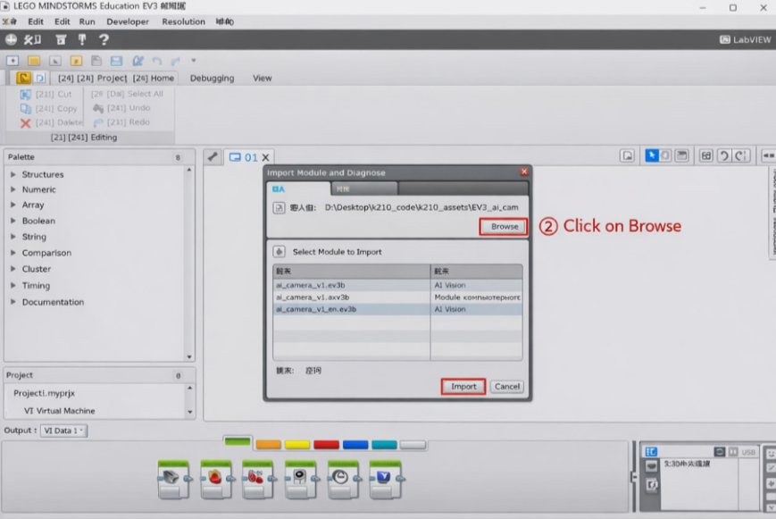

Step 3: Select the extension file and click `"Open" `.

<!-- 这是一张图片，ocr 内容为： -->
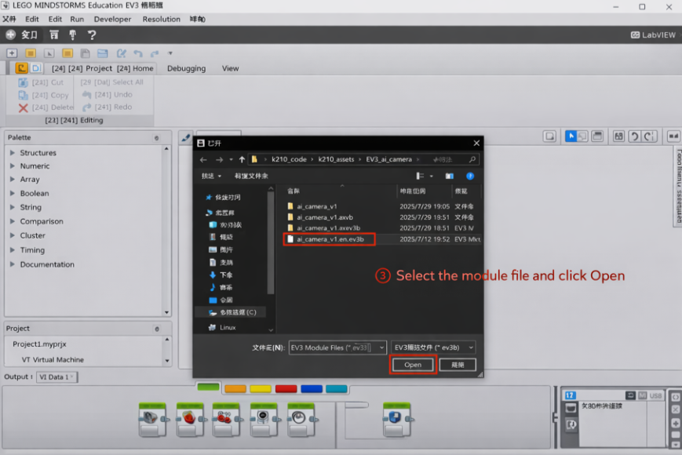

Step 4: Select the extension to be imported, then click` "Import"`.

<!-- 这是一张图片，ocr 内容为： -->
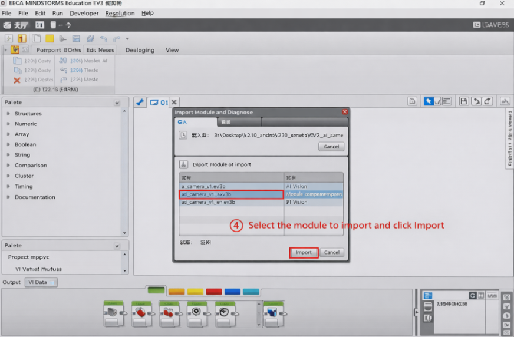

Step 5: A dialog box will pop up with the message: “To apply these changes, you must restart the EV3 editor.”

<!-- 这是一张图片，ocr 内容为： -->
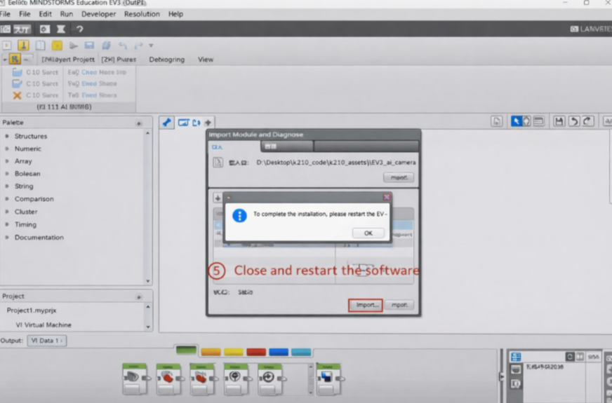

Click OK, then close and restart the EV3 software.

Step 6: A new “Al Vision” programming block has been added to the block palette at the bottom of the interface.

<!-- 这是一张图片，ocr 内容为： -->
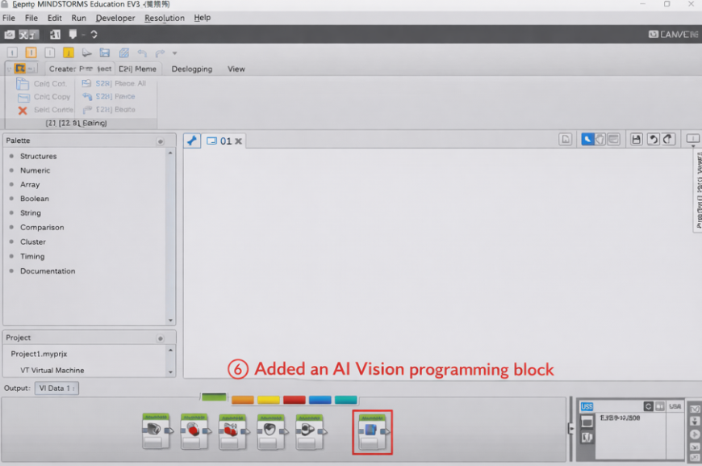

The overall process of adding the extension is as follows:

<!-- 这是一张图片，ocr 内容为： -->
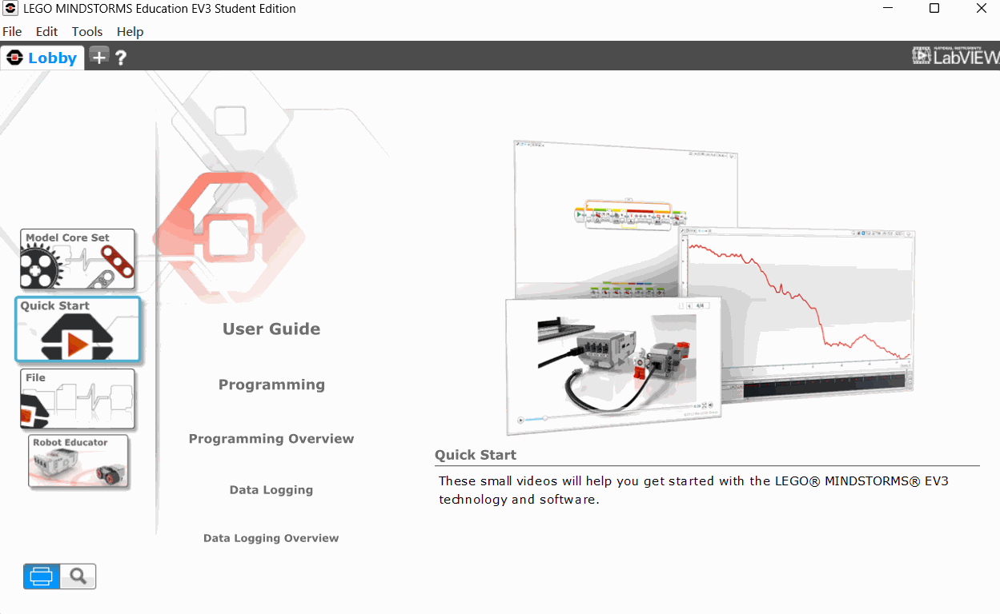

## Hardware Preparation  
### Device Contents  
 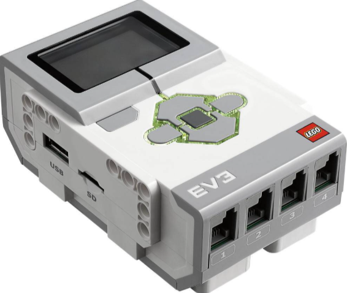 | 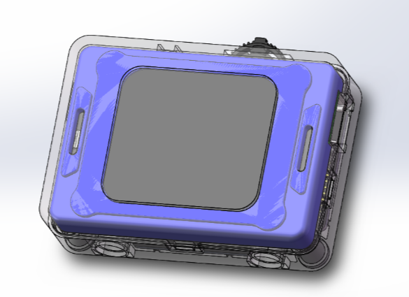 
 EV3 Controller | ICreateRobot AI Vision Sensor 
| 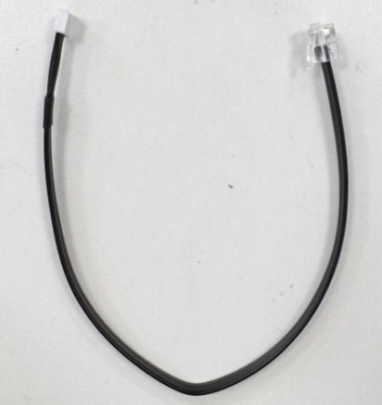 |  |
| EV3 Connection Cable |  |

### Device Operation  
The module communicates with the EV3 device via I²C, so the module must first be connected to a port on the bottom of the EV3. The module will power on automatically. After powering on, adjust the vision module’s port protocol to I²C. The specific operation steps are as follows:  

|  |  |
| 1. Power on the EV3 main controller and connect the module to the EV3. The module will power on automatically upon connection.(Any of the four ports at the bottom of the EV3 support I²C communication; you can choose the port freely.)   | 2. After the module powers on, rotate the dial to go to Settings and change the port protocol to I²C.(If the module displays I²C as the port protocol in the top-left corner of the screen after powering on, this step is not required.   If the module is using the SPIKE protocol upon startup, press and hold the dial to switch to I²C.)   |

## Usage Examples  
### Example 1: Vision Mode – Label Recognition   
**Example Content:**

Connect the vision module to port 1 of the EV3 main controller. After running the program, pressing the middle button on the EV3 will switch the vision module to Label Recognition mode. In this mode, if no label is detected, the EV3 main controller screen displays "None"; if a label is detected, the EV3 main controller displays the label ID.  

**Operation Steps:**

|  |  |
| 1. Power on the EV3 main controller and connect the module to the EV3. The module will power on automatically upon connection.(Any of the four ports at the bottom of the EV3 support I²C communication; you can choose the port freely.)   | 2. After the module powers on, rotate the dial to go to Settings and change the port protocol to I²C.(If the module displays I²C as the port protocol in the top-left corner of the screen after powering on, this step is not required.   If the module is using the SPIKE protocol upon startup, press and hold the dial to switch to I²C.)   |
|  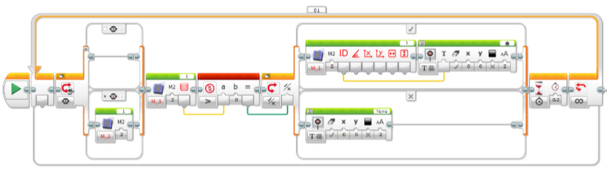 | 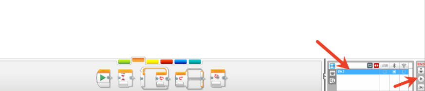 |
| 3. Open the programming software and create a program based on the example content. The programming content can refer to the diagram below.   | 4. Connect the main controller to the software via Bluetooth. After the connection, click Download and Run.   |
|  |  |
| 5.  Execution Details. |  |

### **Example 2: Conversation Mode – Retrieving Conversation Status  **
**Example Content:**

Output the AI conversation status to the screen, with the values:  
0: AI not started  1: Connecting  2: Standby  3: Listening  4: Speaking  
5: Configuring network  

**Operation Steps:**

|  |  |
| 1. Power on the EV3 main controller and connect the module to the EV3. The module will power on automatically upon connection.(Any of the four ports at the bottom of the EV3 support I²C communication; you can choose the port freely.)  | 2. After the module powers on, rotate the dial to go to Settings and change the port protocol to I²C.(If the module displays I²C as the port protocol in the top-left corner of the screen after powering on, this step is not required.   If the module is using the SPIKE protocol upon startup, press and hold the dial to switch to I²C.)   |
|  | 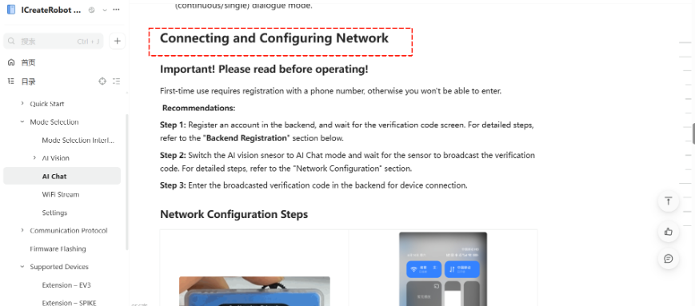 |
| 3. Switch the module to Conversation Mode   | 4. Perform network configuration on the module. For specific operation steps, refer to the [Conversation Mode ](https://ai-vision-advanced-docs.readthedocs.io/en/latest/docs/AIVisionAdvanced/03ModeSelection/03AIChat.html)documentation.   |
|  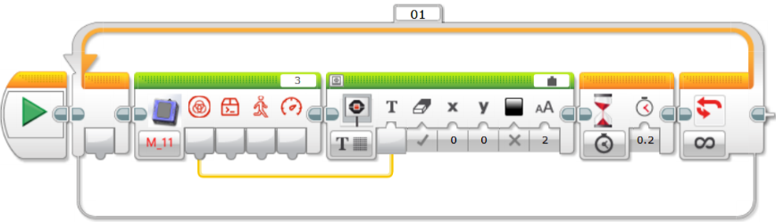 |  |
| 5. Open the programming software and create a program based on the example content. The programming content can refer to the diagram below.   | 6. Connect the main controller to the software via Bluetooth. After the connection, click Download and Run.   |
| 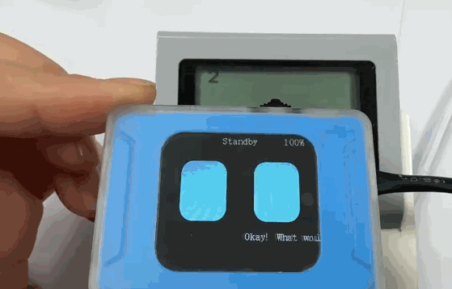 |  |
| 7. Execution Details. |  |

### Example 3: WiFi Image Transmission – Retrieving Webpage Button Values  
**Example Content:**

 Retrieve the value of the button pressed on the webpage and display it on the screen. A single byte is returned, with each button corresponding to a bit in the byte: 0012 3456; when a button is pressed, the corresponding bit is set to 1. 

**Operation Steps:**

|  |  |
| 1. Power on the EV3 main controller and connect the module to the EV3. The module will power on automatically upon connection.(Any of the four ports at the bottom of the EV3 support I²C communication; you can choose the port freely.)  | 2. After the module powers on, rotate the dial to go to Settings and change the port protocol to I²C.(If the module displays I²C as the port protocol in the top-left corner of the screen after powering on, this step is not required.   If the module is using the SPIKE protocol upon startup, press and hold the dial to switch to I²C.)   |
| 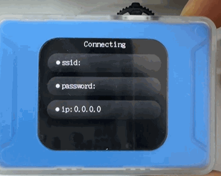 |  |
| 3. Switch the module to WiFi Image Transmission mode . | 4. Perform network configuration on the module. For specific operation steps, refer to the [WiFi Image Transmission ](https://ai-vision-advanced-docs.readthedocs.io/en/latest/docs/AIVisionAdvanced/03ModeSelection/04WiFiStream.html)documentation.   |
| 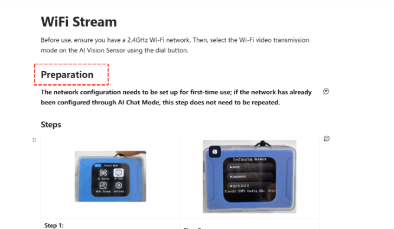 | 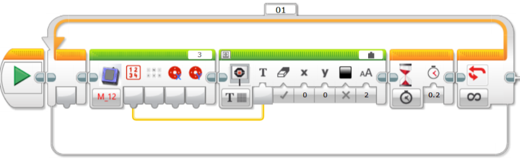 |
| 5. Open the programming software and create a program based on the example content. The programming content can refer to the diagram below.   | 6. Connect the main controller to the software via Bluetooth. After the connection, click Download and Run.   |
| 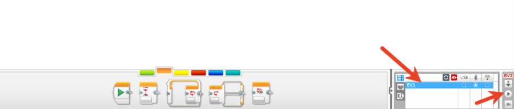 |  |
| 7. Within the same local network as the module, access the IP address displayed on the module using a PC or mobile browser to start image transmission. For detailed operation steps, refer to the [WiFi Image Transmission ](https://ai-vision-advanced-docs.readthedocs.io/en/latest/docs/AIVisionAdvanced/03ModeSelection/04WiFiStream.html)documentation.   | 8. Execution Details. Webpage button mapping for image transmission: 0012 3456; when a button is pressed, the corresponding bit is set to 1.   |

