# Quick Start – SPIKE
SPIKE Prime is developed based on the LEGO SPIKE Prime main control system. The set consists of the SPIKE Prime Hub, motors, sensors, actuators, and other LEGO Technic components. This document focuses on the use of the hub in combination with the vision module.  
Since SPIKE Prime does not allow adding custom modules, the vision module simulates the SPIKE color sensor in order to be used with SPIKE Prime.  

## Software Preparation
|  |  |
| --- | --- |
| 1. Go to the [LEGO SPIKE](https://spike.legoeducation.com/) webpage.  At the bottom right, click SPIKE Prime Essential/Prime Set. | 2. Click New Project. |
| 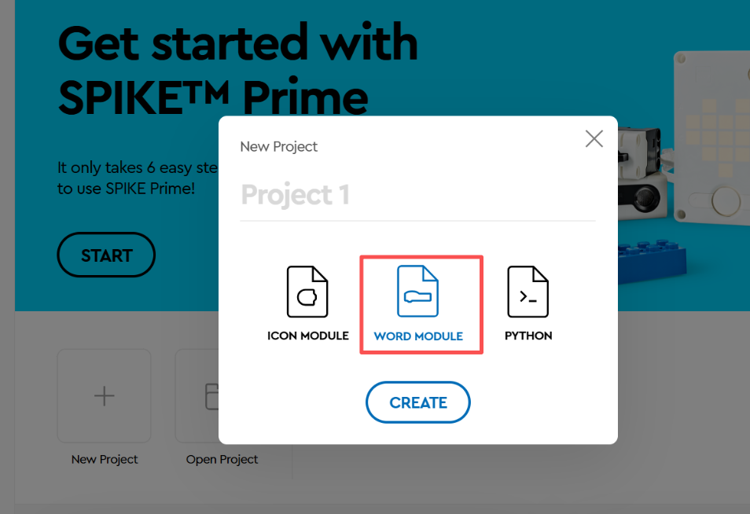 |  |
| 3. Select a programming method you are familiar with.  (The following introduces WORD MODULE programming.) | 4. Enter the block WORD MODULE interface. |
| 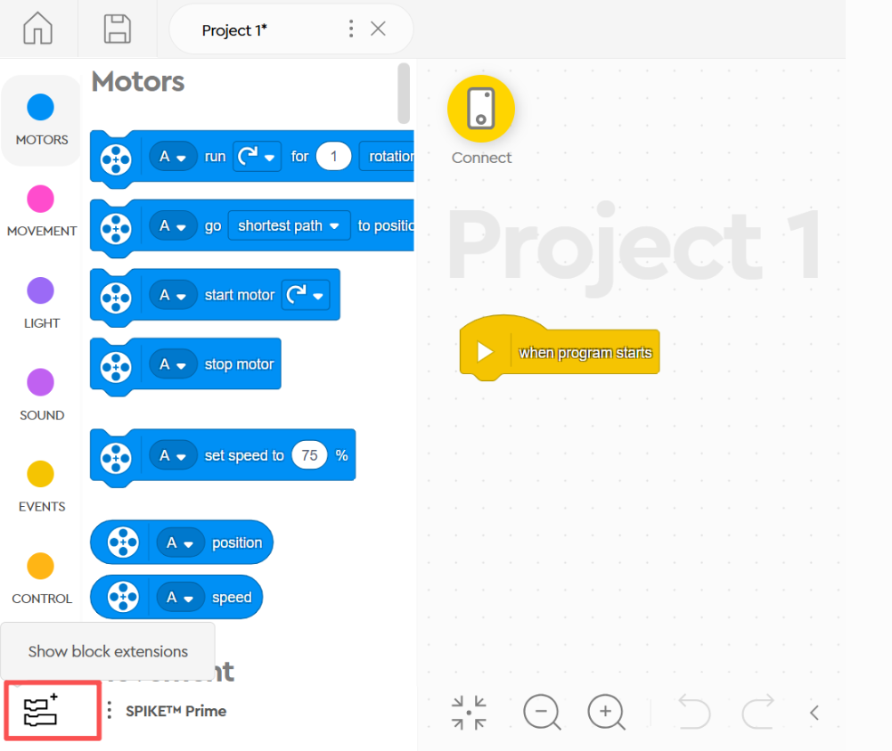 |  |
| 5. Click `Show Block Extensions`. | 6. Select `More Sensor Blocks`. |
| 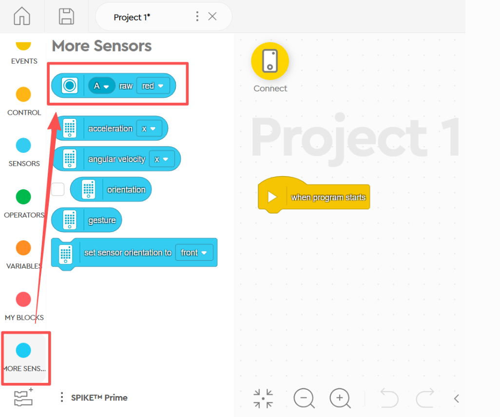 | |
| 7. In the `More Sensor Blocks` section,  an additional block named Get Color Sensor RGB Value will appear. | |

## Hardware Preparation 
### Device Contents  
|  | 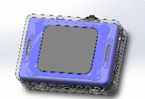 |
| :---: | :---: |
| SPIKE Prime Hub | ICreateRobot AI Vision Sensor |
| 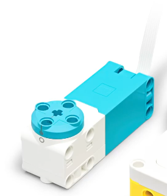 |  |
| SPIKE Motor | Dual-head WeDo 2.0 cable |

### Device Operation 
Connect the vision module to a port on the SPIKE hub. The module will power on automatically. After powering on, adjust the vision module's port protocol to SPIKE. The specific operation steps are as follows:  

|  |  |
| --- | --- |
| 1. Power on the SPIKE hub and connect the module to the SPIKE hub. The module will power on automatically upon connection.   | 2. After the module powers on, rotate the dial to go to Settings and change the port protocol to SPIKE. (If the module displays SPIKE as the port protocol in the top-left corner of the screen after powering on, this step is not required. If the port protocol is not switched to SPIKE, communication errors or lag may occur.)   |

## Usage Examples  
### Example 1: Vision Mode – Label Recognition  
**Example Content:**

Connect the vision module to port A of the SPIKE hub and manually switch the vision module to Label Recognition in Vision Mode. If no label is detected by the vision module, the SPIKE matrix displays the letter "N"; otherwise, the SPIKE matrix displays the label ID.  

**Operation Steps:**

|  |  |
| --- | --- |
| 1. Power on the SPIKE hub and connect the vision module to port A. The module will power on automatically.   | 2. After the module powers on, rotate the dial to go to Settings and change the port protocol to SPIKE. (If the module displays SPIKE as the port protocol in the top-left corner of the screen after powering on,  this step is not required.If the port protocol is not switched to SPIKE, communication errors or lag may occur.)   |
| 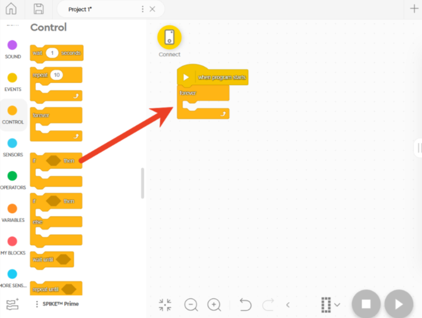 | 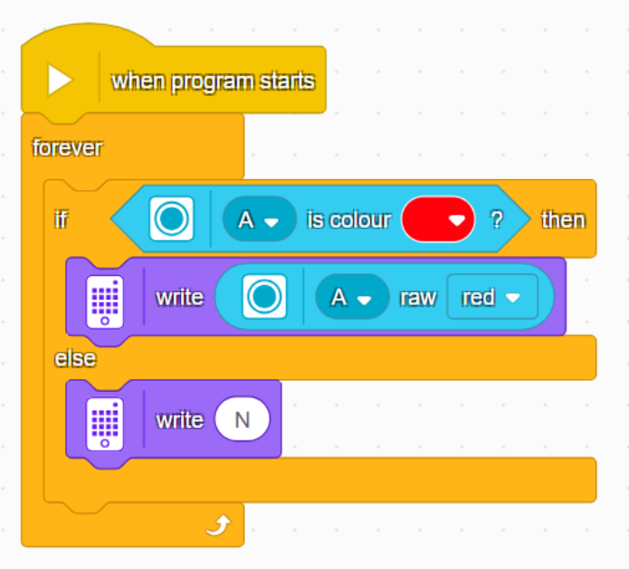 |
| 3. Drag the commands from the left side to the central area in the software and program according to the content requirements.   | 4. The programming content can refer to the diagram below.   |
|  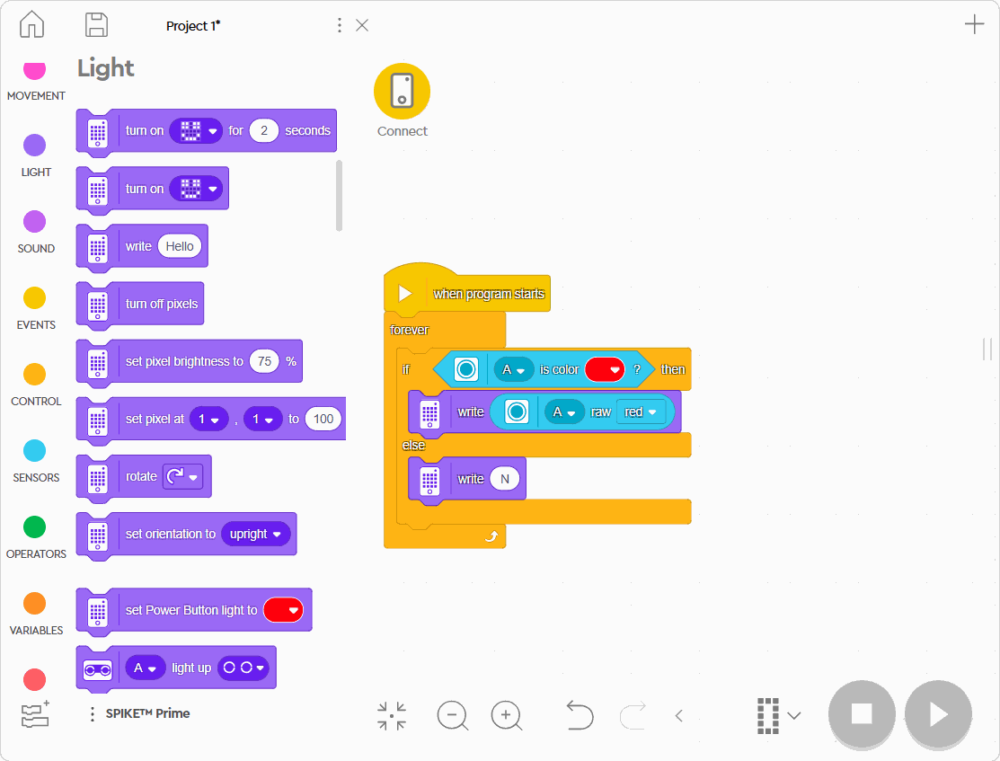 | 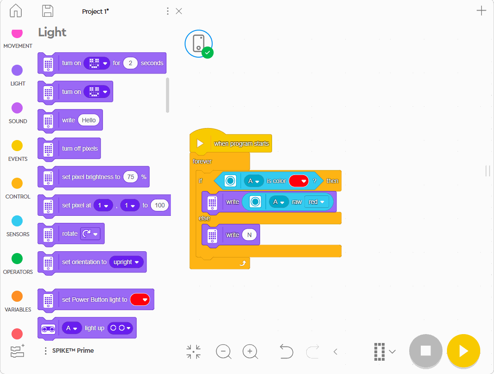 | 
| 5. In the programming software, click Connect and follow the instructions to pair the hub via Bluetooth.   | 6. Run the program. |
| 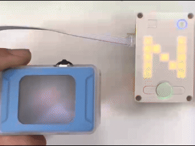 | |
| 7. Execution Result. | |

### Example 2: Conversation Mode – Voice Control of Motor  
**Example Content:**

Connect the vision module to port E of the SPIKE hub, and connect the motor to port B or D (avoid symmetric port selection for the vision module and motor). Use the wake word "Hello, XiaoZhi" to activate the module.

When the command "Forward" is spoken and the reflection value is "1%", the motor rotates clockwise. 

When the command "Backward" is spoken and the reflection value is "2%", the motor rotates counterclockwise. 

When the reflection value is "5%" by default, the motor stops.

**Operation Steps:**

| 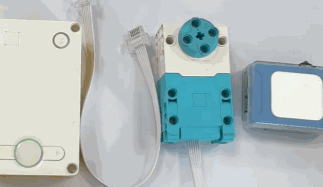 |  |
| --- | --- |
| 1. Power on the SPIKE hub, and connect the vision module and motor to the hub’s ports as required: vision module to port E, motor to port B or D.   | 2. After the module powers on, rotate the dial to go to Settings and change the port protocol to SPIKE. (If the module displays SPIKE as the port protocol in the top-left corner of the screen after powering on, this step is not required. If the port protocol is not switched to SPIKE, communication errors or lag may occur.)   |
| 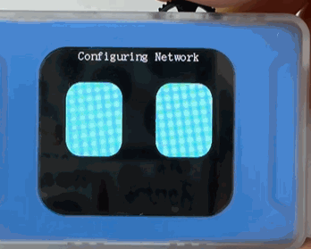 | 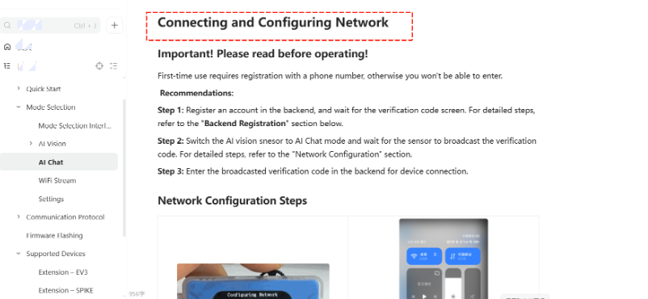 |
| 3. Switch the module to Conversation Mode   | 4. Perform network configuration on the module. For specific operation steps, refer to the [Conversation Mode ](https://ai-vision-advanced-docs.readthedocs.io/en/latest/docs/AIVisionAdvanced/03ModeSelection/03AIChat.html)documentation.  |
|  | 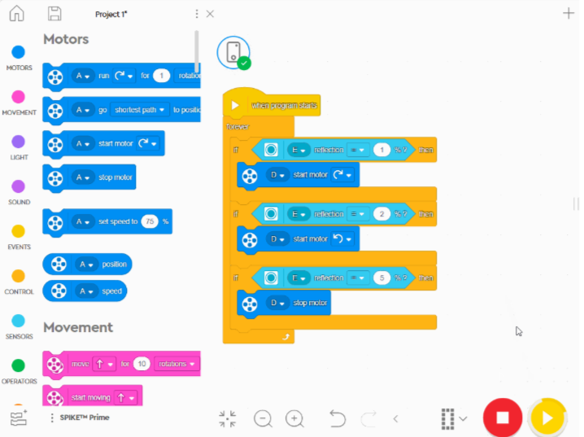 |
| 5. Drag the commands from the left side to the central area in the software and program according to the content requirements.   | 6. The programming content can refer to the diagram below.   |
| 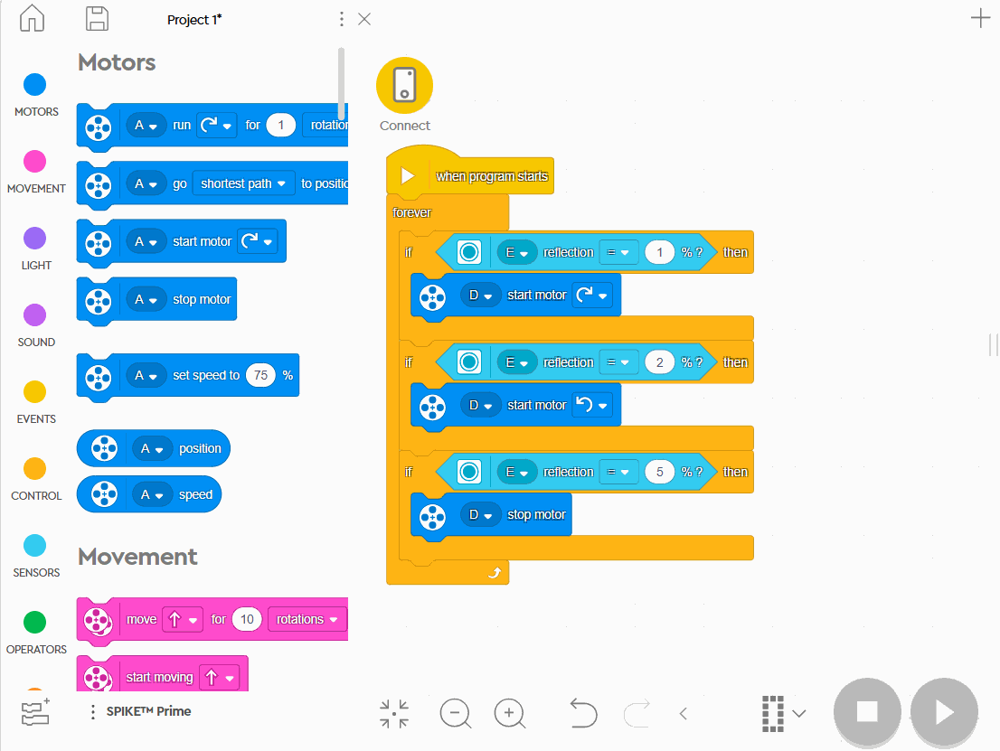 | 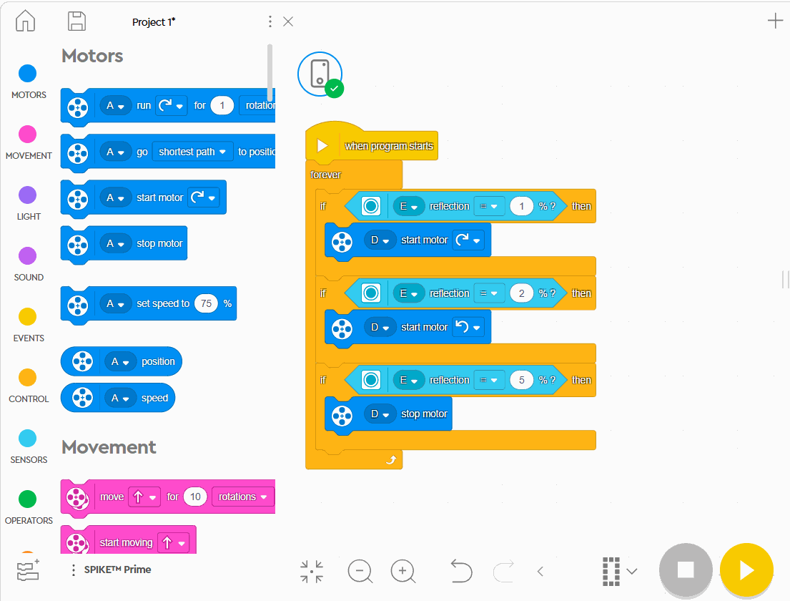 |
| 7. In the programming software, click Connect and follow the instructions to pair the hub via Bluetooth.   | 8. Run the program. |
| 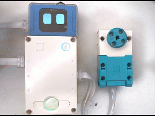 | |
| 9. Execution Result. | |

### Example 3: WiFi Image Transmission – Retrieving Webpage Button Values  
**Example Content:**

Connect the vision module to port A of the SPIKE hub, and use the image transmission buttons to display the collected values on the SPIKE hub matrix.  

**Operation Steps:**

| |  |
| --- | --- |
| 1. Power on the SPIKE hub and connect the vision module to port A. The module will power on automatically.   | 2. After the module powers on, rotate the dial to go to Settings and change the port protocol to SPIKE. (If the module displays SPIKE as the port protocol in the top-left corner of the screen after powering on, this step is not required. If the port protocol is not switched to SPIKE, communication errors or lag may occur.)   |
| 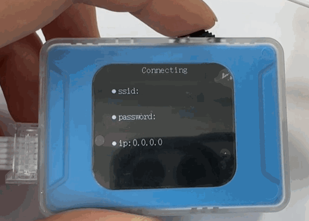 | 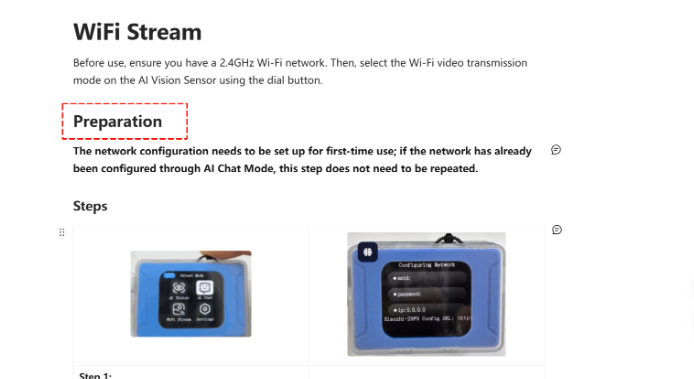 |
| 3. Switch the module to WiFi Image Transmission mode . | 4. Perform network configuration on the module. For specific operation steps, refer to the [WiFi Image Transmission ](https://ai-vision-advanced-docs.readthedocs.io/en/latest/docs/AIVisionAdvanced/03ModeSelection/04WiFiStream.html)documentation.   |
|  | 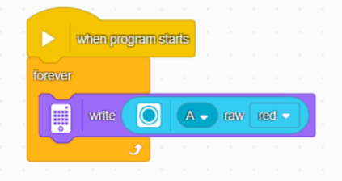 |
| 5. Drag the commands from the left side to the central area in the software and program according to the content requirements.   | 6. The programming content can refer to the diagram below.   |
| 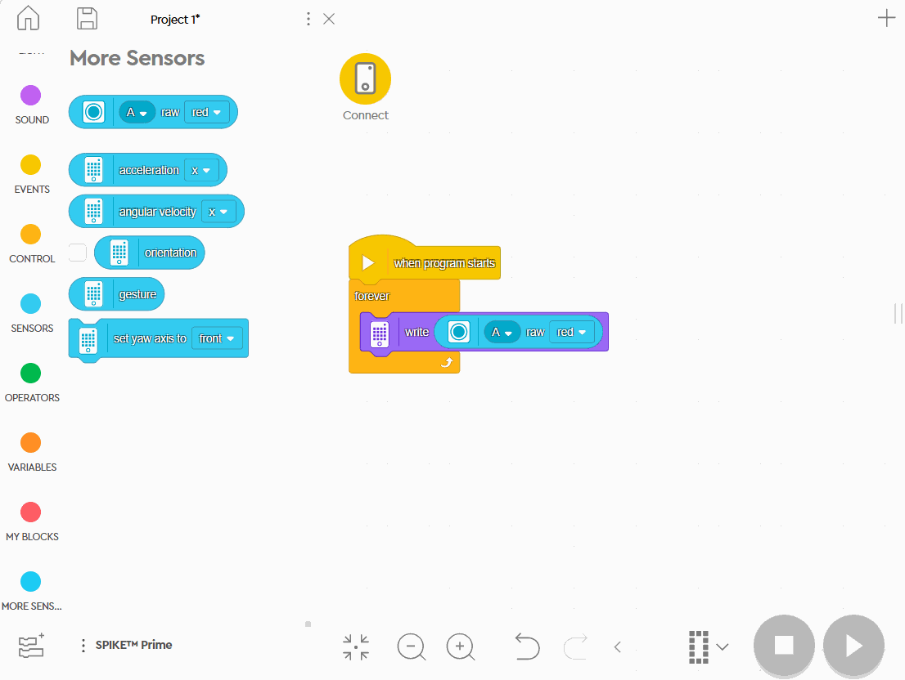 | 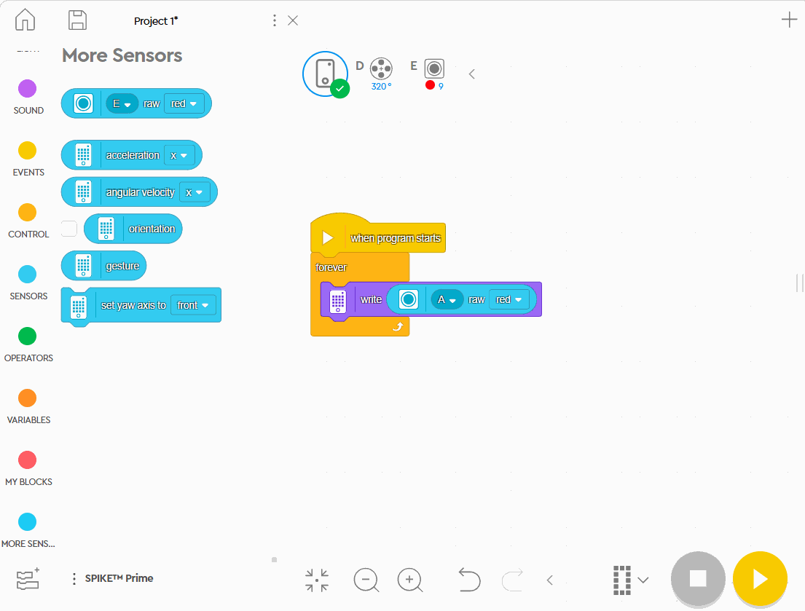 |
| 7. In the programming software, click Connect and follow the instructions to pair the hub via Bluetooth.   | 8. Run the program.   |
| 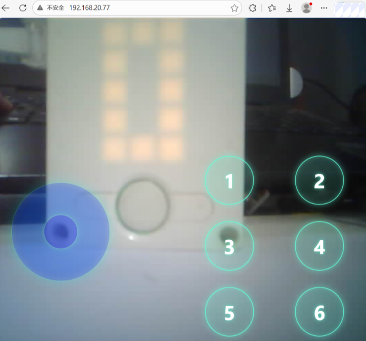 | 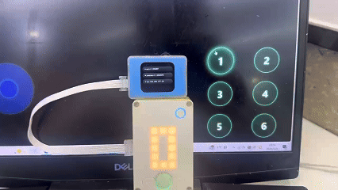 |
| 9. Within the same local network as the module, access the IP address displayed on the module using a PC or mobile browser to start image transmission.  For detailed operation steps, refer to the [WiFi Image Transmission ](https://ai-vision-advanced-docs.readthedocs.io/en/latest/docs/AIVisionAdvanced/03ModeSelection/04WiFiStream.html)documentation.   | 10. Execution Details. Webpage button mapping for image transmission: 0012 3456; when a button is pressed, the corresponding bit is set to 1.  |

