# Quick Start – Arduino
## Software Preparation 
The Arduino library is written in C++ and communicates with the AI Vision Sensor via I²C. Based on this library, programs can be developed with higher efficiency and richer functionality.  

> Note: The examples in this library are mainly based on the `Wire` I²C library, but this library does not depend on Wire. You can refer to the `override` examples to use this library in any environment.  
>

### Obtain the Software  
Open the [Arduino IDE](https://www.arduino.cc/en/software/), obtain the version suitable for your computer system, and download and install it.

<!-- 这是一张图片，ocr 内容为： -->
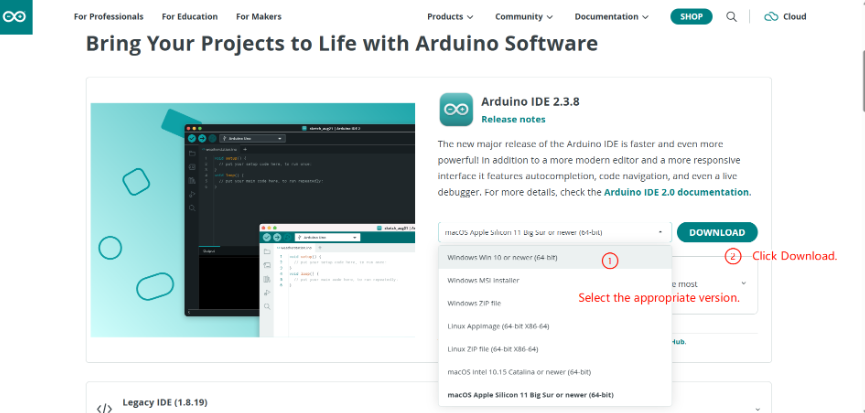

### Obtain the Library  
This document provides the Vision Module API library for download from GitHub and Gitee.  

#### Obtain from GitHub  
Step 1: Go to [GitHub](https://github.com/ICreateRobot/ICrobot_AI_Vision_Arduino).

Step 2: Click the `master` branch, then select the latest version from the `Tags` on the right.  

<!-- 这是一张图片，ocr 内容为： -->
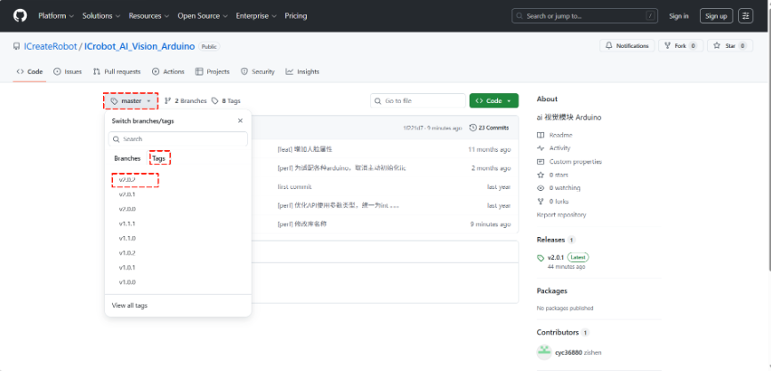

Step 3: Click `Code` and select `Download ZIP` to download the library package.  

<!-- 这是一张图片，ocr 内容为： -->
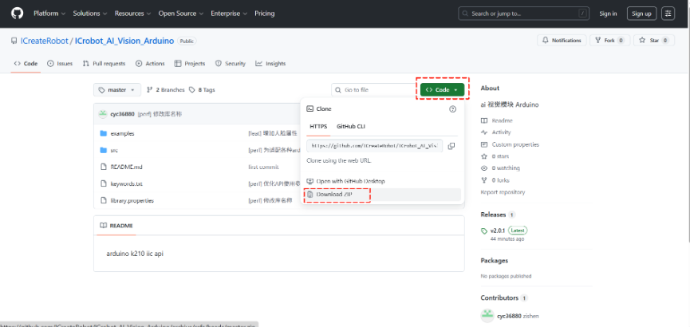

#### Obtain from Gitee
Step 1: Go to [Gitee](https://gitee.com/Embedded-dev/icrobot_-ai_-vision_-arduino).

Step 2: Click the `master` branch, then select the latest version from the`标签`on the right.  <!-- 这是一张图片，ocr 内容为： -->
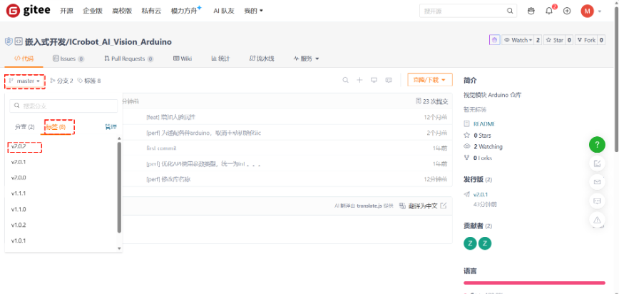

Step 3: Click`克隆/下载`and select`下载ZIP`to download the library package.  

<!-- 这是一张图片，ocr 内容为： -->
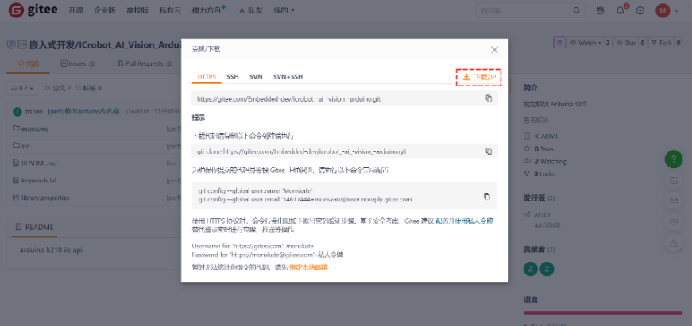

### Import the Library
 Step 1: Open the programming software, create a new project, find`Include Library`in the`Sketch`, and click`Add .ZIP Library`.

<!-- 这是一张图片，ocr 内容为： -->
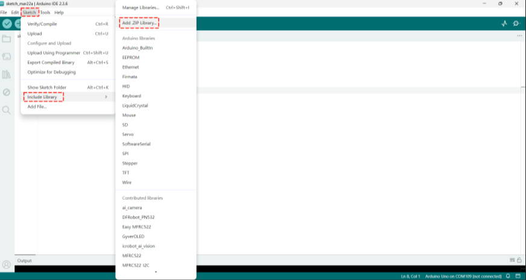

Step 2: Select the downloaded library and click Open in the bottom-right corner.  

<!-- 这是一张图片，ocr 内容为： -->
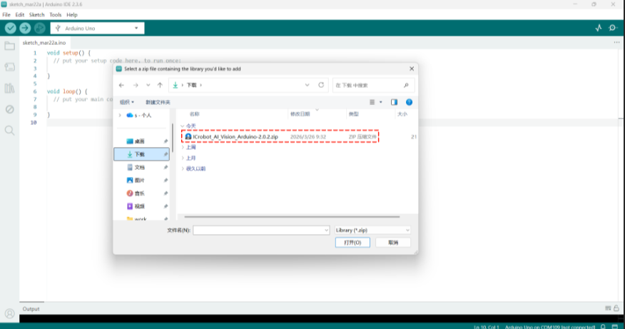

Step 3: In the `File` tab, open `Examples`. In the Examples tab, find the `Examples from Custom Libraries`. If you find `icrobot_ai_vision`, the library has been successfully imported.  

<!-- 这是一张图片，ocr 内容为： -->
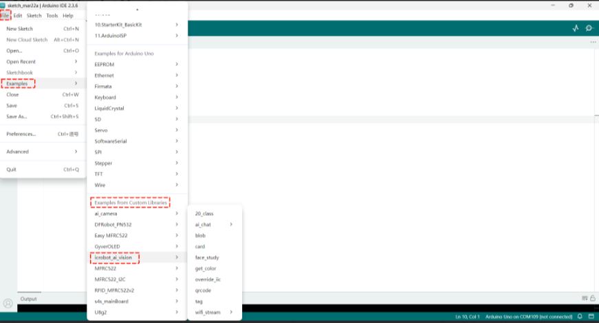

## Hardware Preparation  
### Device Contents
| 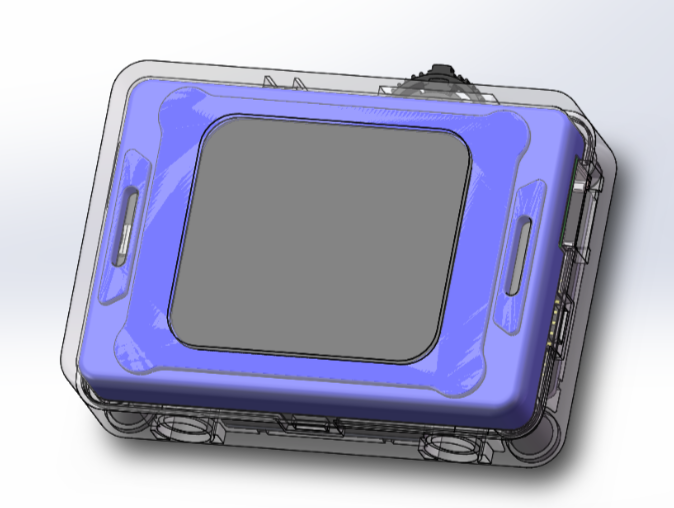 | 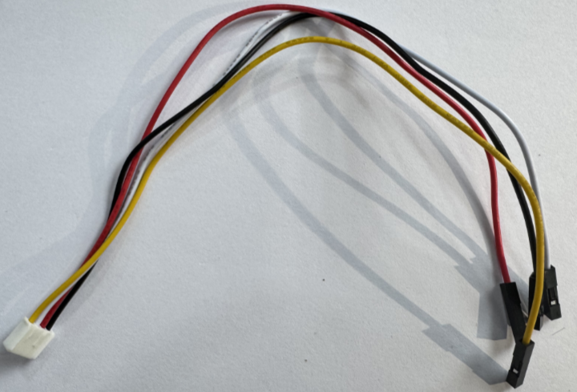 |
| :---: | :---: |
| ICreateRobot AI Vision Sensor | Grove to 4-pin Dupont cable |
| 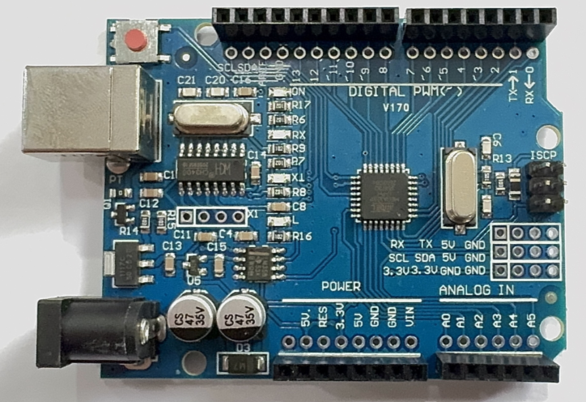 | 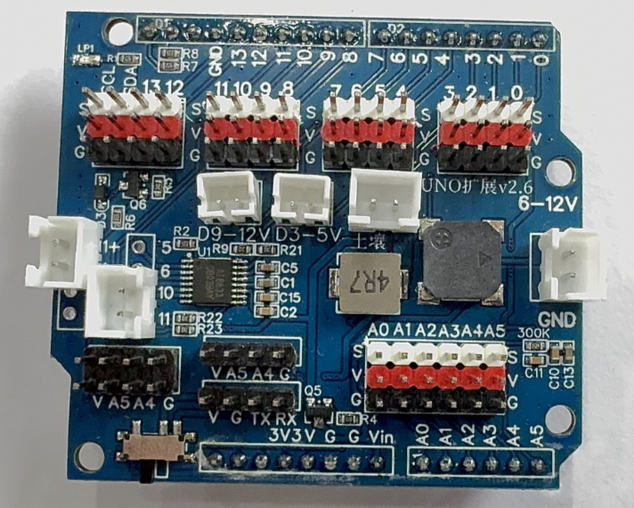 |
| Arduino Uno | Expansion Shield |
| 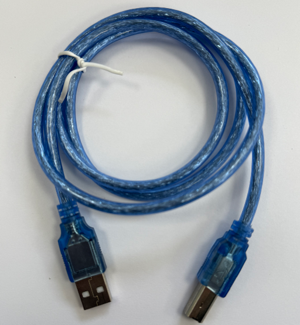 |  |
|  USB Connection Cable   |  |

### Device Operation 
The AI Vision Sensor is connected to the Arduino Uno development board via a Grove-to-4-pin Dupont cable. The specific operation steps are as follows:  

| 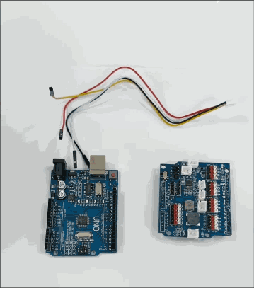 |  |
| --- | --- |
| 1. Insert the expansion board into the Arduino Uno development board.  Connect the yellow wire of the Grove-to-4-pin Dupont cable to the SCL pin on the expansion board,  the white wire to the SDA pin, the red wire to any VCC pin, and the black wire to any GND pin.   | 2. Connect the other end of the adapter cable to the AI Vision Sensor, and power the Arduino Uno development board via the cable from the computer. |
| 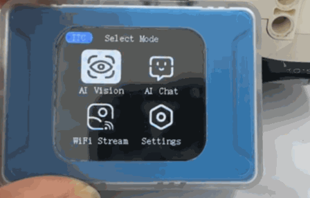 | |
| 3. After the module powers on, rotate the dial to go to Settings and change the port protocol to I²C. (If the module displays I²C as the port protocol in the top-left corner of the screen after powering on, this step is not required.    If the module is using the SPIKE protocol upon startup, press and hold the dial to switch to I²C.)   | |

For connecting the Grove port to Arduino board pins, please refer to [the Grove port pin description](https://ai-vision-advanced-docs.readthedocs.io/en/latest/docs/AIVisionAdvanced/05CommunicationProtocol/01CommunicationProtocol.html).  

## Usage Examples  
The `icrobot_ai_vision` library provides multiple example programs, each containing detailed comments. Combined with [the Arduino user guide](https://ai-vision-advanced-docs.readthedocs.io/en/latest/docs/AIVisionAdvanced/04UserGuide/03UserGuideArduino.html), these examples allow quick mastery of the library. Below, three examples are used to illustrate how to use and compile the routines  

### Example 1: Vision Mode – Label Recognition
**Example Content:**

Connect the AI Vision Sensor to the Arduino UNO development board and switch to Label Recognition in Vision Mode. If the vision module does not detect a label, the board prints "No tag" to the serial monitor; otherwise, it prints the label ID, rotation angle, and label coordinates.  

**Operation Steps:**

| 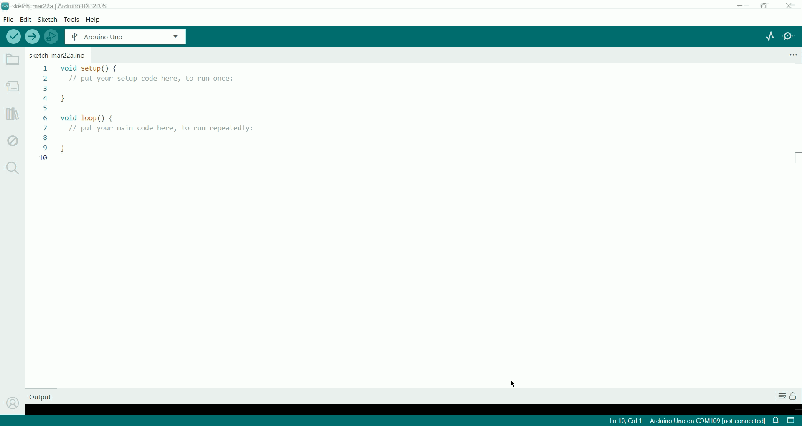 |  |
| --- | --- |
| 1. Select the`tag`example program from the examples and open it.   | 2. Insert the expansion board into the Arduino Uno development board.  Connect the yellow wire of the Grove-to-4-pin Dupont cable to the SCL pin on the expansion board,  the white wire to the SDA pin, the red wire to any VCC pin, and the black wire to any GND pin.   |
|  | 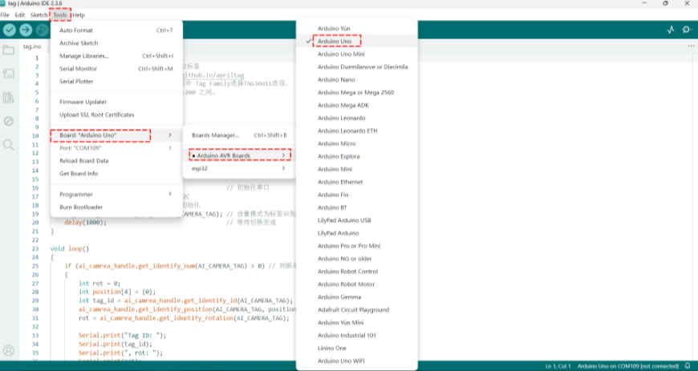 |
| 3. Connect the other end of the adapter cable to the AI Vision Sensor, and power the Arduino Uno development board via the cable from the computer. Select Vision Mode.   | 4. In the `Tools` menu, click `Board`, select `Arduino AVR Boards`, and choose the corresponding board. This example uses the `Arduino Uno` development board.   |
| 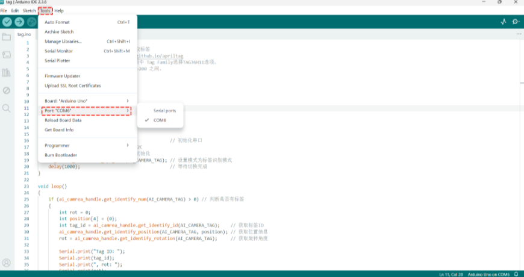 |  |
| 5. In the `Tools` menu, click `Port` and select the corresponding port number.   | 6. Compile and download the program.   |
| 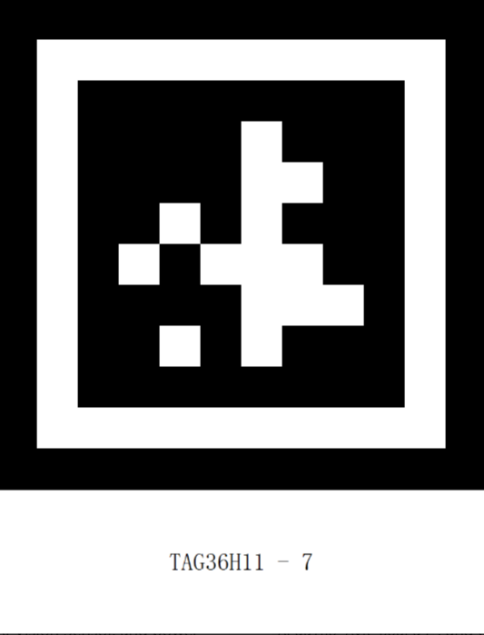 | 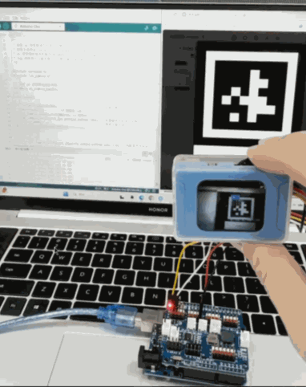 |
| 7. Prepare the labels.   | 8. Execution Result: The serial monitor prints the label ID, rotation angle, and label coordinates.   |

### Example 2: Conversation Mode – Voice-Controlled Movement  
**Example Content:**

Connect the AI Vision Sensor to the Arduino UNO development board and switch to Conversation Mode. The serial monitor prints the user’s voice input for movement commands and speed information.  

**Operation Steps:**

| 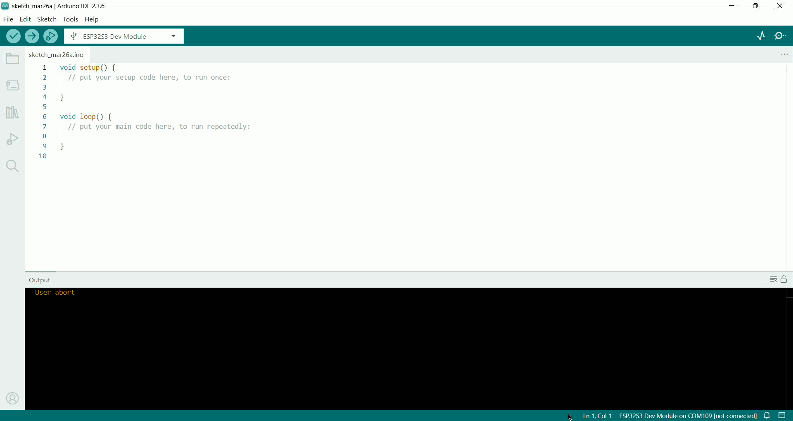 |  |
| --- | --- |
| 1. Select the `get_run_state` example program from the examples and open it.   | 2. Insert the expansion board into the Arduino Uno development board. Connect the yellow wire of the Grove-to-4-pin Dupont cable to the SCL pin on the expansion board,  the white wire to the SDA pin, the red wire to any VCC pin, and the black wire to any GND pin.   |
| 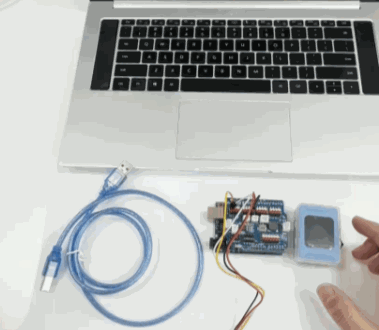 |  |
| 3. Connect the other end of the adapter cable to the AI Vision Sensor, and power the Arduino Uno development board via the cable from the computer. Select Conversation Mode.  For network configuration, refer to [the Conversation Mode guide](https://ai-vision-advanced-docs.readthedocs.io/en/latest/docs/AIVisionAdvanced/03ModeSelection/03AIChat.html).   | 4. In the `Tools` menu, click `Board` , select `Arduino AVR Boards` , and choose the corresponding board. This example uses the `Arduino Uno` development board.   |
| 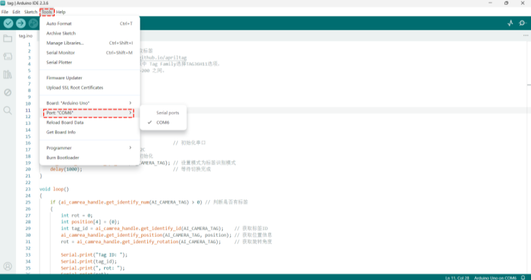 | 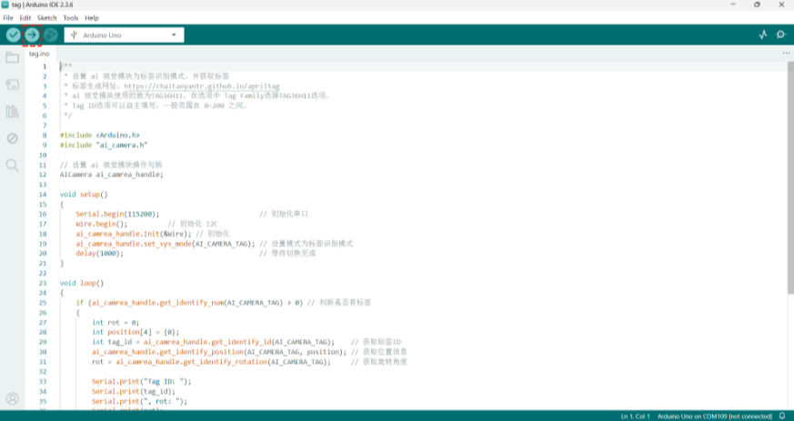 |
| 5. In the `Tools` menu, click `Port` and select the corresponding port number.   | 6. Compile and download the program.   |
| 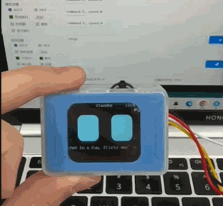 | |
| 7. Execution Result: The serial monitor prints the voice input commands and speed.   | |

### Example 3: WiFi Image Transmission – Web Joystick  
**Example Content:**

Connect the AI Vision Sensor to the Arduino UNO development board and switch to WiFi Image Transmission. The webpage displays the camera feed, and the serial monitor prints the joystick values.  

**Operation Steps:**

|  |  |
| --- | --- |
| 1. Select the`get_joystick`example program from the examples and open it.   | 2. Insert the expansion board into the Arduino Uno development board. Connect the yellow wire of the Grove-to-4-pin Dupont cable to the SCL pin on the expansion board,  the white wire to the SDA pin, the red wire to any VCC pin, and the black wire to any GND pin.   |
|  | 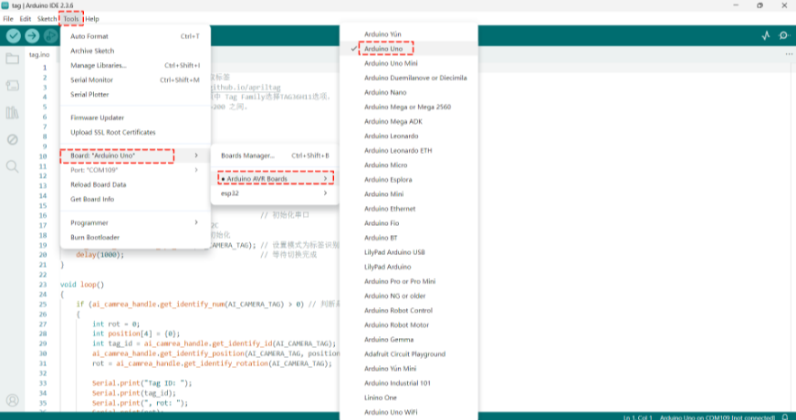 |
| 3. Connect the other end of the adapter cable to the AI Vision Sensor, and power the Arduino Uno development board via the cable from the computer. Select WiFi Image Transmission.  For usage, refer to [the WiFi Image Transmission guide](https://ai-vision-advanced-docs.readthedocs.io/en/latest/docs/AIVisionAdvanced/03ModeSelection/04WiFiStream.html).   | 4. In the `Tools` menu, click `Board`, select `Arduino AVR Boards`, and choose the corresponding board. This example uses the `Arduino Uno` development board.   |
| 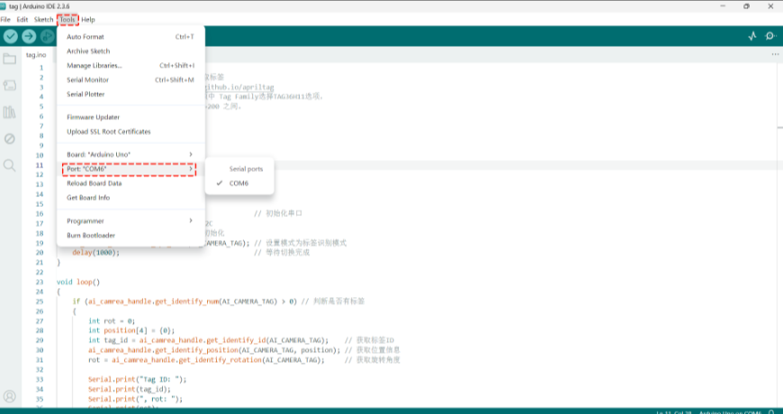 | 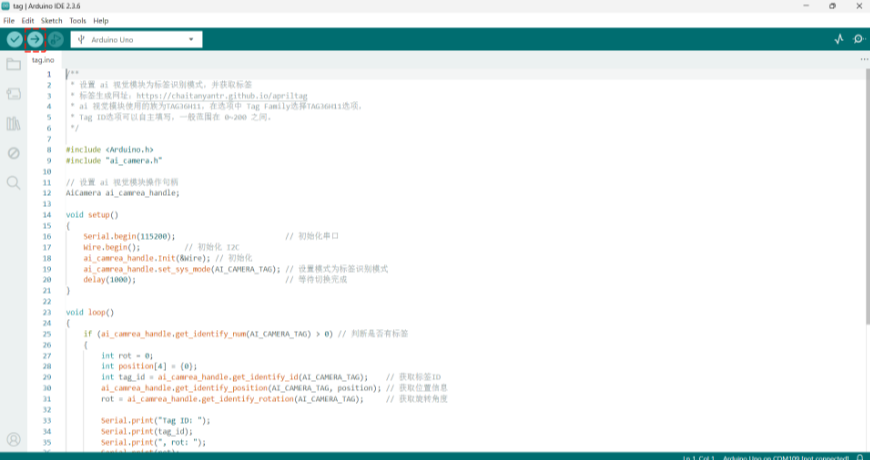 |
| 5. In the `Tools` menu, click `Port` and select the corresponding port number.   | 6. Compile and download the program.   |
|  | |
| 7. Execution Result: The serial monitor prints the joystick values.   | |

