# Quick Start – micro : bit Python
## Software Preparation 
### Access the Online Editor  
Click the link [micro:bit Python Editor](https://python.microbit.org/v/3/project) to enter the online editor. When entering for the first time, the interface looks like this:

<!-- 这是一张图片，ocr 内容为： -->
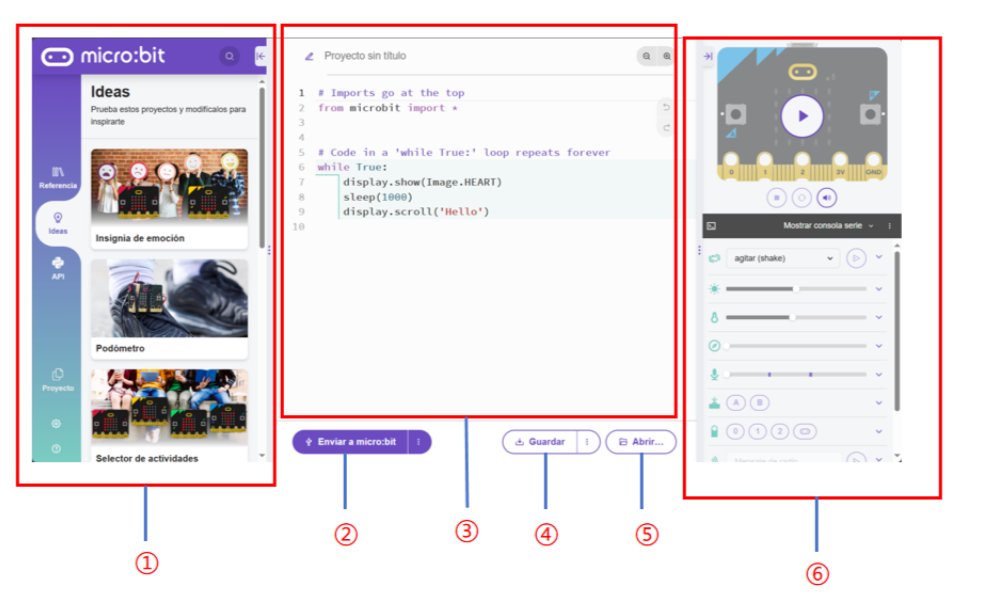

| _**<font style="color:#DF2A3F;">NO.</font>**_ | _**<font style="color:#DF2A3F;">Component</font>**_ | _**<font style="color:#DF2A3F;">Description</font>**_ |
| --- | --- | --- |
| ① | Function Panel | Project management |
| ② | Send Code | Send scripts to the connected micro:bit |
| ③ | Code Editor | Edit user code |
| ④ | Save | Save the project as a .hex file to your computer |
| ⑤ | Open | Open a local file |
| ⑥ | Status Display | Show the current status of the micro:bit |


**Language Switching**

**Step 1: Click the gear icon in the lower-left corner and select the Language button.**

<!-- 这是一张图片，ocr 内容为： -->
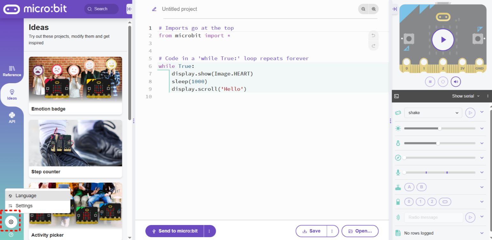


**Step 2: In the pop-up window, select your desired language.**

<!-- 这是一张图片，ocr 内容为： -->
_**<font style="color:#DF2A3F;"></font>**_

> **Note: It is recommended to use micro:bit V2.0 or above. Lower versions have insufficient memory and may not function properly.**
>

### Obtain the Driver Files  
This document provides the Python driver files for download from GitHub and Gitee.  

#### Obtain from GitHub  
Step 1: Go to [GitHub](https://github.com/ICreateRobot/microbit_micropython).

Step 2: Click the `master` branch, then select the latest version from the `Tags` on the right.  

<!-- 这是一张图片，ocr 内容为： -->
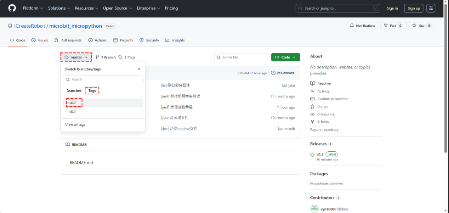

Step 3: Click `Code` and select `Download ZIP` to download the library package.  

<!-- 这是一张图片，ocr 内容为： -->
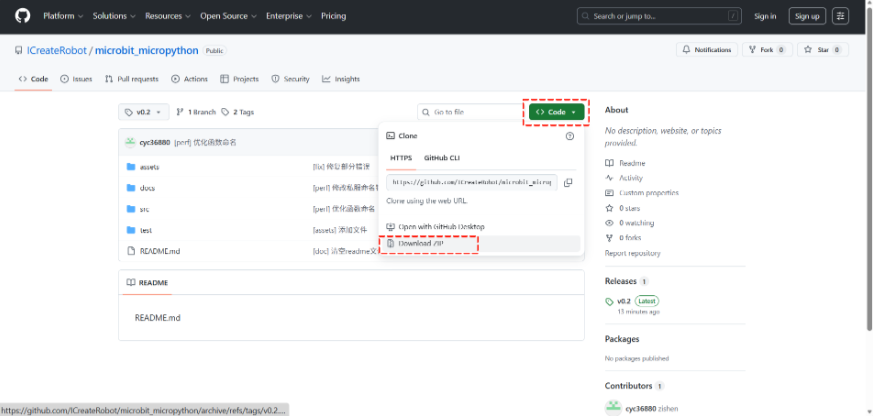

#### Obtain from Gitee
Step 1: Go to [Gitee](https://gitee.com/Embedded-dev/micobit_micropython).  
Step 2: Click the `master` branch, then select the latest version from the`标签`on the right.  <!-- 这是一张图片，ocr 内容为： -->
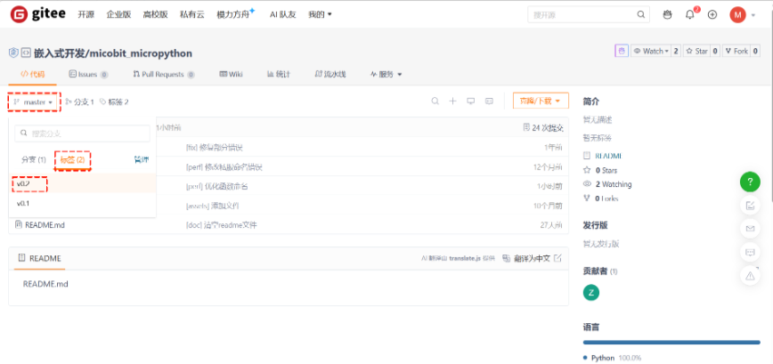

Step 3: Click`克隆/下载`and select`下载ZIP`to download the library package.  

<!-- 这是一张图片，ocr 内容为： -->
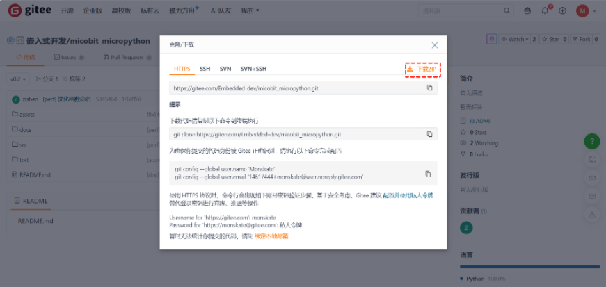

### Import the Files  
Extract the downloaded ZIP file and locate the required Python files.  

<!-- 这是一张图片，ocr 内容为： -->
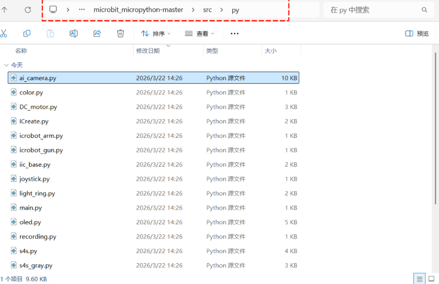

When using the libraries, you should at least import the following files:

`color.py`、`iic_base.py`、`ai_camera.py`

Step 1: Click the `Open` button (lower-left or lower-right).

<!-- 这是一张图片，ocr 内容为： -->


Step 2: Select the file you want to import and click `Open`.

> Note: To select multiple files, hold the Ctrl key and click the files with the mouse.  
>

<!-- 这是一张图片，ocr 内容为： -->


Step 3: In the pop-up dialog, select the second option, then click OK.  

<!-- 这是一张图片，ocr 内容为： -->
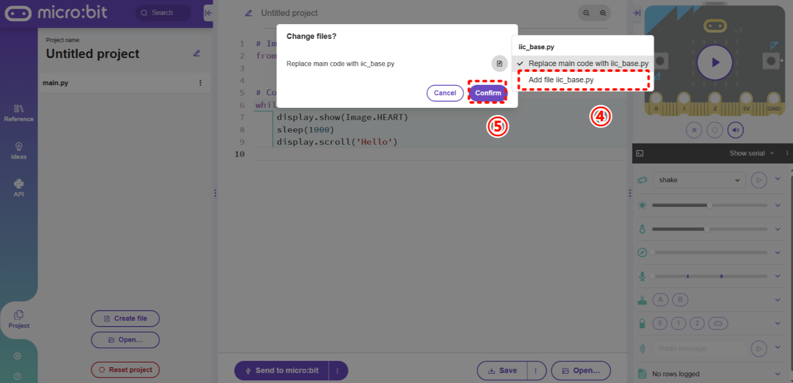


Step 4: The added files will appear in the left-side project panel, indicating that they have been successfully imported.

<!-- 这是一张图片，ocr 内容为： -->
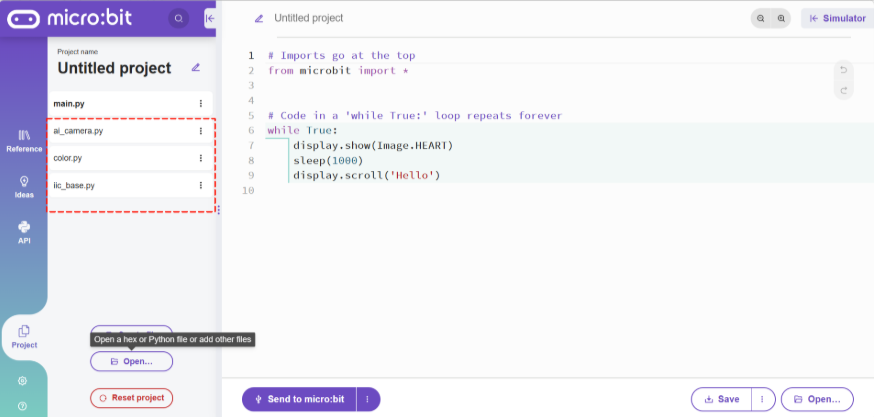

## Hardware Preparation
### Device Contents
| 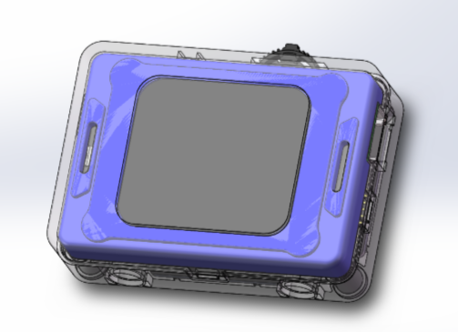 | 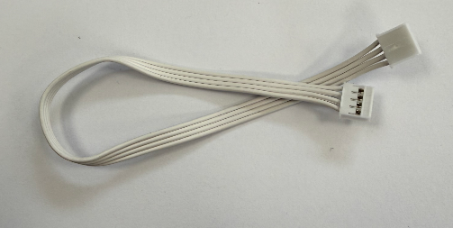 |
| :---: | :---: |
|  ICreateRobot AI Vision Sensor  | Grove Connection Cable |
| 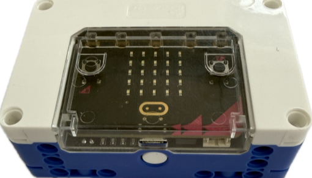 | 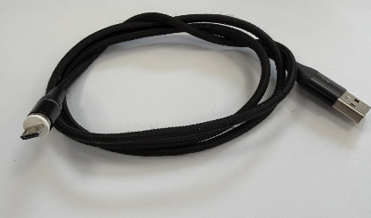 |
|   micro:bit Hub |  Micro-USB Connection Cable |


### Device Operation
The AI Vision Sensor is connected to the micro:bit Hub via a Grove cable. The specific operation steps are as follows:  

| 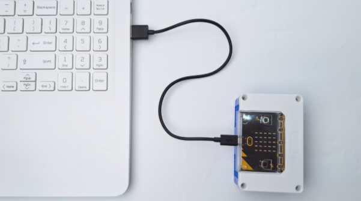 | 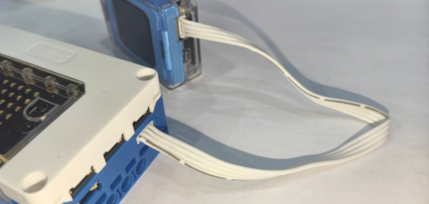 |
| --- | --- |
| 1. Use a Micro-USB cable to connect the micro:bit Hub to the computer.   | 2. Connect one end of the Grove cable to any I²C port on the micro:bit Hub, and connect the other end to the Grove port on the AI Vision Sensor.   |
|  |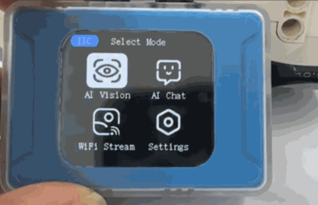 |
| 3. Press and hold the power button to turn on the micro:bit Hub.   | 4. After the module powers on, rotate the dial to go to Settings and change the port protocol to I²C.(If the module displays I²C as the port protocol in the top-left corner of the screen after powering on, this step is not required.   If the module is using the SPIKE protocol upon startup, press and hold the dial to switch to I²C.)   |


## Usage Examples  
### Example 1: Vision Mode – Label Recognition
**Example Content:**

Connect the AI Vision Sensor to the micro:bit Hub and switch to Label Recognition in Vision Mode. If the vision module does not detect a label, the micro:bit serial output prints "No label detected"; otherwise, it prints the label ID.  

**Operation Steps:**

| 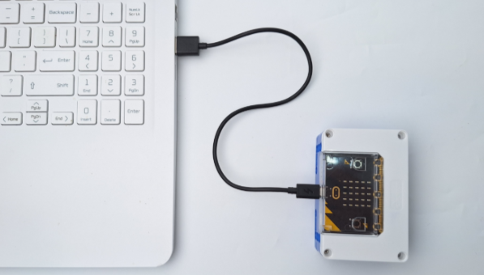 | 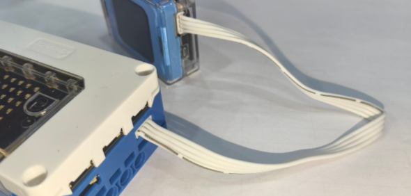 |
| --- | --- |
| 1. Use a Micro-USB cable to connect the micro:bit Hub to the computer.  | 2. Connect one end of the Grove cable to any I²C port on the micro:bit Hub, and connect the other end to the Grove port on the AI Vision Sensor.   |
| ```cpp from microbit import * import ai_camera ai_camera_handle = ai_camera.ai_camera() ai_camera_handle.set_sys_mode(ai_camera.AI_CAMERA_TAG)  sleep(1000)  while True:     if ai_camera_handle.get_identify_num(ai_camera.AI_CAMERA_TAG):          target_id = ai_camera_handle.get_identify_id(ai_camera.AI_CAMERA_TAG)         print("id：", target_id)     else:         print("No label detected")     sleep(400) ```  | 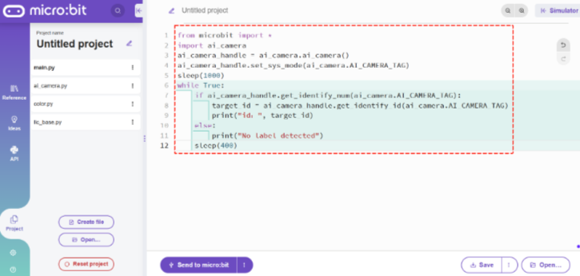 |
| 3. Copy the above code.   | 4. Paste it into the code area of the online editor.   |
| 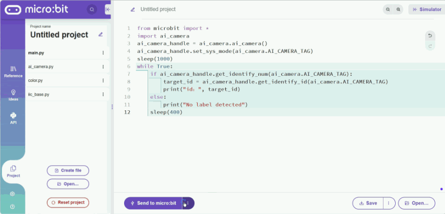 |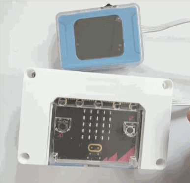 |
| 5. Click the three-dot icon to the right of `Send to micro:bit` to connect to the micro:bit hub, then click `Send to micro:bit`to download the program to the micro:bit hub.   | 6. Press and hold the power button to turn on the micro:bit Hub.Select Vision Mode.  |
|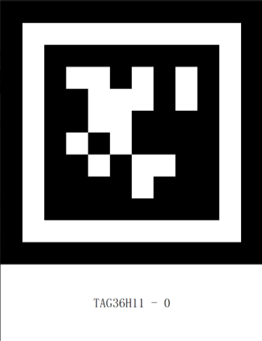
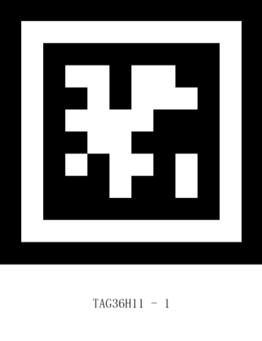
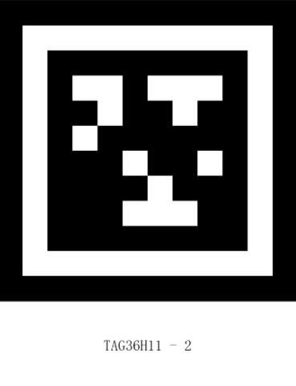 | 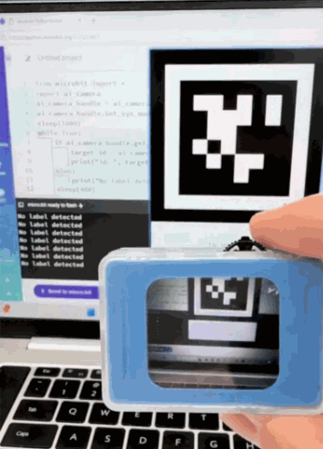 |
| 7. Prepare the labels. | 8. Execution Result: The serial output prints the label ID.   |


### Example 2: Conversation Mode – Voice-Controlled Movement  
**Example Content:**

Connect the AI Vision Sensor to the micro:bit Hub and switch to Conversation Mode. The serial output prints the user's voice input commands and speed information.  

**Operation Steps:**

| 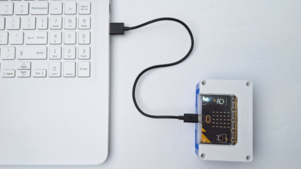 | 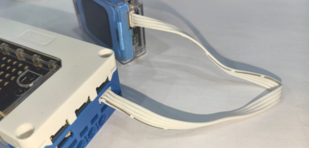 |
| --- | --- |
| 1. Use a Micro-USB cable to connect the micro:bit Hub to the computer.  | 2. Connect one end of the Grove cable to any I²C port on the micro:bit Hub, and connect the other end to the Grove port on the AI Vision Sensor.   |
| ```cpp from microbit import * import ai_camera   ai_camera_handle = ai_camera.ai_camera()  while True:     print(ai_camera_handle.get_ai_chat_run_state())         sleep(1000) ```  | 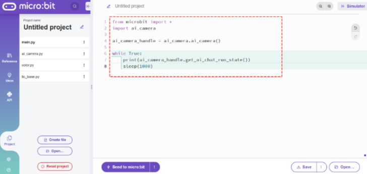 |
| 3. Copy the above code.   | 4. Paste it into the code area of the online editor.   |
| 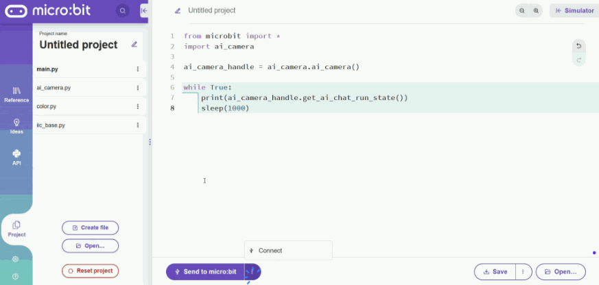 |  |
| 5. Click the three-dot icon to the right of `Send to micro:bit` to connect to the micro:bit hub, then click `Send to micro:bit`to download the program to the micro:bit hub.   | 6. Press and hold the power button to turn on the micro:bit Hub. Select Conversation Mode. For network configuration, refer to [the Conversation Mode guide](https://ai-vision-advanced-docs.readthedocs.io/en/latest/docs/AIVisionAdvanced/03ModeSelection/03AIChat.html).   |
| 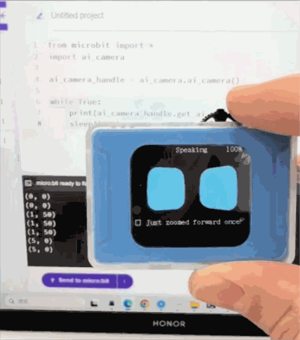 |  |
| 7. Execution Result: The serial output prints the user’s voice input commands and speed information.   |  |


### Example 3: WiFi Image Transmission – Web Joystick 
**Example Content:**

Connect the AI Vision Sensor to the micro:bit Hub and switch to WiFi Image Transmission mode. The webpage displays the camera feed, and the serial output prints the joystick values.  

**Operation Steps:**

| 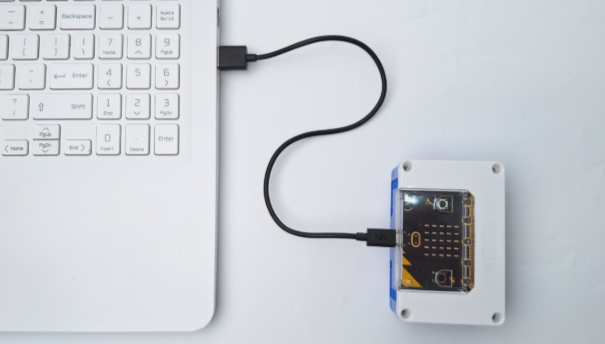 | 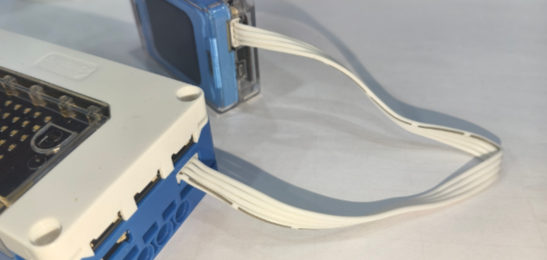 |
| --- | --- |
| 1. Use a Micro-USB cable to connect the micro:bit Hub to the computer.  | 2. Connect one end of the Grove cable to any I²C port on the micro:bit Hub, and connect the other end to the Grove port on the AI Vision Sensor.   |
| ```cpp from microbit import * import ai_camera  ai_camera_handle = ai_camera.ai_camera()  while True:     print(ai_camera_handle.get_wifi_stream_joystick())         sleep(1000) ```  | 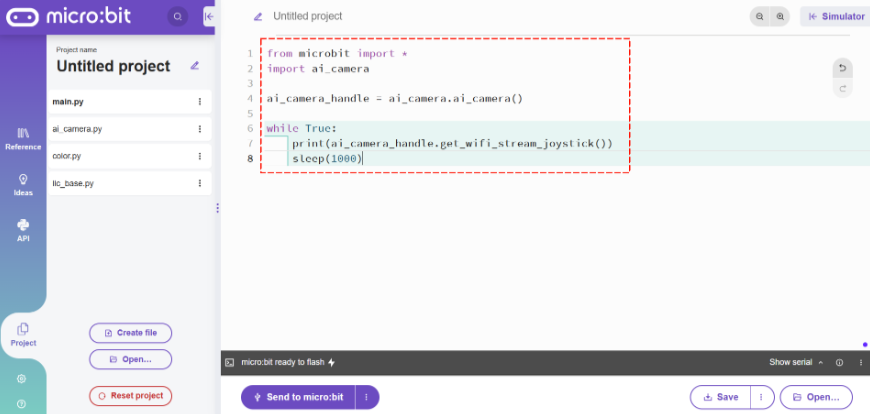 |
| 3. Copy the above code.   | 4. Paste it into the code area of the online editor.   |
| 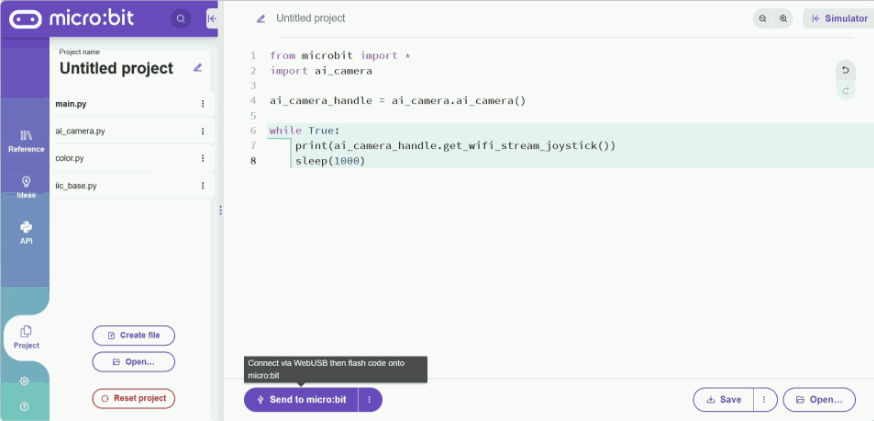 |  |
| 5. Click the three-dot icon to the right of `Send to micro:bit` to connect to the micro:bit hub, then click `Send to micro:bit`to download the program to the micro:bit hub.   | 6. Press and hold the power button to turn on the micro:bit Hub. Select WiFi Image Transmission. For usage, refer to [the WiFi Image Transmission guide](https://ai-vision-advanced-docs.readthedocs.io/en/latest/docs/AIVisionAdvanced/03ModeSelection/04WiFiStream.html).   |
| 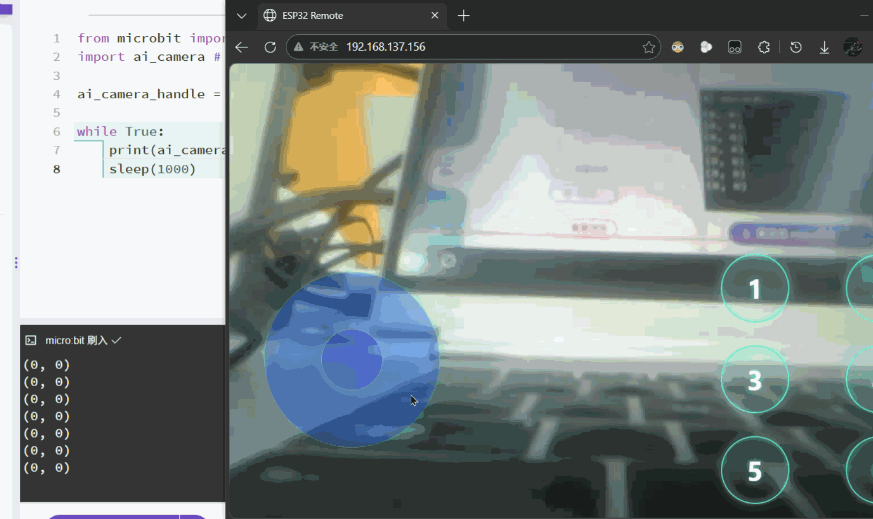 |  |
| 7. Execution Result: The webpage displays the camera feed, and the serial output prints the joystick values.   |  |


