# Quick Start – make _ code
## Introduction
 The K210 vision module can be used together with the micro:bit kit. The micro:bit can supply power and communicate with the vision module via the HY2.0-4P interface. For quickly getting started with the MakeCode programming platform, refer to the documentation: [**User Guide**](https://icreaterobot-microbit-docs.readthedocs.io/en/latest/docs/Microbit/02QuickStart.html). 

  
It is recommended to use the micro:bit V2.0 or higher versions as the main control board. Lower versions have insufficient memory, which may cause issues with functionality.

## Software Preparation  
### Get the Extension
Click the link [AI Vision_micro:bit_V0.1.0.hex](https://github.com/ICreateRobot/AI-Vision-Sensor-) to download the micro:bit extension files.  

<!-- 这是一张图片，ocr 内容为： -->
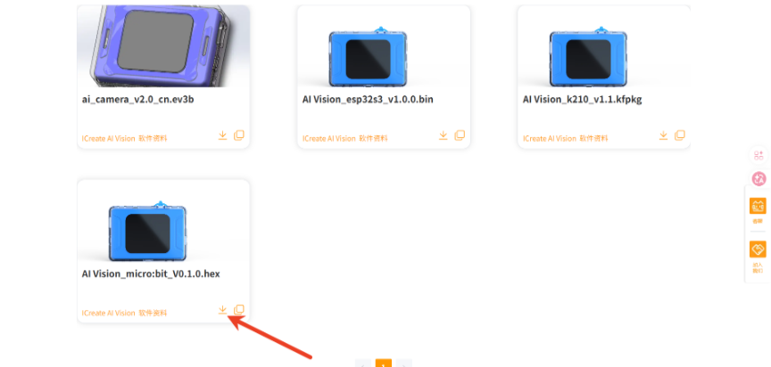

### Add Extension  
Click the link [**makecode.microbit**](https://makecode.microbit.org/#) to open the online editor.  

<!-- 这是一张图片，ocr 内容为： -->
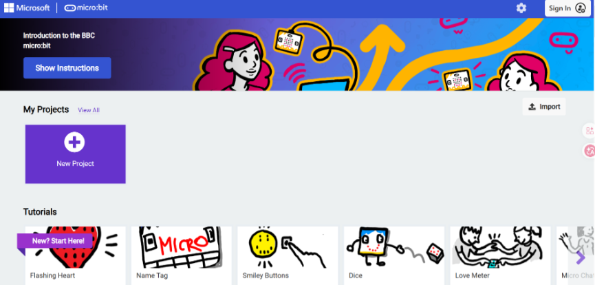

Click **New Project**, give the project a name, and then click **Create**.

<!-- 这是一张图片，ocr 内容为： -->
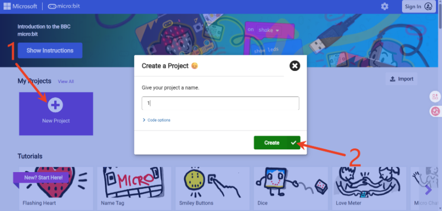

Click **Extensions** at the bottom of the left-side menu, select **Import File**, then locate and import the extension file you just downloaded.

<!-- 这是一张图片，ocr 内容为： -->
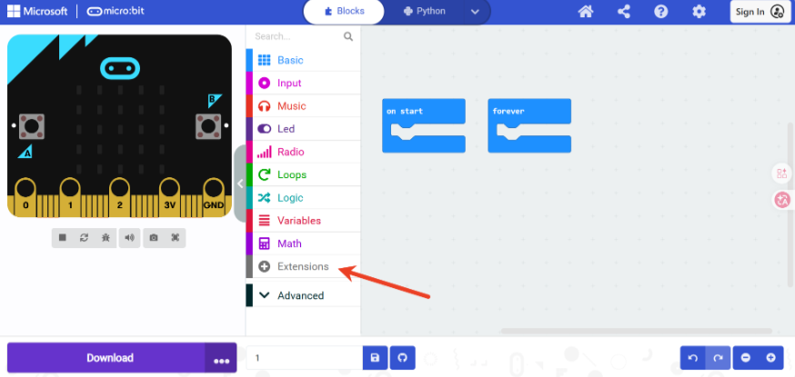

<!-- 这是一张图片，ocr 内容为： -->
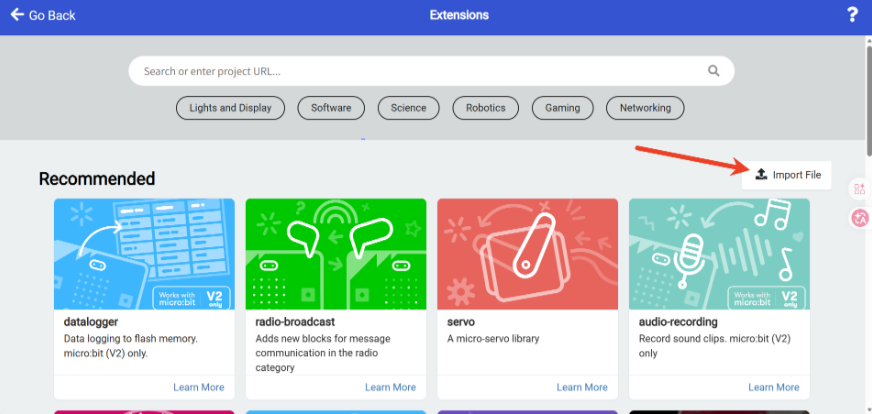

<!-- 这是一张图片，ocr 内容为： -->
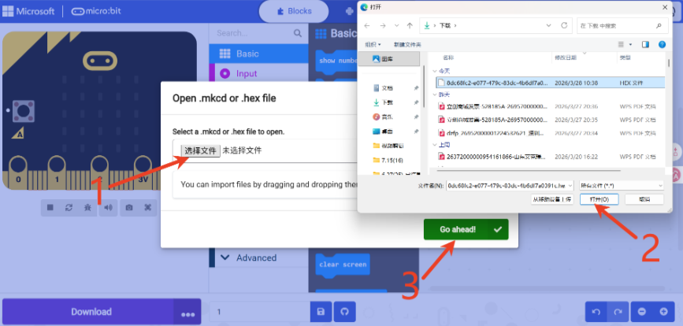

The **AI Vision** extension has been successfully added to the left-side menu.

<!-- 这是一张图片，ocr 内容为： -->
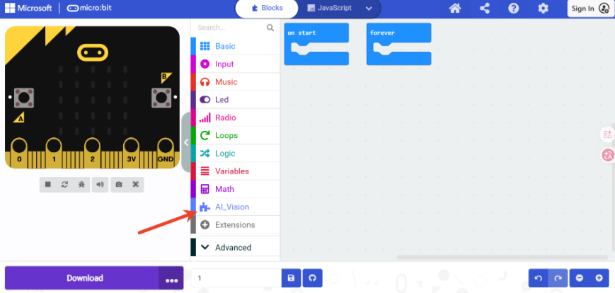

## Hardware Preparation  
### Device Contents 
|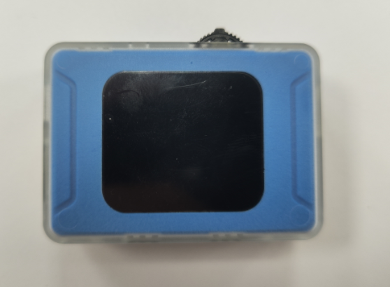|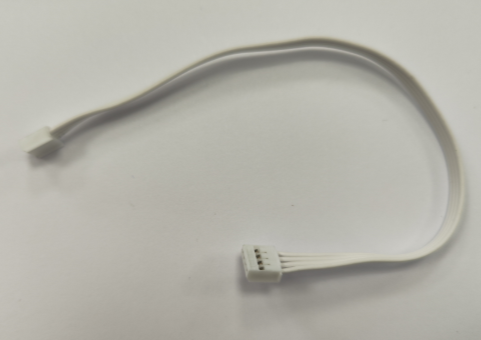|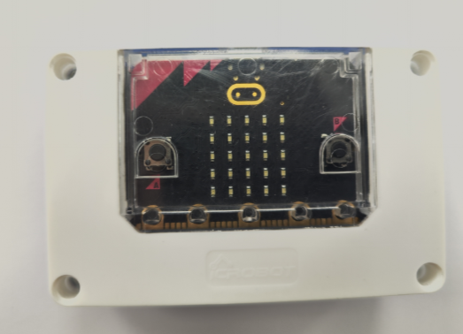| 
| --- | --- | --- |
| ICreateRobot AI Vision Sensor | Grove Connection Cable | Grove Connection Cable  |
 
### Device Operation  
Connect one end of the Grove male-to-male cable to the Grove port on the vision module, and the other end to the I²C port on the micro:bit smart hub.  
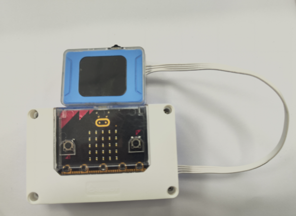 
| 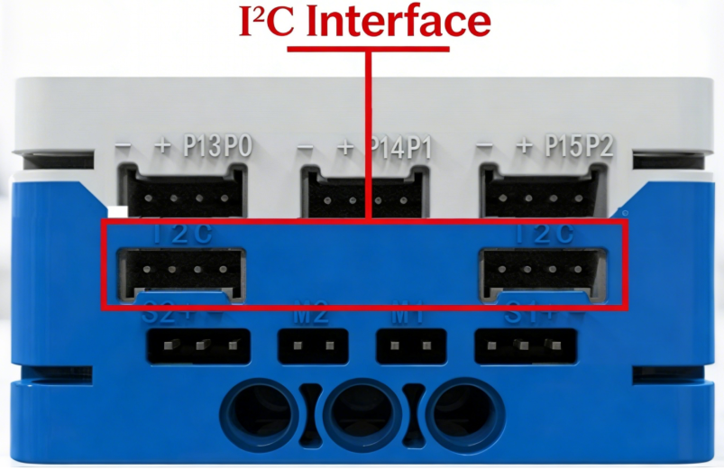 | 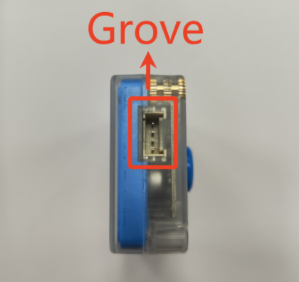 |
| --- | --- |
| micro:bit | ICreateRobot AI Vision Sensor |

  

The K210 AI vision module communicates via I²C and can be connected to any I²C port on the micro:bit smart hub.  

First, power on the micro:bit to supply power to the vision module and enter the startup interface.  

<!-- 这是一张图片，ocr 内容为： -->
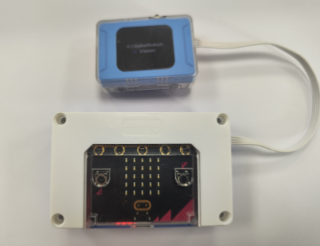

 In the mode selection, find Settings, then check whether the port protocol is I²C. If not, toggle the switch left (or right) to Port Protocol, press to switch to I²C. Then toggle the switch to the Exit option, press to return to mode selection. (If the vision module is in SPIKE mode, the port protocol cannot be set normally. You need to hold down the switch and power on again. Once the startup screen appears, release the switch, and it will automatically enter the vision module. Then press the reset button to return to mode selection.)  

<!-- 这是一张图片，ocr 内容为： -->
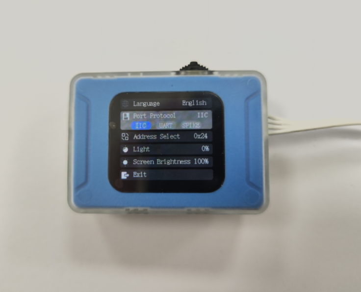

## Usage Examples
### Example 1: Vision Mode – Color Acquisition  
Enter Vision Mode from the mode selection. (If in another mode, press the top reset button or disconnect and reconnect the power to make the module re-enter the mode selection interface.)  
Use micro:bit to display the R value of the color acquired by the vision module on the core board's LED matrix.  

 **Sample program**

<!-- 这是一张图片，ocr 内容为： -->
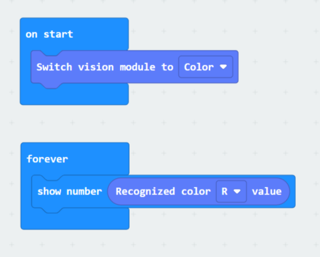

**Effect demonstration:**

<!-- 这是一张图片，ocr 内容为： -->
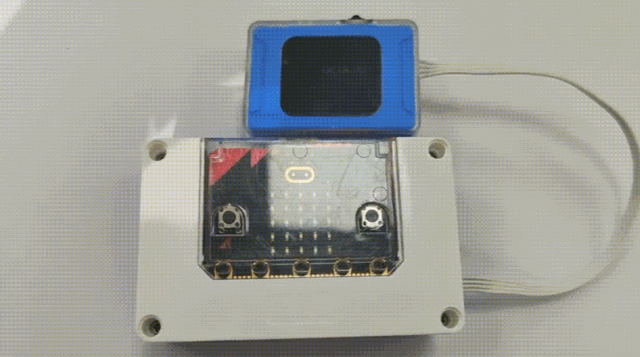

### Example 2: Dialogue Mode – Dialogue Status Display  
Enter Dialogue Mode from the mode selection. (If in another mode, press the top reset button or disconnect and reconnect the power to make the module re-enter the mode selection interface.)  
First, configure the network for the vision module. For details, please refer to Dialogue Mode.  
Use micro:bit to display the corresponding status of the K210 module on the core board’s LED matrix.  

**Sample program**

<!-- 这是一张图片，ocr 内容为： -->
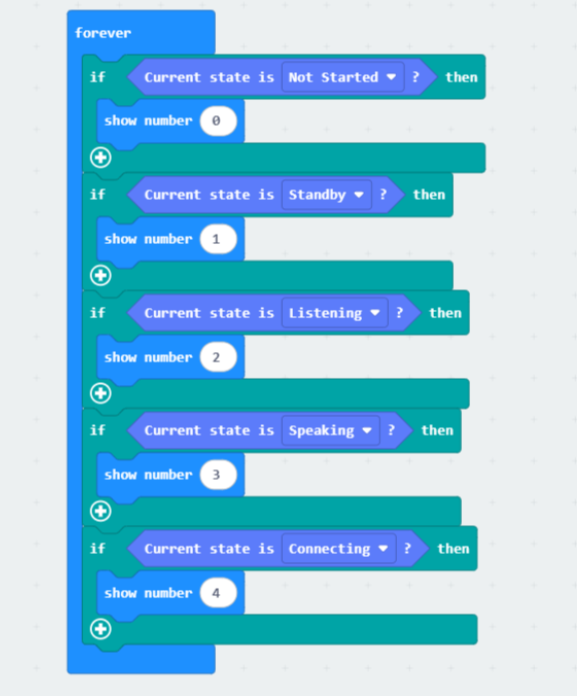

**Effect demonstration:**

<!-- 这是一张图片，ocr 内容为： -->
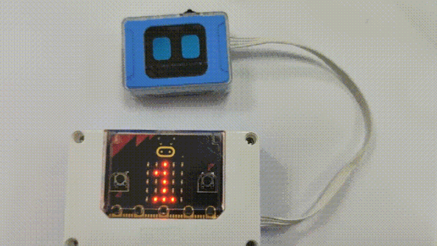

### Example 3:  WiFi Image Transmission – Joystick Position Acquisition  
Enter WiFi Image Transmission Mode from the mode selection. (If in another mode, press the top reset button or disconnect and reconnect the power to make the module re-enter the mode selection interface.)  
First, configure the network for the vision module. If the network has already been configured in Dialogue Mode, you can proceed to the next step. For network configuration details, please refer to WiFi Image Transmission.  
Then, on a PC or mobile browser within the same local network as the module, access the IP address displayed on the module to start image transmission. At the same time, control commands can be sent using the joystick or buttons.  

|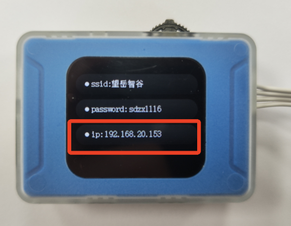 | 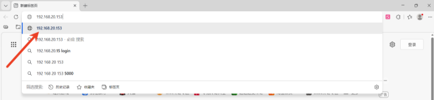 |
| --- | --- |
| Step 1:   After completing the network configuration, locate the IP address displayed on the module. | Step 2:   Open a browser and enter the IP address in the address bar. |
| 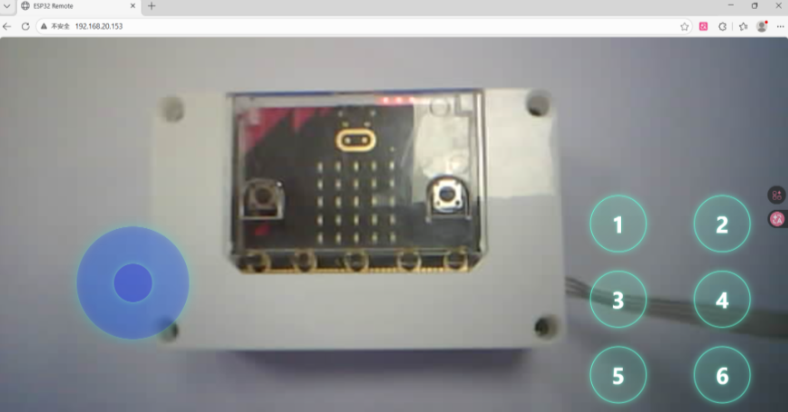 |  |
| Step 3:   Start image transmission, and the webpage will display the real-time content captured by the module. |  |

Use micro:bit to display the X value of the joystick position from the webpage on the core board’s LED matrix.  

**Sample program**

<!-- 这是一张图片，ocr 内容为： -->
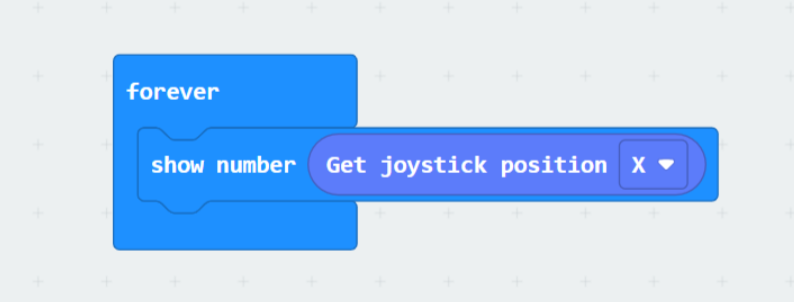

**Effect demonstration:**

<!-- 这是一张图片，ocr 内容为： -->
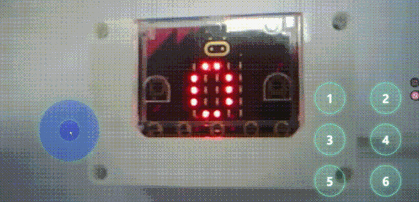

