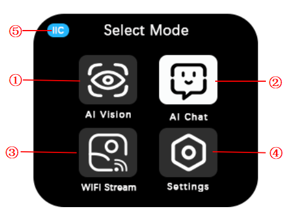

# Mode Selection Interface Overview
<!-- 这是一张图片，ocr 内容为： -->

| No. |  Name |  Description |
| :---: | :---: | --- |
| ① | AI Vision | The AI Vision Mode includes 10 AI functions: color detection, color block tracking, AprilTag recognition, line recognition, 20-class object recognition, QR code recognition, face attributes, face ID recognition, deep learning, and road sign recognition.   |
| ② | AI Chat | In AI Chat Mode, users can interact with the module through voice commands. |
| ③ | WIFI Stream | WiFi video transmission allows the module's captured content to be displayed in real-time on a web page through network configuration.   |
| ④ | Settings | Settings are used to change language, port protocols (IIC/UART/SPIKE compatibility mode), communication address, screen brightness, fill light status, and fill light brightness.   |
| ⑤ |  Communication Protocol | This section indicates the current communication protocol type, which can be either IIC or UART.   |

**Note: Except for the "Settings" mode, the other three modes can only be exited by performing a system reset or powering off and restarting the device.**

