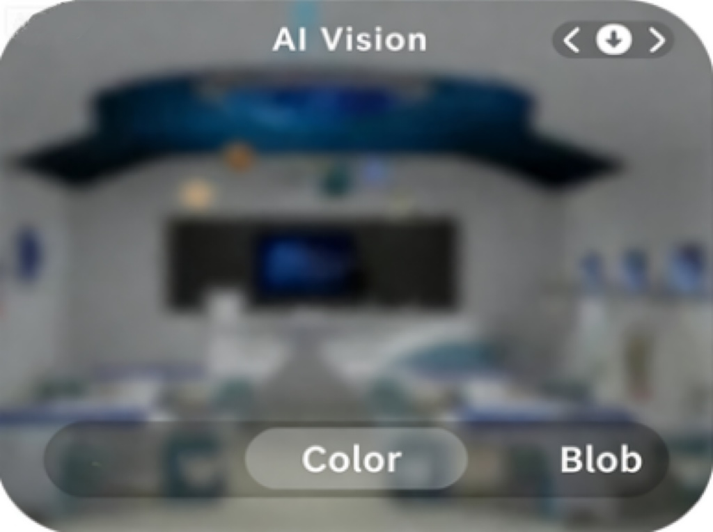

# Control Interface Description
Each AI function in the Vision Mode corresponds to an independent interface. Users can directly operate the module using the dial button, without relying on external port control. 

+ Toggle the dial button left or right to switch between different function interfaces.
+ Once you enter a specific interface, the corresponding AI function will be automatically enabled.
+ If an AI function includes additional steps (such as "select" or "learn"), press the dial button for more detailed control (specific operations depend on the current function).

_**Note: The images shown are for reference only. The actual display may vary depending on the module.  **_

## **Top Status Bar & Bottom Navigation Bar**
<!-- 这是一张图片，ocr 内容为： -->

To optimize display clarity, both the top and bottom bars **automatically hide** after 5s of inactivity.

+ **Redisplay status bar:**  
Perform any dial button action (click or toggle).
    - This action only restores the display and does not trigger any function change or setting modification.
+ **Resume operations:**  
After the bars reappear, you can continue using the dial button for normal function control.

Design purpose: keep the interface clean and avoid accidental interference with ongoing tasks.

**Layout Description:**

1. **Bottom Navigation Bar**
    - **Center highlighted icon:** currently active function
    - **Left/Right icons:** represent the “previous” and “next” functions (switchable via left/right dial toggle)
2. **Top Status Bar**
    - Displays information dynamically based on the active function
    - Specific details vary depending on function requirements

> Interaction Logic: When the dial is toggled left or right, the highlighted marker in the bottom bar updates in real time, and the top bar synchronously refreshes with information for the target function.
>

