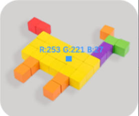

# Color Detection
<!-- 这是一张图片，ocr 内容为： -->

+ A rectangular region is displayed at the center of the screen. The module calculates the **average RGB values** of the pixels within this region.
+ The color shown on the screen represents the average RGB value of that area, making it convenient for standardized recognition.

Demonstration:

<!-- 这是一张图片，ocr 内容为： -->

