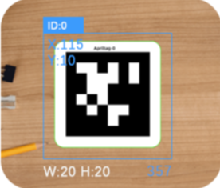
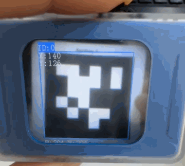

# AprilTag Recognition
<!-- 这是一张图片，ocr 内容为： -->

+ Supports recognition of AprilTag formats** TAG36H11 **and **TAG16H5.**
+ When the camera is aligned with a tag, the screen will automatically highlight it with a bounding box and display: x, y (coordinates); w, h (width and height); Tag ID value; Rotation angle (0–359°)

Demonstration:

<!-- 这是一张图片，ocr 内容为： -->

