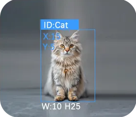

# 20-Class Object Recognition
<!-- 这是一张图片，ocr 内容为： -->

+ Supports recognition of the following 20 common objects:

> Airplane, Bicycle, Bird, Boat, Bottle, Bus, Car, Cat, Chair, Cow, Dining Table, Dog, House, Motorcycle, Person, Potted Plant, Sheep, Sofa, Train, TV Monitor
>

+ When the sensor is aimed at one of the listed objects, the recognition result will be displayed on the screen with a bounding box and the corresponding object name.
+ Supports recognition of up to** 4 target objects** simultaneously.

Demonstration:

<!-- 这是一张图片，ocr 内容为： -->

