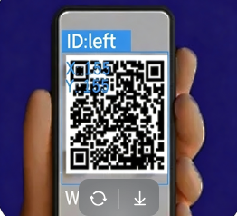
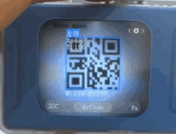

# QR Code Recognition
<!-- 这是一张图片，ocr 内容为： -->

+ Supports recognition of standard square QR codes composed of black and white blocks.
+ Only one QR code can be recognized at a time.
+ When the camera is aligned with a QR code, the screen will highlight it with a bounding box and display: the decoded content, The QR code' s x, y coordinates, width, and height.

Demonstration:

<!-- 这是一张图片，ocr 内容为： -->

