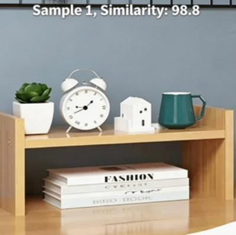

# Deep Learning
<!-- 这是一张图片，ocr 内容为： -->

+ Supports learning of up to **2 target categories**, with** 2 images** required per category.
+ Press the button to start learning the current category. The current category number will be displayed in the top left corner, and the number of images taken will be shown in the top right corner.
+ If no further button presses are made within 5 seconds after learning category 0, the system will automatically switch to recognition mode.
+ After reaching the maximum number of categories for learning, either a 5-second wait or pressing the button will also switch to recognition mode.  
+ Once in recognition mode, **the function mode cannot be switched.** A prompt will appear, asking to reset the learning first. To reset the learning data, long press the button and select "Confirm" in the popup window.  
+ The deep learning data will not be saved after power-off, and the learning process needs to be repeated upon the next power-up.

Demonstration:

<!-- 这是一张图片，ocr 内容为： -->

