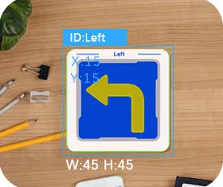
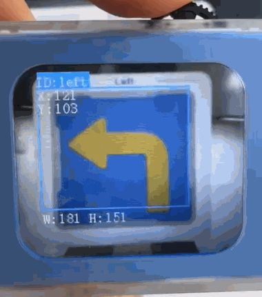

# Card Road Sign Recognition
<!-- 这是一张图片，ocr 内容为： -->

+ Supports recognition of the following 6 traffic-related signs:

> Green Light, Left Turn, Stop, Red Light, Right Turn, Horn, Target
>

+ When the camera is aimed at a traffic sign card, the module will automatically highlight it with a bounding box and display the corresponding name on the screen.

Demonstration:

<!-- 这是一张图片，ocr 内容为： -->

