# AI Chat
## User Guide  
1. **Startup:**

After powering on the sensor, select "Dialogue Mode" using the dial button and enter. Before using Dialogue Mode for the first time, you need to complete network configuration. Please refer to the "Connecting and Configuring Network" section below for detailed instructions.  

2. **Interface Explanation for Dialogue Mode States  **

**（1）Network Configuration  **

The following image shows the sensor during the network configuration state.

<!-- 这是一张图片，ocr 内容为： -->
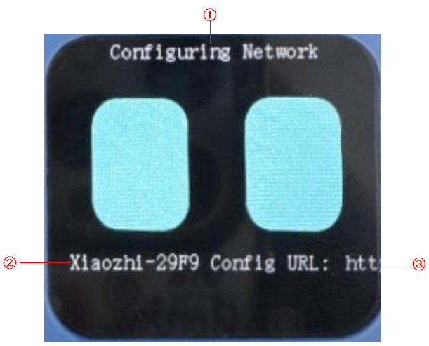

| No. | ** Name** | ** Description** |
| :---: | :---: | :---: |
| ① |  Configuring Network   |  Displays that the sensor is in network configuration state. |
| ② |  Connecting to Hotspot |  Displays the hotspot the sensor is trying to connect to. |
| ③ |  Browser Access | After connecting to the hotspot, the browser will automatically open this page. If it doesn't, visit “http://192.168.4.1” manually.   |

**（2）Connecting**

The following image shows the vision sensor during the connecting state.

<!-- 这是一张图片，ocr 内容为： -->
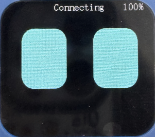

**（3）Standby**

The following image shows the vision sensor in standby mode.  

<!-- 这是一张图片，ocr 内容为： -->
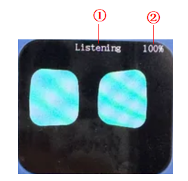

| No. | ** Name** | ** Description** |
| :---: | :---: | :---: |
| ① |  Standby |  Displays that the vision sensor is in standby mode.   |
| ② |  Volume |  Displays the volume, which can be adjusted by rotating the dial button left or right, or through interaction with XiaoZhi. |

**（4）Listening  **

The following image shows the vision sensor in listening mode.  

<!-- 这是一张图片，ocr 内容为： -->
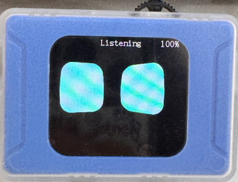

**（5）Speaking  **

The following image shows the vision sensor in speaking mode.  

<!-- 这是一张图片，ocr 内容为： -->
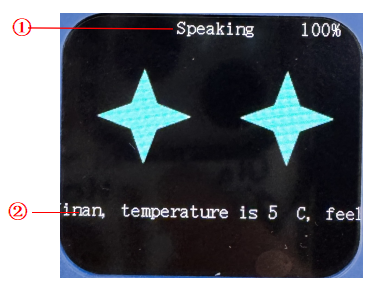

| No. | ** Name** | ** Description** |
| :---: | :---: | :---: |
| ① |  Speaking |  Displays that the K210 module is in answering mode. |
| ② |  Dialogue Box | Displays the conversation information. |

## Function Introduction  
### Command Control  
#### Definition  
XiaoZhi supports voice control, including control of switch connections, backlight brightness adjustment, enabling/disabling tag and road sign recognition, setting custom command words, and controlling modules such as motors.

####  Command Description  
|  Category |  Description |
| :---: | :---: |
| Device Control | Turn on/off fill light Turn on/off backlight Adjust brightness to () Adjust volume to () |
| Vision Recognition |  Enable/Disable Apriltag recognition  Enable/Disable card road sign recognition    |
|  Custom Commands   |  Set custom command () to ()    Execute custom command ()   |
|  Extended Control |  Forward, backward, left turn, right turn, start, stop  |

#### Custom Command Setup Steps
 Example:

+  Step 1: Wake up the AI Vision Sensor by saying "Hello XiaoZhi."  
+  Step 2: Set the custom command by saying, "Set custom command (1) to (forward)."  
K210 replies: "Custom command 1 set to forward." (Indicating successful setup) 
+  Step 3: Execute the custom command by saying, "Execute custom command 1."  
K210 replies: "Executed custom command 1." (K210 sends data to the corresponding port). 

### Voice Interaction  
#### Definition  
The AI Vision Sensor supports single-turn, continuous conversation, and contextual understanding, allowing interaction based on image recognition.  

####  Command Description  
|  Category |  Description |
| :---: | :---: |
|  Device Status |  Check current device status (Wi-Fi strength/volume level)  |
|  Vision |  "Look at what's in front"   |
|  Free Q&A |  Weather/time/culture/geography/music...   |

#### Usage Steps  
+ After powering on the module, select AI Chat Mode.
+ In AI Chat Mode, the sensor will automatically attempt to connect to the network. If the network is not yet configured, please refer to the "Network Configuration" section below.
+ After the network is connected, issue the "Hello XiaoZhi" command or press the dial button to start the dialogue interaction.  
**Note**: By default, the module will enter single-turn dialogue mode after powering on. To switch between single-turn and continuous dialogue modes, use the command: “Switch to (continuous/single) dialogue mode.”

## Connecting and Configuring Network  
### **Important! Please read before operating!**
First-time use requires registration with a phone number, otherwise you won't be able to enter.

 **Recommendations:**

**Step 1: **Register an account in the backend, and wait for the verification code screen. For detailed steps, refer to the "**Backend Registration**" section below.

**Step 2:** Switch the AI vision snesor to AI Chat mode and wait for the sensor to broadcast the verification code. For detailed steps, refer to the "Network Configuration" section.  

**Step 3: **Enter the broadcasted verification code in the backend for device connection.

### Network Configuration Steps  
| <!-- 这是一张图片，ocr 内容为： -->
 | <!-- 这是一张图片，ocr 内容为： -->
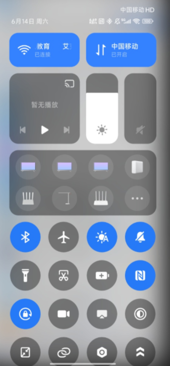 |
| --- | --- |
| **Step 1:**   Switch the AI vision sensor to AI Chat Mode. The interface will change to “Configuring Network” and display “Connecting to hotspot Xiaozhi-XXXX, browser access http://192.168.4.1.” At the same time, the sensor will announce “Entering network configuration mode.”   | **Step 2:**   Open your phone settings and turn on Wi-Fi.   |
| <!-- 这是一张图片，ocr 内容为： -->
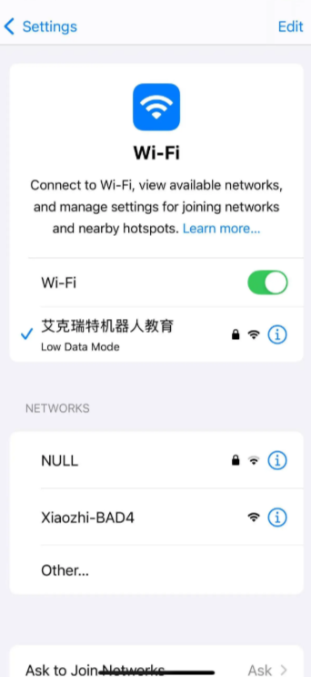 | <!-- 这是一张图片，ocr 内容为： -->
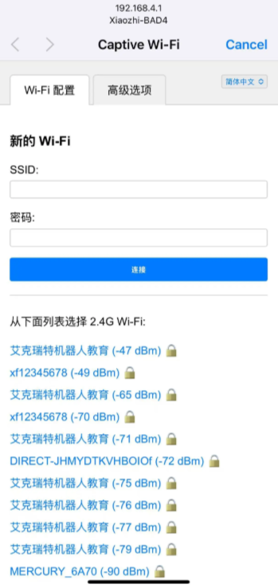 |
| **Step 3:**   Select and connect to "XiaoZhi-XXXX" (device ID from Step 1).   | **Step 4:**   After completing Step 3, your phone will automatically redirect to the network configuration page. If it doesn't, please refer to Step 5.   |
| <!-- 这是一张图片，ocr 内容为： -->
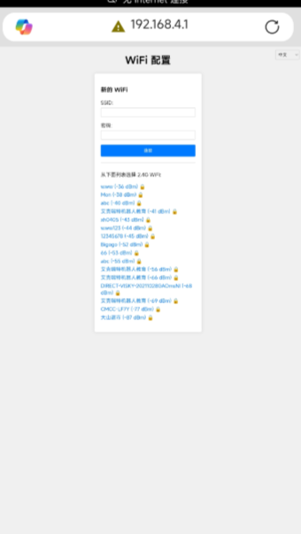 | <!-- 这是一张图片，ocr 内容为： -->
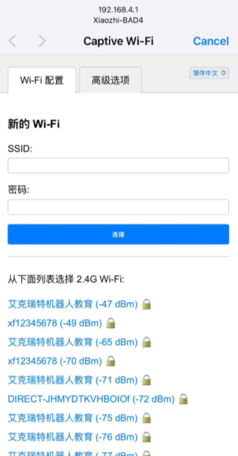 |
| **Step 5:**   If your phone doesn't automatically redirect, open a browser and enter [http://192.168.4.1](http://192.168.4.1) to access the network configuration page.   | **Step 6:**   From the blue section, select the available Wi-Fi network (SSID) around you and fill in the password.   Alternatively, you can manually enter the Wi-Fi network name (SSID) and password to connect.   |
| <!-- 这是一张图片，ocr 内容为： -->
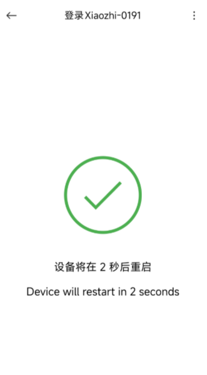 | <!-- 这是一张图片，ocr 内容为： -->
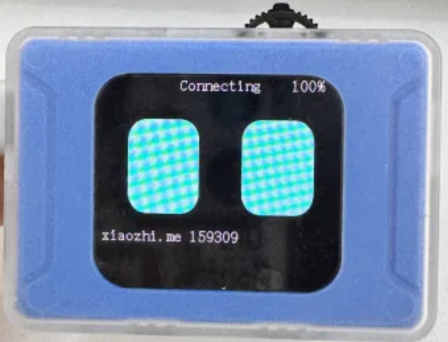 |
| **Step 7:**   After entering the Wi-Fi name and password, click "Connect." After successful connection, the page will redirect, please wait patiently.   | **Step 8:**   The Visual Module interface will show a six-digit verification code. The module will also announce “Please log into the control panel, add the device, and enter the verification code XXXXXX.”   While announcing, the module's interface will display the six-digit verification code.   |

### Backend Registration  
| <!-- 这是一张图片，ocr 内容为： -->
 | <!-- 这是一张图片，ocr 内容为： -->
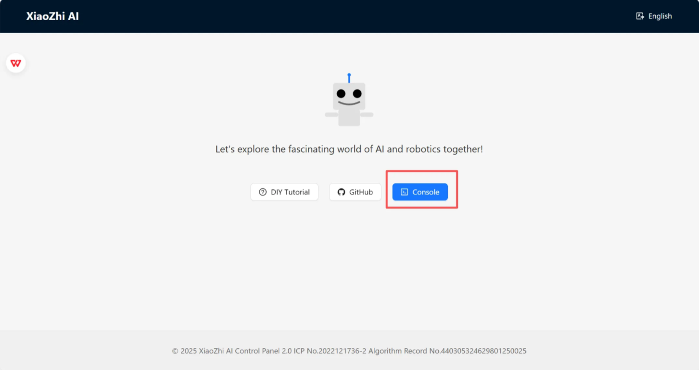 |
| --- | --- |
| Step 1: Open the website in a browser. Register by entering your phone number and verification code. (If you already have an account, skip this step.)    | Step 2:  Click the website link: [https://xiaozhi.me/](https://xiaozhi.me/) to enter the control panel.      |
| <!-- 这是一张图片，ocr 内容为： -->
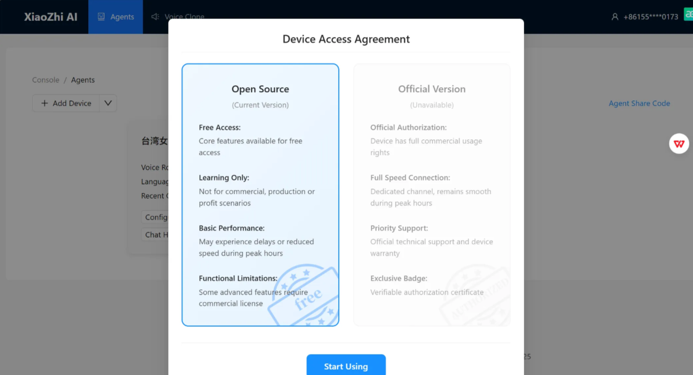 | <!-- 这是一张图片，ocr 内容为： -->
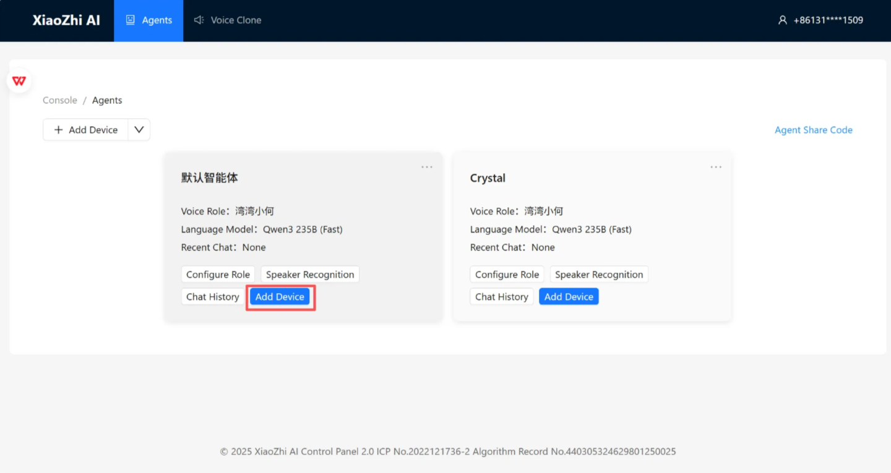 |
| **Step 3:**   In the control panel, select the open-source version.   | **Step4:**   Click "Add Device."   |
| <!-- 这是一张图片，ocr 内容为： -->
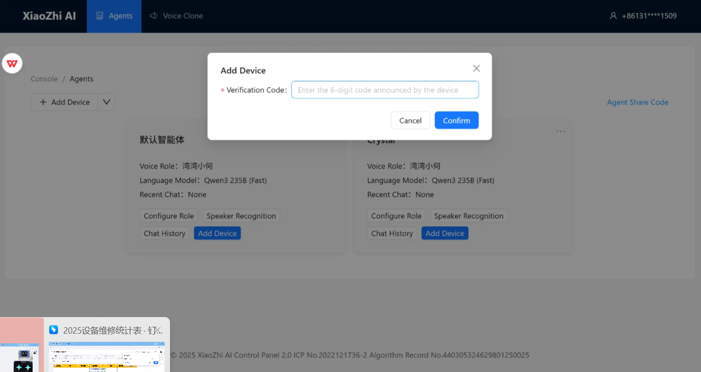 | <!-- 这是一张图片，ocr 内容为： -->
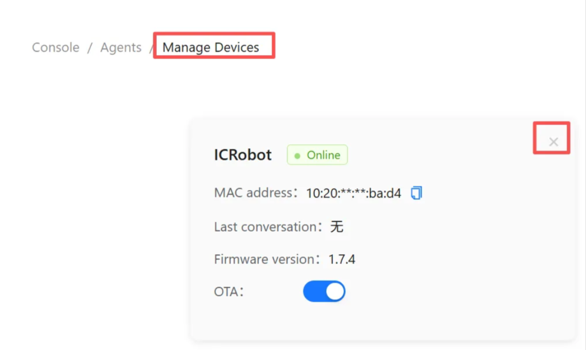 |
| **Step 5:**   Enter the six-digit verification code broadcasted by the module and click "Confirm."   | **Step 6:**   This screen will appear, indicating the device has been successfully configured. After this configuration, next time you power on, the device will be ready for use without needing to configure again.  **Note:**   If the device has already been bound to a user and you wish to change the bound user, first delete the device from the existing user account.   |

