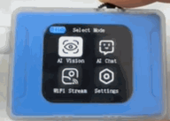
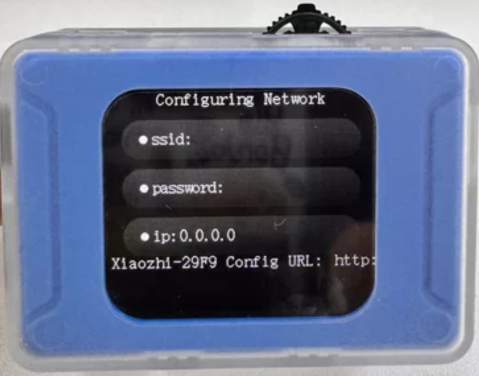
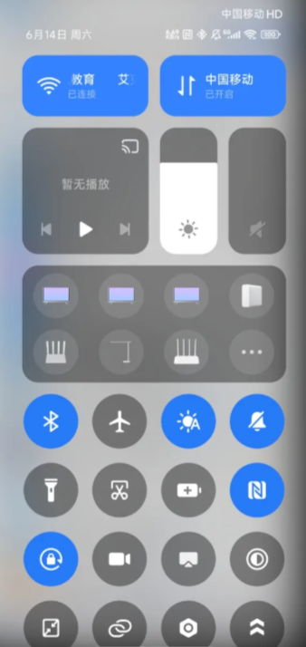
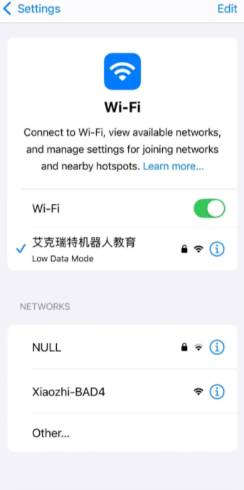
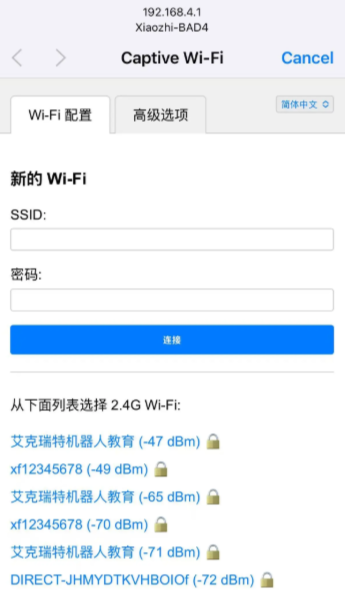
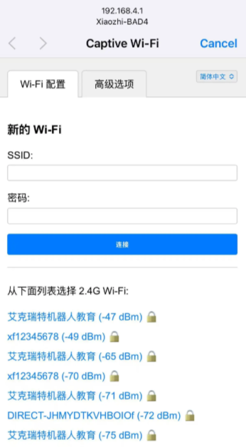
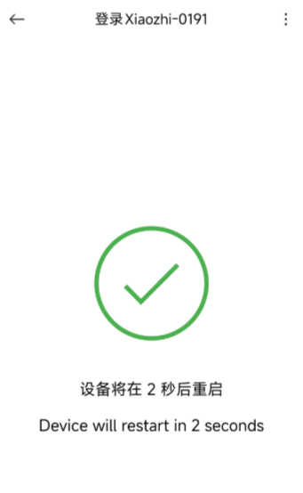
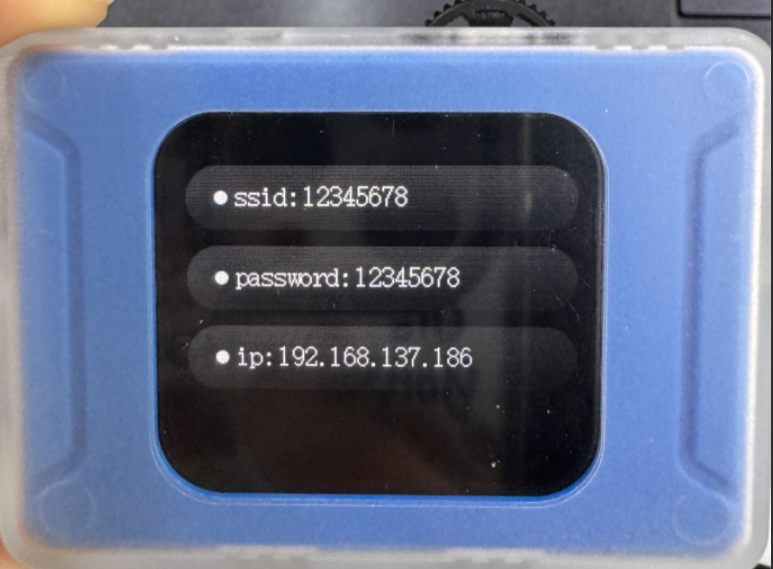
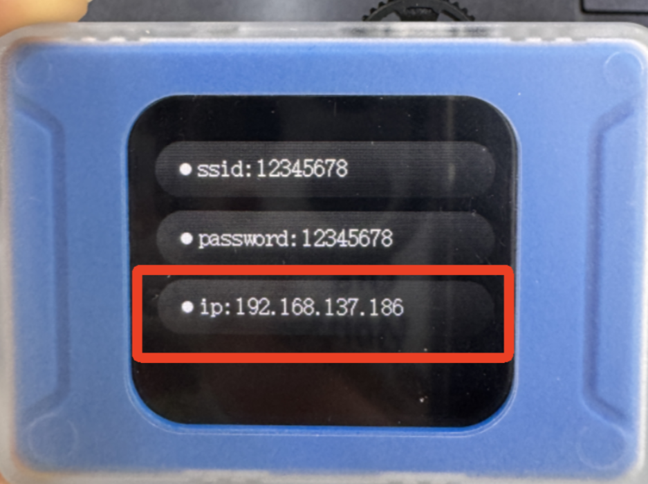
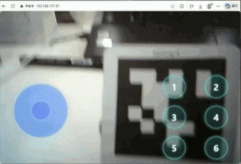

# WiFi Stream
Before use, ensure you have a 2.4GHz Wi-Fi network. Then, select the Wi-Fi video transmission mode on the AI Vision Sensor using the dial button.  

## Preparation  
**The network configuration needs to be set up for first-time use; if the network has already been configured through AI Chat Mode, this step does not need to be repeated.  **

### Steps
| <!-- 这是一张图片，ocr 内容为： -->
 | <!-- 这是一张图片，ocr 内容为： -->
 |
| --- | --- |
| **Step 1:**   The visual module enters Wi-Fi Stream mode, with a voice prompt indicating "Entering network configuration mode." The title bar at the top of the interface displays "Configuring Network."   | **Step 2:**   A scrolling text on the screen shows "Device connecting to hotspot Xiaozhi-XXXX, visit [http://192.168.4.1](http://192.168.4.1) in your browser."   |
| <!-- 这是一张图片，ocr 内容为： -->
 | <!-- 这是一张图片，ocr 内容为： -->
 |
| **Step 3:**   Open your phone's settings and select Wi-Fi.   | **Step 4:**   Find and select "XiaoZhi-XXXX" from the Wi-Fi list (device ID is referenced in Step 2).   |
| <!-- 这是一张图片，ocr 内容为： -->
 | <!-- 这是一张图片，ocr 内容为： -->
 |
| **Step 5:**   After completing Step 4, your phone will automatically redirect to the network configuration page.   If the redirect doesn't happen, proceed to Step 6.   | **Step 6:**   If your phone doesn't automatically redirect to the configuration page, open a browser and enter [**http://192.168.4.1**](http://192.168.4.1) to access the network configuration page.   |
| <!-- 这是一张图片，ocr 内容为： -->
 | <!-- 这是一张图片，ocr 内容为： -->
 |
| **Step 7:** From the blue area below, select the available Wi-Fi network name (SSID) around you and enter the password. You can also manually enter the Wi-Fi network name (SSID) and password to connect to the network. | **Step 8:**   After filling in the Wi-Fi name and password, click "Connect." Once connected, the page will redirect to the configuration page.   |
| <!-- 这是一张图片，ocr 内容为： -->
 |  |
| **Step 9:**   Once Step 8 is completed, the visual module's interface will switch from the "Configuring Network" screen to a screen displaying the connected network name, password, and IP address, indicating successful network configuration.   |  |

******Note:****  
****If the device has already been configured with a network but you wish to clear the current configuration to connect to another network, you can reconfigure the network.  **

### **Reconfigure Network Operation  **
**Step 1:**  
When the module is already connected to a network, long-press the dial button to reset. After the reset is successful, the module will announce "Entering network configuration mode," and the interface will display "Configuring Network," as shown in the following image.  

<!-- 这是一张图片，ocr 内容为： -->

**Step 2:**  
Repeat the network configuration steps mentioned above.  

## Image Transmission Access
To start the image stream transmission, access the IP address displayed on the module using a PC or mobile browser within the same local area network. Additionally, control commands can be sent via the joystick or buttons.  

| <!-- 这是一张图片，ocr 内容为： -->
 | <!-- 这是一张图片，ocr 内容为： -->
 |
| --- | --- |
| **Step 1:**   After completing the network configuration, find the IP address displayed on the module.   | **Step 2:**   Open a browser and enter the IP address in the address bar.   |
| <!-- 这是一张图片，ocr 内容为： -->
 |  |
| **Step 3:**   Start the image transmission. The content captured by the module will be displayed in real-time on the webpage.   |  |

