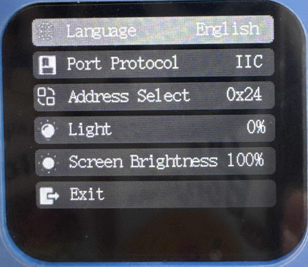

# Settings
## Settings Interface  
<!-- 这是一张图片，ocr 内容为： -->

The settings interface is used to configure the module's basic parameters, such as language, port protocols, and more.

When you first enter this interface, you need to press the button to activate the settings function.

By default, the language setting option is selected (highlighted), and you can switch to other settings (such as port protocols) by rotating the dial button left or right.

After making the desired changes, press the "Exit" button to save and exit.

_Note: Some settings require a restart to take effect, and the device will automatically reboot._

|  Settings Options   |  Description |
| :---: | --- |
|  Language | When this option is selected, press the button to switch between Chinese and English. |
|  Port Protocol | The communication protocol with the K210, which is influenced by the **Control Chip** option. Refer to the **Communication Protocol** section for more details. Press the button to set the protocol.   + ** Select the protocol for K210: ** IIC Protocol UART Protocol SPIKE Compatibility Mode + **ESP32 Mode**     -  Set the IIC protocol for K210 communication.       -  When set to SPIKE protocol, the device must be connected to a SPIKE device via an adapter board, otherwise the visual module will not function. Refer to the SPIKE Compatibility Mode documentation for more details.   |
| Address Select | Choose the IIC address for K210. Options are 0x24, 0x25, or 0x26. Press the button to set the address.   |
| Light | Used to configure the fill light at the back of the module.   **Status:** Turn On/Off the fill light. The light will only turn on when enabled. Otherwise, it remains off.   **Brightness:** Adjust the fill light brightness, range from 0% to 100%, with a step of 10%. It cannot be adjusted more finely.   **Return:** Exit fill light settings.   |
|  Screen Brightness | Set the screen brightness, range from 20% to 100%, with a step of 20%. It cannot be adjusted more finely.   |
|  Exit |  Save and exit the settings. After modifying the settings in the interface, you must click "Exit" to save the changes. The rules are as follows:   1.  For general settings (like language), changes are saved immediately without needing a reboot.   2.  For key parameters (like port protocol/address selection), if they differ from the initial values when entering the settings interface, the module will automatically reboot when exiting to apply the new configuration.   > **Note:** If you don't click "Exit" and just power off, the settings will be lost!    |

