# User Guide - EV3

## unction Block Description
<!-- 这是一张图片，ocr 内容为： -->
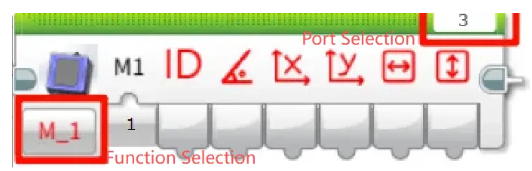

Before use, make sure that the port and function options are selected correctly.

###  Vision Mode  
#### Get Object ID and Coordinates
<!-- 这是一张图片，ocr 内容为： -->
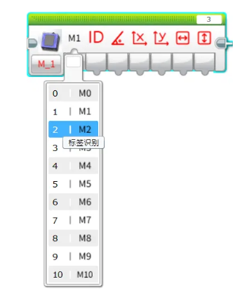

Retrieve the following parameters of the recognized object:

ID、Rotation angle、X, Y coordinates、Width and height

Note: Not all detected objects contain a full set of attributes. For attributes not applicable to a specific object, the corresponding field will return 0.

Example:

<!-- 这是一张图片，ocr 内容为： -->
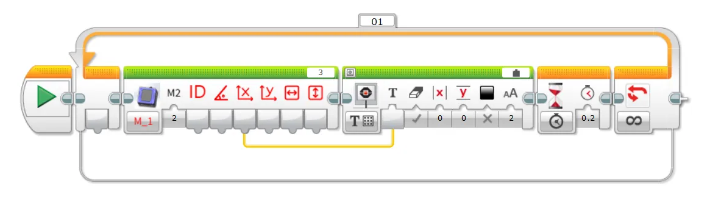

+ Connect the Vision Module to Port 3.
+ Manually switch to Tag Recognition Mode.
+ The EV3 screen will display the X coordinate of the recognized tag.

#### Set Working Mode
<!-- 这是一张图片，ocr 内容为： -->
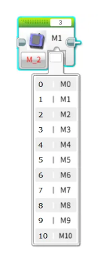

Configure the Vision Module to switch between different recognition modes automatically.

Example:

<!-- 这是一张图片，ocr 内容为： -->

Connect the Vision Module to Port 3 and run the program. The module will automatically switch between Color Recognition mode and Tag Recognition mode at 3-second intervals.

#### Get the Number of Recognized Objects
<!-- 这是一张图片，ocr 内容为： -->

Retrieve the number of objects detected by the Vision Module in the selected mode.

Example:

<!-- 这是一张图片，ocr 内容为： -->
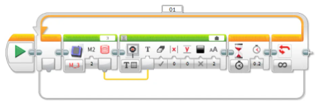

Connect the Vision Module to Port 3, manually switch to Tag Recognition mode, and run the program. The EV3 screen will display the number of recognized tags.

#### Get the RGB Values of a Color
<!-- 这是一张图片，ocr 内容为： -->
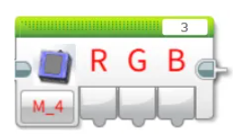

Retrieve the RGB values detected by the Vision Module in Color Recognition mode.

Example:

<!-- 这是一张图片，ocr 内容为： -->

Connect the Vision Module to Port 3, manually switch to Color Recognition mode, and run the program. The EV3 screen will display the detected R (Red) value of the color.

#### Get Face Attributes
<!-- 这是一张图片，ocr 内容为： -->

Retrieve whether the detected face has the following attributes: mouth open, smiling, or wearing glasses. The value is 1 if true, otherwise 0.

Example:

<!-- 这是一张图片，ocr 内容为： -->
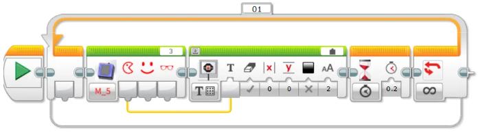

Connect the Vision Module to Port 3, manually switch to Face Attribute Recognition mode, and run the program.

When the module detects a face with an open mouth, the EV3 screen will display 1; otherwise, it will display 0.

#### Face Learning  
<!-- 这是一张图片，ocr 内容为： -->

Train the module to recognize the currently detected face.

Example:

<!-- 这是一张图片，ocr 内容为： -->
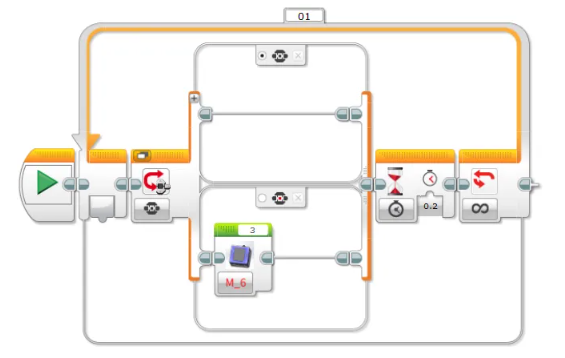

Connect the Vision Module to Port 3, manually switch to Face Recognition mode, and run the program.

When the Vision Module detects a face, press the center button on the EV3 controller to let the module learn and store the current face.

#### Set Target Color for Color Block Tracking
<!-- 这是一张图片，ocr 内容为： -->

Configure the Vision Module to track a specific color.

A total of 6 colors are available for selection.

Example:  

<!-- 这是一张图片，ocr 内容为： -->

+ Connect the Vision Module to Port 3, manually switch to Color Block Tracking mode, and run the program.
+ Press the left button on the EV3 controller to start tracking a red color block.
+ Press the right button to start tracking a green color block.

#### Set Fill Light Brightness
<!-- 这是一张图片，ocr 内容为： -->
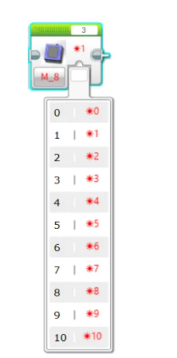

Adjust the brightness of the fill light.

There are 11 levels available, where 0 means off and 10 represents 100% brightness.

Example:

<!-- 这是一张图片，ocr 内容为： -->

Before operation, please ensure the fill light has been switched ON in the settings menu.

Connect the Vision Module to Port 3 and run the program:

Press the left button on the EV3 controller → the fill light turns on at 10% brightness.

Press the right button → the fill light turns on at 60% brightness.

#### Get Fill Light Brightness
<!-- 这是一张图片，ocr 内容为： -->
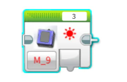

Retrieve the current brightness level of the fill light.

The brightness range is 0 to 10.

Example:

<!-- 这是一张图片，ocr 内容为： -->
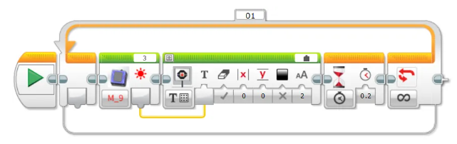

After connecting the Vision Module to Port 3 and running the program, the current brightness value of the fill light will be displayed in real time on the EV3 screen.

You can adjust the brightness through the settings menu.

The displayed value will update simultaneously, providing an intuitive reflection of the current brightness setting.

#### Set Fill Light State
<!-- 这是一张图片，ocr 内容为： -->
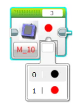

Set the ON/OFF state of the fill light.

Example:

<!-- 这是一张图片，ocr 内容为： -->
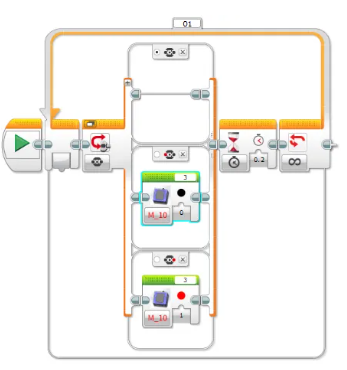

Before operation, make sure the fill light brightness is set to greater than 0 in the settings menu.

After connecting the Vision Module to Port 3 and running the program:

Press the left button on the EV3 controller to turn OFF the fill light.

Press the right button on the EV3 controller to turn ON the fill light again.

###  AI Conversation  
<!-- 这是一张图片，ocr 内容为：3 贝向 M 11 -->

Before first use, network configuration and registration of the AI recognition code with XiaoZhi are required. For detailed steps, refer to the Conversation Mode guide under Mode Selection.

#### Retrieve Conversation Status
<!-- 这是一张图片，ocr 内容为：01 3 因炎@ T X 0 T CO M 11 0.2 -->
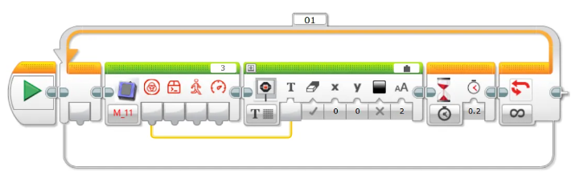

Display the AI conversation status on the screen. The status values are:

0: AI not started    1: Connecting    2: Standby    3: Listening

4: Speaking    5: Configuring network

#### Retrieve Custom Commands  
<!-- 这是一张图片，ocr 内容为：01 . 0 0.2 M 11 -->

Display the executed custom command on the screen. For usage, refer to the description of custom commands in the Conversation Mode section under Mode Selection.

#### Retrieve Movement Commands
<!-- 这是一张图片，ocr 内容为：01 因员向 T O 0.2 M_11 CO -->

Use voice commands to control forward, backward, left turn, and right turn movements, and display the corresponding command number on the screen.

Movement command values:  1: Forward    2: Backward    3: Left Turn    4: Right Turn     5: Stop

#### Retrieve Movement Speed
<!-- 这是一张图片，ocr 内容为：01 WHHHIN 0 0.2 M_11 S -->

Use voice commands to control movement and display the movement speed on the screen.

Movement speed range: 0 ~ 100

### WiFi Image Transmission
<!-- 这是一张图片，ocr 内容为：图 M 12 -->

Before first use, the device needs to be configured for network access. For detailed steps, refer to the WiFi Image Transmission guide under Mode Selection.

#### Retrieve Webpage Button Values
<!-- 这是一张图片，ocr 内容为： -->

Retrieve the value of buttons pressed on the webpage and display it on the screen. The value is returned as a single byte, with each button corresponding to a bit in the byte as follows: `0012 3456`. When a button is pressed, its corresponding bit is set to 1.  

####  Retrieve Keyboard Key Values  
<!-- 这是一张图片，ocr 内容为： -->

Retrieve the state of the WASD keys on the keyboard and display it on the screen. The value is returned as a single byte, with each key corresponding to a bit in the byte as follows: `0000 wasd`. When a key is pressed, its corresponding bit is set to 1.  

####  Retrieve Webpage Joystick Values  
<!-- 这是一张图片，ocr 内容为： -->

Retrieve the X-axis value of the joystick and display it on the screen. The range is -100 to 100.  

<!-- 这是一张图片，ocr 内容为： -->
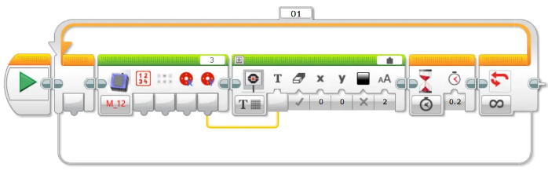

Retrieve the Y-axis value of the joystick and display it on the screen. The range is -100 to 100.

## Notes
Due to the I²C communication mechanism of EV3, in certain modes, if data is read immediately without an appropriate delay, the retrieved values may be inaccurate.

Therefore, when reading data in these modes, it is recommended to add a delay of about 0.2 seconds to ensure stable communication and obtain correct sensor values.

