# User Guide – Arduino
This guide uses the ESP32 development board as an example.  

## Usage Notes  
+ AprilTag generation (Tag Recognition)

You can generate tags using an online [AprilTag generator](https://chaitanyantr.github.io/apriltag.html).

Set Tag Family to`TAG36H11` (this is the family used by the Vision Module).

Set Tag ID as needed (typical range: 0–200).

Print the generated tag and ensure good lighting and focus during testing.

+ QR code generation (QR Code Recognition)

Use any standard QR code generator [website](https://cli.im/) or tool.

Enter the text/content to be encoded and click Generate.

Ensure sufficient print quality and size so the module can decode reliably.

## Class: AiCamera
The AiCamera class is the fundamental object used to operate the AI Vision Module.

### Constructor
```cpp
class AiCamera(uint8_t addr=0x24)
```

Create an AI camera object.

+ `addr` sets the device address. The AI Vision Module supports three optional addresses: `0x24`, `0x25`, and `0x26`. 
+  The default value of `addr` is `0x24`.

### Parameter Macros
```cpp
enum Register
{
    AI_CAMERA_COLOR,            // Color detection
    AI_CAMERA_PATCH,            // Color block tracking
    AI_CAMERA_TAG,              // Label recognition
    AI_CAMERA_LINE,             // Line recognition
    AI_CAMERA_20_CLASS,         // 20-class object recognition
    AI_CAMERA_QRCODE,           // QR code recognition
    AI_CAMERA_FACE_ATTRIBUTE,   // Face attributes
    AI_CAMERA_FACE_RE,          // Face recognition
    AI_CAMERA_DEEP_LEARN,       // Deep learning
    AI_CAMERA_CARD,             // Card recognition
    AI_CAMERA_WIFI_SERVER,      // WiFi image transmission
};
enum Color
{
    AI_CAMERA_COLOR_RED,     // Red
    AI_CAMERA_COLOR_GREEN,   // Green
    AI_CAMERA_COLOR_BLUE,    // Blue
    AI_CAMERA_COLOR_YELLOW,  // Yellow
    AI_CAMERA_COLOR_BLACK,   // Black
    AI_CAMERA_COLOR_WHITE,   // White
};
```

+ These macros are used when switching modes, reading/writing data in a specific mode, and configuring color settings of the Vision Module.

### Functions  
#### Initialization  
###### Init
+ Init(TwoWire *wire) 

Initialization Function

**Parameters:**

+ `wire` – Pointer to the I²C object

**Example Usage:**

```cpp
#include <Arduino.h>   
#include "ai_camera.h" 

AiCamera ai_camrea_handle;

void setup()
{
    Wire.begin();       
    ai_camrea_handle.Init(&Wire);
}

void loop()
{
}
```

###### begin
+ begin(TwoWire *wire)

> ##### Use the same `Init` function to maintain consistency with the Arduino coding style.  

#### Vision Mode  
##### Operating Modes  
###### set_sys_mode
+ set_sys_mode(uint8_t mode)

Set the operating mode of the AI Vision Module.

**Parameter:**

+ `mode` – Operating mode
    - Refer to the predefined mode macros (e.g., `AI_CAMERA_COLOR`, `AI_CAMERA_TAG`, etc.)

**Example Usage:**

```cpp
#include <Arduino.h>   
#include "ai_camera.h" 

AiCamera ai_camrea_handle;

void setup()
{
    Wire.begin();          
    ai_camrea_handle.Init(&Wire); 
    ai_camrea_handle.set_sys_mode(AI_CAMERA_QRCODE); 
}

void loop()
{
}
```

<!-- 这是一张图片，ocr 内容为： -->
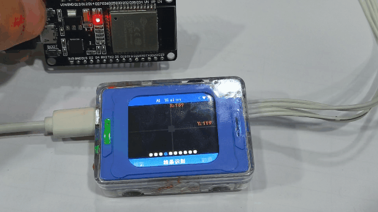

After uploading the code to the development board and resetting the chip, the operating mode of the Vision Module switches from Line Recognition mode to QR Code Recognition mode.

###### get_sys_mode
+ get_sys_mode()

Get the device's current working mode

**Return value:**

AI_CAMERA_COLOR ~ AI_CAMERA_CARD

> Use parameter macros to compare which type is returned  
>

**Example Usage:**

```cpp
#include <Arduino.h>   
#include "ai_camera.h" 

AiCamera ai_camrea_handle;

void setup()
{
    Serial.begin(115200);      
    Wire.begin();          
    ai_camrea_handle.Init(&Wire)
}

void loop()
{
    int get_mode = ai_camrea_handle.get_sys_mode(); 
    if (get_mode == AI_CAMERA_TAG)
    {
        Serial.println("In label recognition mode");
    }
    else if (get_mode == AI_CAMERA_FACE_ATTRIBUTE)
    {
        Serial.println("In face detection mode");
    }
    else
    {
        Serial.println("Other modes");
    }
    delay(400);
}
```

##### Color recognition  
###### get_color_rgb
+ get_color_rgb(int rgb[3])

 Get the RGB values for color recognition (array type)  

**Parameter ：**

+  `rgb[3]` –  int type, an RGB buffer of size 3 

**Example Usage:**

```cpp
#include <Arduino.h>  
#include "ai_camera.h" 

AiCamera ai_camrea_handle;

void setup()
{
    Serial.begin(115200);    
    Wire.begin();         
    ai_camrea_handle.Init(&Wire); 
    ai_camrea_handle.set_sys_mode(AI_CAMERA_COLOR); 
    delay(1000);                
}

void loop()
{
    int rgb[3] = {0}; 
    ai_camrea_handle.get_color_rgb(rgb); 
    Serial.print("rgb:(");
    Serial.print(rgb[0]);
    Serial.print(" ");
    Serial.print(rgb[1]);
    Serial.print(" ");
    Serial.print(rgb[2]);
    Serial.println(")");

    delay(400);
}
```

<!-- 这是一张图片，ocr 内容为： -->
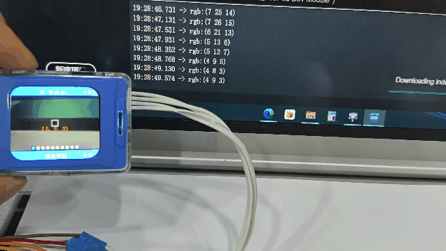

There is a white box at the center of the vision module, which is the color extraction area. Below the white box, the extracted RGB values are displayed, and these values are consistent with those printed via the serial port.  

###### get_color_rgb
+ get_color_rgb(int &r, int &g, int &b)

Get the RGB values for color recognition

**Parameters:**

+ `r` – Red, int type reference
+ `g` – Green, int type reference
+ `b` – Blue, int type reference  

**Example Usage:**

```cpp
#include <Arduino.h>  
#include "ai_camera.h" 

AiCamera ai_camrea_handle;


void setup()
{
    Serial.begin(115200);    
    Wire.begin();        
    ai_camrea_handle.Init(&Wire); 
    ai_camrea_handle.set_sys_mode(AI_CAMERA_COLOR); 
    delay(1000);                 
}

void loop()
{
    int r, g, b;  
    ai_camrea_handle.get_color_rgb(r, g, b); 
    Serial.print("rgb:(");
    Serial.print(r);
    Serial.print(" ");
    Serial.print(g);
    Serial.print(" ");
    Serial.print(b);
    Serial.println(")");

    delay(400);
}
```

> Refer to the previous function with the same name for usage.
>

##### Color block tracking  
###### set_find_color
+ set_find_color(uint8_t color_id)

Set the color for color block tracking  

**Parameter：**

+ `color_id` – The color to track  
    - AI_CAMERA_COLOR_RED,     		// Red
    - AI_CAMERA_COLOR_GREEN,   	// Green
    - AI_CAMERA_COLOR_BLUE,    		// Blue
    - AI_CAMERA_COLOR_YELLOW,  	// Yellow
    - AI_CAMERA_COLOR_BLACK,   	// Black
    - AI_CAMERA_COLOR_WHITE,   	// White

**Example Usage:**

```cpp
#include <Arduino.h>   
#include "ai_camera.h" 

AiCamera ai_camrea_handle;


void setup()
{
    Serial.begin(115200);      
    Wire.begin();       
    ai_camrea_handle.Init(&Wire); 
    ai_camrea_handle.set_sys_mode(AI_CAMERA_BLOB); 
    delay(1000);                 
    ai_camrea_handle.set_find_color(AI_CAMERA_COLOR_GREEN);
}

void loop()
{
}
```

<!-- 这是一张图片，ocr 内容为： -->
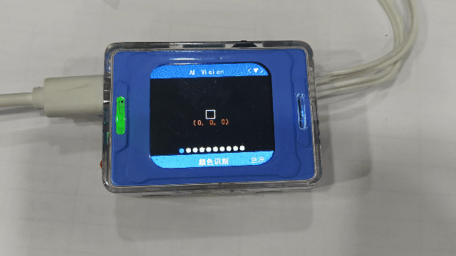

After uploading the code to the development board and resetting the chip, the vision module switches from color recognition mode to color block tracking mode, and the top-right corner indicates that the tracked color is green.  

###### get_identify_num
+ get_identify_num(uint8_t features, uint8_t total=0)

Get whether a color is detected  

**Parameter  ：**

+ `features` –  Function selection  
    - AI_CAMERA_PATCH   # Color block tracking  
+ `total`–  Total number of detections  

> This parameter is invalid in color block tracking mode  
>

**Return value:  **

+ Returns 1 if detected, 0 if not detected  

**Usage example  ：**

```cpp
#include <Arduino.h>   
#include "ai_camera.h" 

AiCamera ai_camrea_handle;


void setup()
{
    Serial.begin(115200);    
    Wire.begin();        
    ai_camrea_handle.Init(&Wire);

    ai_camrea_handle.set_sys_mode(AI_CAMERA_PATCH); 
    delay(1000);                          
    ai_camrea_handle.set_find_color(AI_CAMERA_COLOR_GREEN);
}

void loop()
{
    if (ai_camrea_handle.get_identify_num(AI_CAMERA_PATCH) > 0)
    {
        Serial.println("find patch");
    }
    else
    {
        Serial.println("no find patch");
    }
    delay(400);
}
```

<!-- 这是一张图片，ocr 内容为： -->
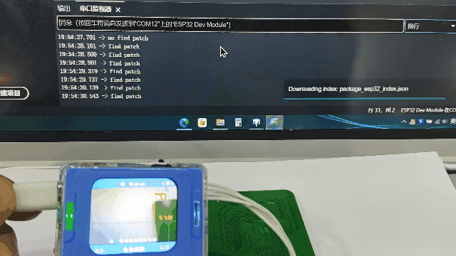

When the vision module detects a green object, it frames it and prints "find patch" to the serial port. When no green object is detected, it prints "no find patch" to the serial port.  

###### get_identify_id
+ get_identify_id(uint8_t features, uint8_t index=0)

Get the ID of the detected color  

**Parameter  ：**

+ `features` –  Function selection  
    - AI_CAMERA_PATCH             // Color block tracking  
+ `index` –  Which detected object  
    - Range 0~3, this parameter is meaningless in this mode  

**Return value  ：**

Detected ID  

> In `color block tracking mode`, IDs 1–6 represent Red, Green, Blue, Yellow, Black, and White, respectively; you can use the color macros in the AiCamera class to check. (The retrieved value is the set color ID, which can be obtained regardless of whether a color block is detected.)  
>

###### <font style="color:rgb(38, 38, 38);">get_identify_position</font>
+ <font style="color:rgb(38, 38, 38);">get_identify_position(uint8_t features, int16_t position[4], uint8_t index=0)</font>

<font style="color:rgb(38, 38, 38);"> Get the position of the detected color  </font>

**Parameters  :**

+ `<font style="color:rgb(38, 38, 38);">features</font>` – <font style="color:rgb(38, 38, 38);"> Function selection  </font>
    - <font style="color:rgb(38, 38, 38);">AI_CAMERA_PATCH            //  Color block tracking  </font>
+ `<font style="color:rgb(38, 38, 38);">position[4]</font>` – <font style="color:rgb(38, 38, 38);"></font>`<font style="color:rgb(38, 38, 38);">int16_t</font>`<font style="color:rgb(38, 38, 38);"> type, a position buffer of size 4  </font>
    - <font style="color:rgb(38, 38, 38);">The four values represent x, y, w, h  </font>
+ `<font style="color:rgb(38, 38, 38);">index</font>` – <font style="color:rgb(38, 38, 38);">Which detected object  </font>
    - <font style="color:rgb(38, 38, 38);">Default is 0  </font>

###### <font style="color:rgb(38, 38, 38);">get_identify_position</font>
+ get_identify_position(AI_CAMERA_REGISTER_t features, int &x, int &y, int &w, int &h, uint8_t index=0)

<font style="color:rgb(38, 38, 38);">Get the position of the detected color  </font>

**Parameters :**

+ `<font style="color:rgb(38, 38, 38);">features</font>` – <font style="color:rgb(38, 38, 38);"> Function selection  </font>
    - <font style="color:rgb(38, 38, 38);">AI_CAMERA_PATCH            //  Color block tracking </font>
+ `x` – int type reference    
+ `y` – int type reference  
+ `w` – int type reference  
+ `h` – int type reference  
+ `<font style="color:rgb(38, 38, 38);">index</font>` – <font style="color:rgb(38, 38, 38);">Which detected object  </font>
    - <font style="color:rgb(38, 38, 38);">Default is 0 </font>

##### Label recognition
###### get_identify_num
+ get_identify_num(uint8_t features, uint8_t total=0)

Get the number of detected labels  

**Parameter  ：**

+ `features` –  Function selection 
    - AI_CAMERA_TAG     # Label recognition  
+ `total`–  Total number of detections  

> This parameter is invalid in label recognition mode  
>

**Return value  ：**

+ Returns the number of detected labels.  

###### get_identify_id
+ get_identify_id(uint8_t features, uint8_t index=0)

Get the ID of the detected label  

**Parameter ：**

+ `features` –  Function selection 
    - AI_CAMERA_TAG                 // Label recognition 
+ `index` –  Which detected object  
    - Range 0~3, this parameter is meaningless in this mode  

**Return value  ：**

Detection ID  

> In `label recognition mode`, IDs 0~… represent the IDs assigned during label creation; they are the IDs that the labels themselves represent.  
>


**<font style="color:rgb(38, 38, 38);">Usage example: Check the detected label ID  </font>**

| 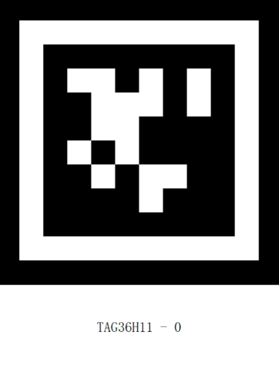 | | 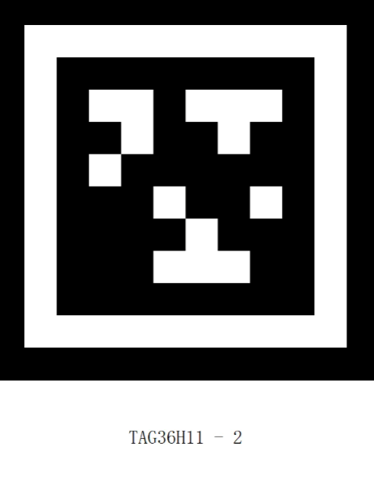 |
| --- | --- | --- |
| 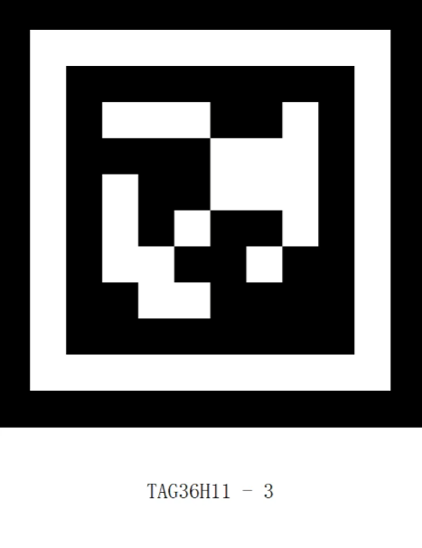 | 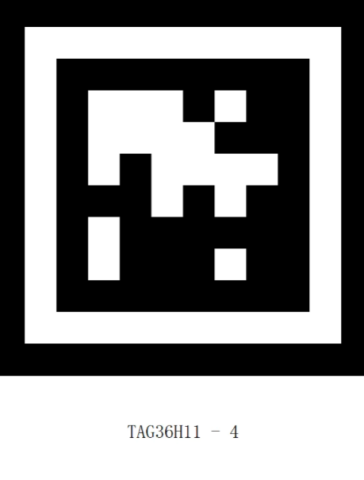 |  |
|  | 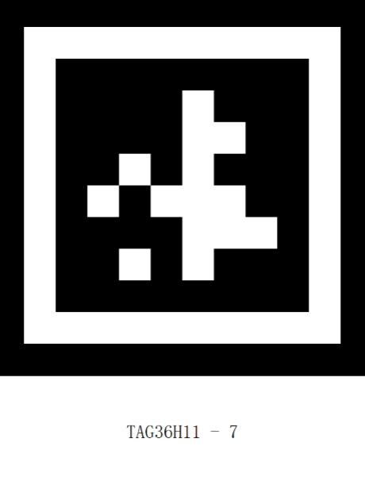 |  |


<font style="color:rgb(38, 38, 38);">Labels with IDs ranging from 0 to 8.</font>

```cpp
#include <Arduino.h>   
#include "ai_camera.h" 

AiCamera ai_camrea_handle;

void setup()
{
    Serial.begin(115200);   
    Wire.begin();         
    ai_camrea_handle.Init(&Wire);
    ai_camrea_handle.set_sys_mode(AI_CAMERA_TAG); 
    delay(1000);              
}

void loop()
{
    if (ai_camrea_handle.get_identify_num(AI_CAMERA_TAG) > 0)
    {
        int target_id = ai_camrea_handle.get_identify_id(AI_CAMERA_TAG);
        Serial.print("tag id: ");
        Serial.println(target_id);
    }
    else
    {
        Serial.println("no find tag");
    }
    delay(400);
}
```

<!-- 这是一张图片，ocr 内容为： -->
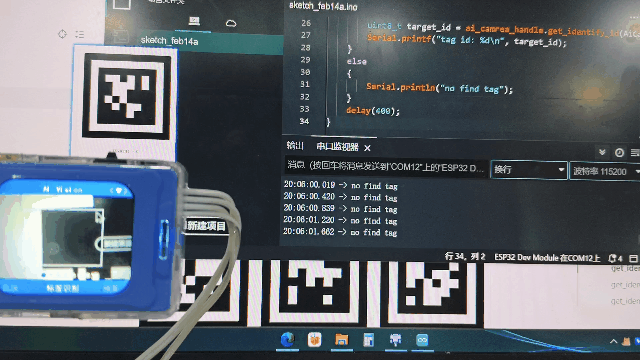

When the vision module does not detect a label, it prints "no find tag" to the serial port. When a label is detected, it prints the label's ID.  

###### <font style="color:rgb(38, 38, 38);">get_identify_rotation</font>
+ get_identify_rotation(uint8_t features, uint8_t index=0)

Get the rotation angle of the detected label

**Parameter ：**

+ `features` –  Function selection 
    - AI_CAMERA_TAG     #Label recognition 
+ index  Which detected object  
    - Default is 0. Usually 0 is sufficient; this parameter is reserved for future functionality expansion.  

**Return value  ：**

0~359


**<font style="color:rgb(38, 38, 38);">Usage example</font>****：**

<!-- 这是一张图片，ocr 内容为： -->
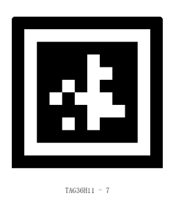

```cpp
#include <Arduino.h>   
#include "ai_camera.h" 

AiCamera ai_camrea_handle;

void setup()
{
    Serial.begin(115200);  
    Wire.begin();       
    ai_camrea_handle.Init(&Wire); 

    ai_camrea_handle.set_sys_mode(AI_CAMERA_TAG); 
    delay(1000);              
}

void loop()
{
    if (ai_camrea_handle.get_identify_num(AI_CAMERA_TAG) > 0)
    {
        int rot = ai_camrea_handle.get_identify_rotation(AI_CAMERA_TAG);
        Serial.print("rot: ");
        Serial.println(rot);
    }
    else
    {
        Serial.println("no find tag");
    }
    delay(400);
}
```

<!-- 这是一张图片，ocr 内容为： -->
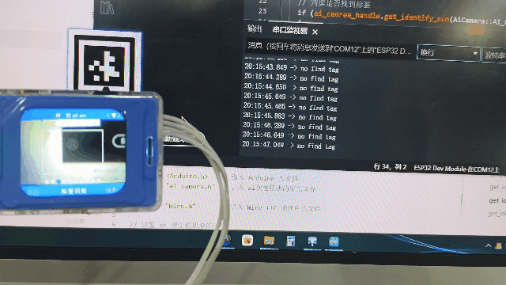

<font style="color:rgb(38, 38, 38);">When the vision module detects a label, rotate the vision module and the serial port prints the angle of the label relative to the vision module. If no label is detected, it prints "no find tag".  </font>

###### <font style="color:rgb(38, 38, 38);">get_identify_position</font>
+ <font style="color:rgb(38, 38, 38);">get_identify_position(uint8_t features, int16_t position[4], uint8_t index=0)</font>

<font style="color:rgb(38, 38, 38);">Get the position of the detected label  </font>

**Parameter :**

+ `features` –  Function selection 
    - <font style="color:rgb(38, 38, 38);">AI_CAMERA_TAG                // Label recognition </font>
+ `<font style="color:rgb(38, 38, 38);">position[4]</font>` – <font style="color:rgb(38, 38, 38);"></font>`<font style="color:rgb(38, 38, 38);">int16_t</font>`<font style="color:rgb(38, 38, 38);"> type, a position buffer of size 4  </font>
    - <font style="color:rgb(38, 38, 38);">The four values represent x, y, w, h  </font>
+ `<font style="color:rgb(38, 38, 38);">index</font>` – <font style="color:rgb(38, 38, 38);">Which detected object  </font>
    - <font style="color:rgb(38, 38, 38);">Default is 0  </font>

**<font style="color:rgb(38, 38, 38);">Usage example</font>：**

<!-- 这是一张图片，ocr 内容为： -->
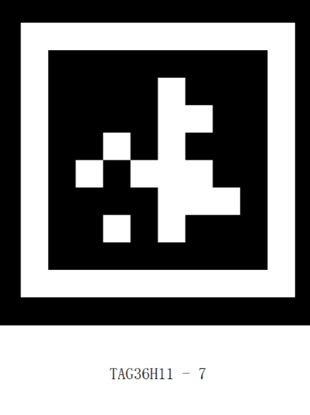

```cpp
#include <Arduino.h>   
#include "ai_camera.h" 

AiCamera ai_camrea_handle;

void setup()
{
    Serial.begin(115200);      
    Wire.begin();         
    ai_camrea_handle.Init(&Wire);

    ai_camrea_handle.set_sys_mode(AI_CAMERA_TAG); 
    delay(1000);             
}

void loop()
{
    if (ai_camrea_handle.get_identify_num(AI_CAMERA_TAG) > 0)
    {
 
        int position[4] = {0};
      
        ai_camrea_handle.get_identify_position(AI_CAMERA_TAG, position);
        Serial.print("x y w h:(");
        Serial.print(position[0]);
        Serial.print(" ");
        Serial.print(position[1]);
        Serial.print(" ");
        Serial.print(position[2]);
        Serial.print(" ");
        Serial.print(position[3]);
        Serial.println(")");
        
        
        int pos_x = position[0]; 
        if (pos_x > 170)
        {
            Serial.println("Position shifted to the right");
        }
        else
        {
            Serial.println("Position shifted to the left");
        }
    }
    else
    {
        Serial.println("no find tag");
    }
    delay(400);
}
```

###### <font style="color:rgb(38, 38, 38);">get_identify_position</font>
+ <font style="color:rgb(38, 38, 38);">get_identify_position(AI_CAMERA_REGISTER_t features, int &x, int &y, int &w, int &h, uint8_t index=0)</font>

<font style="color:rgb(38, 38, 38);">Get the position of the detected label  </font>

**Parameter :**

+ `<font style="color:rgb(38, 38, 38);">features</font>`<font style="color:rgb(38, 38, 38);"> –  Function selection</font>
    - <font style="color:rgb(38, 38, 38);">AI_CAMERA_TAG                // Label recognition </font>
+ `x` – int type reference    
+ `y` – int type reference  
+ `w` – int type reference  
+ `h` – int type reference  
+ `<font style="color:rgb(38, 38, 38);">index</font>` – <font style="color:rgb(38, 38, 38);">Which detected object  </font>
    - <font style="color:rgb(38, 38, 38);">Default is 0 </font>

##### Line recognition
###### get_identify_num
+ get_identify_num(uint8_t features, uint8_t total=0)

Get whether a line is detected

**Parameter ：**

+ `features` –  Function selection 
    - AI_CAMERA_LINE    #  Line recognition  
+ `total`–  Total number of detections  

> This parameter is invalid in line recognition mode
>

**Return value:  **

+ Returns 1 if detected, 0 if not detected  

###### <font style="color:rgb(38, 38, 38);">get_identify_position</font>
+ <font style="color:rgb(38, 38, 38);">get_identify_position(uint8_t features, int16_t position[4], uint8_t index=0)</font>

<font style="color:rgb(38, 38, 38);">Get the position of the detected line</font>

**Parameter :**

+ `features` –  Function selection 
    - <font style="color:rgb(38, 38, 38);">AI_CAMERA_LINE               //  Line recognition  </font>
+ `<font style="color:rgb(38, 38, 38);">position[4]</font>` – <font style="color:rgb(38, 38, 38);"></font>`<font style="color:rgb(38, 38, 38);">int16_t</font>`<font style="color:rgb(38, 38, 38);"> type, a position buffer of size 4  </font>
    - <font style="color:rgb(38, 38, 38);">The four values represent x, y, w, h  </font>
+ `<font style="color:rgb(38, 38, 38);">index</font>` – <font style="color:rgb(38, 38, 38);">Which detected object  </font>
    - <font style="color:rgb(38, 38, 38);">Default is 0  </font>

> In` line recognition`, there are three rectangular boxes; from bottom to top, the indices are 0, 1, and 2.
>

###### <font style="color:rgb(38, 38, 38);">get_identify_position</font>
+ get_identify_position(AI_CAMERA_REGISTER_t features, int &x, int &y, int &w, int &h, uint8_t index=0)

<font style="color:rgb(38, 38, 38);">Get the position of the detected line</font>

**Parameter :**

+ `features` –  Function selection 
    - <font style="color:rgb(38, 38, 38);">AI_CAMERA_LINE               //  Line recognition  </font>
+ `x` – int type reference    
+ `y` – int type reference  
+ `w` – int type reference  
+ `h` – int type reference  
+ `<font style="color:rgb(38, 38, 38);">index</font>` – <font style="color:rgb(38, 38, 38);">Which detected object  </font>
    - <font style="color:rgb(38, 38, 38);">Default is 0 </font>

> `<font style="color:rgb(38, 38, 38);">线条识别</font>`<font style="color:rgb(38, 38, 38);">有三个矩形框，从下到上，index依次为0，1，2</font>
>

##### 20-class object recognition
###### get_identify_num
+ get_identify_num(uint8_t features, uint8_t total=0)

Get the number of detected 20-class objects

**Parameter：**

+ `features` –  Function selection 
    - AI_CAMERA_20_CLASS# 20-class object recognition
+ `total`–  Total number of detections  

> This parameter is invalid in 20-class object recognition mode
>

**Return value  ：**

+ Returns the number of detected labels.  

###### get_identify_id
+ get_identify_id(uint8_t features, uint8_t index=0)

Get the ID of the detected 20-class object

**Parameter：**

+ `features` –  Function selection
    - AI_CAMERA_20_CLASS       // 20-class object recognition
+ `index` –  Which detected object  
    - Range 0~3

**Return value  ：**

Detection ID  

> In 20-class object recognition mode, IDs 0–19 represent "airplane", "bicycle", "bird", "boat", "bottle", "bus", "car", "cat", "chair", "cow", "dining table", "dog", "house", "motorcycle", "person", "potted plant", "sheep", "sofa", "train", and "TV".
>

****

**Usage example: Check the detected 20-class object**

|  |  |
| :---: | :---: |

<font style="color:rgb(38, 38, 38);">Images of "bicycle" and "car".</font>

```cpp
#include <Arduino.h>   
#include "ai_camera.h" 

AiCamera ai_camrea_handle;

void setup()
{
    Serial.begin(115200);     
    Wire.begin();         
    ai_camrea_handle.Init(&Wire); 

    ai_camrea_handle.set_sys_mode(AI_CAMERA_20_CLASS); 
    delay(1000);              
}

void loop()
{
    // 
    if (ai_camrea_handle.get_identify_num(AI_CAMERA_20_CLASS) > 0)
    {
        
        uint8_t target_id = ai_camrea_handle.get_identify_id(AI_CAMERA_20_CLASS);
        if (target_id == 1)
        {
            Serial.println("bicycle");
        }
        else
        {
            Serial.println("other");
        }
    }
    else
    {
        Serial.println("no find 20 class");
    }
    delay(400);
}
```

###### <font style="color:rgb(38, 38, 38);">get_identify_position</font>
+ <font style="color:rgb(38, 38, 38);">get_identify_position(uint8_t features, int16_t position[4], uint8_t index=0)</font>

<font style="color:rgb(38, 38, 38);">Get the position of the detected 20-class object</font>

**Parameter:**

+ `features` –  Function selection 
    - <font style="color:rgb(38, 38, 38);">AI_CAMERA_20_CLASS       //20-class object recognition</font>
+ `<font style="color:rgb(38, 38, 38);">position[4]</font>` – <font style="color:rgb(38, 38, 38);"></font>`<font style="color:rgb(38, 38, 38);">int16_t</font>`<font style="color:rgb(38, 38, 38);"> type, a position buffer of size 4  </font>
    - <font style="color:rgb(38, 38, 38);">The four values represent x, y, w, h  </font>
+ `<font style="color:rgb(38, 38, 38);">index</font>` – <font style="color:rgb(38, 38, 38);">Which detected object  </font>
    - <font style="color:rgb(38, 38, 38);">Default is 0  </font>

###### <font style="color:rgb(38, 38, 38);">get_identify_position</font>
+ get_identify_position(AI_CAMERA_REGISTER_t features, int &x, int &y, int &w, int &h, uint8_t index=0)

<font style="color:rgb(38, 38, 38);">Get the position of the detected 20-class object</font>

**Parameter:**

+ `features` –  Function selection 
    - <font style="color:rgb(38, 38, 38);">AI_CAMERA_20_CLASS       // 20-class object recognition</font>
+ `x` – int type reference    
+ `y` – int type reference  
+ `w` – int type reference  
+ `h` – int type reference  
+ `<font style="color:rgb(38, 38, 38);">index</font>` – <font style="color:rgb(38, 38, 38);">Which detected object  </font>
    - <font style="color:rgb(38, 38, 38);">Default is 0 </font>

##### QR code recognition
###### get_qrcode_content
+ get_qrcode_content()

Get the content of the QR code recognition  

**Return value:**

String  

> Returns a std::string type string  
>

**Usage example:**

<!-- 这是一张图片，ocr 内容为： -->
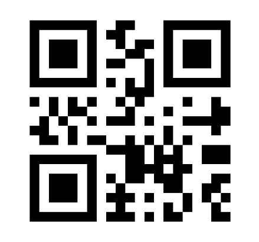

A QR code with the content "hello".

```cpp
#include <Arduino.h>   
#include "ai_camera.h" 

AiCamera ai_camrea_handle;

void setup()
{
    Serial.begin(115200);     
    Wire.begin();          
    ai_camrea_handle.Init(&Wire);
 
    ai_camrea_handle.set_sys_mode(AI_CAMERA_QRCODE); 
    delay(1000);           
}

void loop()
{

    if (ai_camrea_handle.get_identify_num(AI_CAMERA_QRCODE) > 0)
    {
       
        std::string qrcode_content = ai_camrea_handle.get_qrcode_content(); 
        Serial.print("qrocde content: ");
        Serial.println(qrcode_content);
    }
    else
    {
        Serial.println("no find qrcode");
    }
    delay(400);
}
```

<!-- 这是一张图片，ocr 内容为： -->
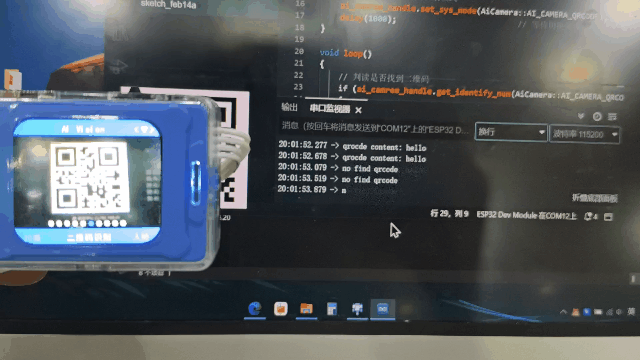

Use a QR code generator to create a QR code with the content "hello". When the vision module detects the QR code, it prints "qrcode content: hello" to the serial port. If no QR code is detected, it prints "no find qrcode".

###### get_identify_num
+ get_identify_num(uint8_t features, uint8_t total=0)

Get whether a QR code is detected

**Parameter：**

+ `features` –  Function selection 
    - AI_CAMERA_QRCODE  # QR code recognition
+ `total`–  Total number of detections  

> This parameter is invalid in QR code recognition mode
>

**Return value:**

+ Returns 1 if detected, 0 if not detected  

###### <font style="color:rgb(38, 38, 38);">get_identify_position</font>
+ <font style="color:rgb(38, 38, 38);">get_identify_position(uint8_t features, int16_t position[4], uint8_t index=0)</font>

<font style="color:rgb(38, 38, 38);">Get the position of the detected QR code</font>

**Parameter:**

+ `features` –  Function selection 
    - <font style="color:rgb(38, 38, 38);">AI_CAMERA_QRCODE         // QR code recognition</font>
+ `<font style="color:rgb(38, 38, 38);">position[4]</font>` – <font style="color:rgb(38, 38, 38);"></font>`<font style="color:rgb(38, 38, 38);">int16_t</font>`<font style="color:rgb(38, 38, 38);"> type, a position buffer of size 4  </font>
    - <font style="color:rgb(38, 38, 38);">The four values represent x, y, w, h  </font>
+ `<font style="color:rgb(38, 38, 38);">index</font>` – <font style="color:rgb(38, 38, 38);">Which detected object  </font>
    - <font style="color:rgb(38, 38, 38);">Default is 0  </font>

###### <font style="color:rgb(38, 38, 38);">get_identify_position</font>
+ get_identify_position(AI_CAMERA_REGISTER_t features, int &x, int &y, int &w, int &h, uint8_t index=0)

<font style="color:rgb(38, 38, 38);">Get the position of the detected QR code</font>

**Parameter:**

+ `features` –  Function selection 
    - <font style="color:rgb(38, 38, 38);">AI_CAMERA_QRCODE         //QR code recognition</font>
+ `x` – int type reference    
+ `y` – int type reference  
+ `w` – int type reference  
+ `h` – int type reference  
+ `<font style="color:rgb(38, 38, 38);">index</font>` – <font style="color:rgb(38, 38, 38);">Which detected object  </font>
    - <font style="color:rgb(38, 38, 38);">Default is 0 </font>

##### Face attribute recognition
###### get_face_attributes
+ get_face_attributes(int &is_male, int &is_mouth_open, int &is_smail, int &is_glasses, uint8_t index=0)

Get face attributes  

**Parameter:**

+ `is_male` –  Whether male  
+ `is_mouth_open` –  Whether mouth is open  
+ `is_glasses` –  Whether wearing glasses  
+ `index` –  Which face, default is the first one  

**Usage example:**

```cpp
#include <Arduino.h>   
#include "ai_camera.h"  

AiCamera ai_camrea_handle;

void setup() 
{
    Serial.begin(115200); 
    Wire.begin();      
    ai_camrea_handle.Init(&Wire);
    ai_camrea_handle.set_sys_mode(AI_CAMERA_FACE_ATTRIBUTE); 
    delay(1000);
}

void loop() 
{

    if (ai_camrea_handle.get_identify_num(AI_CAMERA_FACE_ATTRIBUTE) > 0)
    {

        int is_male, is_mouth_open, is_smail, is_glasses;
        ai_camrea_handle.get_face_attributes(is_male, is_mouth_open, is_smail, is_glasses);
        Serial.print("is_male: ");
        Serial.print(is_male);
        Serial.print(", is_mouth_open: ");
        Serial.print(is_mouth_open);
        Serial.print(", is_smail: ");
        Serial.print(is_smail);
        Serial.print(", is_glasses: ");
        Serial.println(is_glasses);
    }
    else
    {
        Serial.println("No face detected.");
    }

    delay(400);
}
```

###### get_identify_num
+ get_identify_num(uint8_t features, uint8_t total=0)

Get the number of detected faces

**Parameter：**

+ `features` –  Function selection 
    - AI_CAMERA_FACE_ATTRIBUTE # Face attribute recognition
+ `total`–  Total number of detections  

> This parameter is invalid in face attribute recognition mode
>

**Return value  ：**

+ Returns the number of detected labels.  

###### <font style="color:rgb(38, 38, 38);">get_identify_position</font>
+ <font style="color:rgb(38, 38, 38);">get_identify_position(uint8_t features, int16_t position[4], uint8_t index=0)</font>

<font style="color:rgb(38, 38, 38);">Get the position of the detected face</font>

**Parameter:**

+ `features` –  Function selection 
    - <font style="color:rgb(38, 38, 38);">AI_CAMERA_FACE_ATTRIBUTE // Face attribute recognition</font>
+ `<font style="color:rgb(38, 38, 38);">position[4]</font>` – <font style="color:rgb(38, 38, 38);"></font>`<font style="color:rgb(38, 38, 38);">int16_t</font>`<font style="color:rgb(38, 38, 38);"> type, a position buffer of size 4  </font>
    - <font style="color:rgb(38, 38, 38);">The four values represent x, y, w, h  </font>
+ `<font style="color:rgb(38, 38, 38);">index</font>` – <font style="color:rgb(38, 38, 38);">Which detected object  </font>
    - <font style="color:rgb(38, 38, 38);">Default is 0  </font>

###### <font style="color:rgb(38, 38, 38);">get_identify_position</font>
+ get_identify_position(AI_CAMERA_REGISTER_t features, int &x, int &y, int &w, int &h, uint8_t index=0)

<font style="color:rgb(38, 38, 38);">Get the position of the detected face</font>

**Parameter:**

+ `features` –  Function selection 
    - <font style="color:rgb(38, 38, 38);">AI_CAMERA_FACE_ATTRIBUTE // Face attribute recognition</font>
+ `x` – int type reference    
+ `y` – int type reference  
+ `w` – int type reference  
+ `h` – int type reference  
+ `<font style="color:rgb(38, 38, 38);">index</font>` – <font style="color:rgb(38, 38, 38);">Which detected object  </font>
    - <font style="color:rgb(38, 38, 38);">Default is 0 </font>

##### Face recognition
###### face_study
+ face_study()

Start enrolling face features

> This command is valid only when a face is detected; otherwise, it is invalid.  
After enrollment, an ID is automatically assigned to the current face, ranging from 0–3. If more than 4 faces are enrolled, IDs start overwriting from 0.
>

**Usage example:**

```cpp
#include <Arduino.h>   
#include "ai_camera.h" 

AiCamera ai_camrea_handle;

void setup()
{
    Serial.begin(115200);      
    Wire.begin();         
    ai_camrea_handle.Init(&Wire); 
 
    ai_camrea_handle.set_sys_mode(AI_CAMERA_FACE_RE); 
    delay(1000);                 
    ai_camrea_handle.face_study();  
}

void loop()
{
}
```

###### get_identify_num
+ get_identify_num(uint8_t features, uint8_t total=0)

Get the number of detected faces

**Parameter：**

+ `features` –  Function selection 
    - AI_CAMERA_FACE_RE	 #Face recognition
+ `total`–  Total number of detections  

**Return value  ：**

+ Returns the number of detected labels.  

> By default, it returns the number of enrolled faces detected. Only when total = 1 does it return the total number of faces detected on the screen (both enrolled and unenrolled faces).
>

###### get_identify_id
+ get_identify_id(uint8_t features, uint8_t index=0)

Get the ID of the detected face

**Parameter：**

+ `features` –  Function selection
    - AI_CAMERA_FACE_RE          //  Face recognition
+ `index` –  Which detected object  
    - Range 0~3 

**Return value  ：**

Detection ID  

> In `face recognition mode,` IDs 0–3 are automatically assigned in order during enrollment.
>

###### <font style="color:rgb(38, 38, 38);">get_identify_position</font>
+ <font style="color:rgb(38, 38, 38);">get_identify_position(uint8_t features, int16_t position[4], uint8_t index=0)</font>

<font style="color:rgb(38, 38, 38);">Get the position of the detected face</font>

**Parameter:**

+ `features` –  Function selection 
    - <font style="color:rgb(38, 38, 38);">AI_CAMERA_FACE_RE         //Face recognition</font>
+ `<font style="color:rgb(38, 38, 38);">position[4]</font>` – <font style="color:rgb(38, 38, 38);"></font>`<font style="color:rgb(38, 38, 38);">int16_t</font>`<font style="color:rgb(38, 38, 38);"> type, a position buffer of size 4  </font>
    - <font style="color:rgb(38, 38, 38);">The four values represent x, y, w, h  </font>
+ `<font style="color:rgb(38, 38, 38);">index</font>` – <font style="color:rgb(38, 38, 38);">Which detected object  </font>
    - <font style="color:rgb(38, 38, 38);">Default is 0  </font>

###### <font style="color:rgb(38, 38, 38);">get_identify_position</font>
+ get_identify_position(AI_CAMERA_REGISTER_t features, int &x, int &y, int &w, int &h, uint8_t index=0)

<font style="color:rgb(38, 38, 38);">Get the position of the detected face</font>

**Parameter:**

+ `features` –  Function selection 
    - <font style="color:rgb(38, 38, 38);">AI_CAMERA_FACE_RE         //Face recognition</font>
+ `x` – int type reference    
+ `y` – int type reference  
+ `w` – int type reference  
+ `h` – int type reference  
+ `<font style="color:rgb(38, 38, 38);">index</font>` – <font style="color:rgb(38, 38, 38);">Which detected object  </font>
    - <font style="color:rgb(38, 38, 38);">Default is 0 </font>

##### Deep learning
###### deep_learn_study
+ deep_learn_study()

Start deep learning recognition training

> Take photos continuously; when the duration exceeds 5 seconds or the number of classes exceeds 4, enter recognition mode.
>

**Usage example:**

```cpp
#include <Arduino.h>   
#include "ai_camera.h" 

AiCamera ai_camrea_handle;


void setup()
{
    Serial.begin(115200);     
    Wire.begin();          
    ai_camrea_handle.Init(&Wire); 
    ai_camrea_handle.set_sys_mode(AI_CAMERA_DEEP_LEARN); 
    delay(1000);                          
    ai_camrea_handle.deep_learn_study();  
}

void loop()
{
}
```

###### get_identify_num
+ get_identify_num(uint8_t features, uint8_t total=0)

Get whether a deep learning object is detected

**Parameter：**

+ `features` –  Function selection 
    - AI_CAMERA_DEEP_LEARN #Deep learning
+ `total`–  Total number of detections  

> This parameter is invalid in deep learning mode
>

**Return value:**

+ Returns 1 if detected, 0 if not detected  

###### get_identify_id
+ get_identify_id(uint8_t features, uint8_t index=0)

Get the ID of the detected deep learning object

**Parameter：**

+ `features` –  Function selection
    - AI_CAMERA_DEEP_LEARN  //  Deep learning
+ `index` –  Which detected object  
    - Range 0~3, this parameter is meaningless in this mode  

**Return value  ：**

Detection ID  

> In `deep learning mode`, IDs 0–3 are automatically assigned in order during training.
>

###### <font style="color:rgb(38, 38, 38);">get_identify_position</font>
+ <font style="color:rgb(38, 38, 38);">get_identify_position(uint8_t features, int16_t position[4], uint8_t index=0)</font>

<font style="color:rgb(38, 38, 38);">Get the position of the detected deep learning object</font>

**Parameter:**

+ `features` –  Function selection 
    - <font style="color:rgb(38, 38, 38);">AI_CAMERA_DEEP_LEARN // Deep learning</font>
+ `<font style="color:rgb(38, 38, 38);">position[4]</font>` – <font style="color:rgb(38, 38, 38);"></font>`<font style="color:rgb(38, 38, 38);">int16_t</font>`<font style="color:rgb(38, 38, 38);"> type, a position buffer of size 4  </font>
    - <font style="color:rgb(38, 38, 38);">The four values represent x, y, w, h  </font>
+ `<font style="color:rgb(38, 38, 38);">index</font>` – <font style="color:rgb(38, 38, 38);">Which detected object  </font>
    - <font style="color:rgb(38, 38, 38);">Default is 0  </font>

###### <font style="color:rgb(38, 38, 38);">get_identify_position</font>
+ get_identify_position(AI_CAMERA_REGISTER_t features, int &x, int &y, int &w, int &h, uint8_t index=0)

<font style="color:rgb(38, 38, 38);">Get the position of the detected deep learning object</font>

**Parameter:**

+ `features` –  Function selection 
    - <font style="color:rgb(38, 38, 38);">AI_CAMERA_DEEP_LEARN // Deep learning</font>
+ `x` – int type reference    
+ `y` – int type reference  
+ `w` – int type reference  
+ `h` – int type reference  
+ `<font style="color:rgb(38, 38, 38);">index</font>` – <font style="color:rgb(38, 38, 38);">Which detected object  </font>
    - <font style="color:rgb(38, 38, 38);">Default is 0 </font>

##### Road sign recognition
###### get_identify_num
+ get_identify_num(uint8_t features, uint8_t total=0)

Get the number of detected road signs

**Parameter：**

+ `features` –  Function selection 
    - AI_CAMERA_CARD # Road sign recognition
+ `total`–  Total number of detections  

> This parameter is invalid in road sign recognition mode
>

**Return value  ：**

+ Returns the number of detected labels.  

###### get_identify_id
+ get_identify_id(uint8_t features, uint8_t index=0)

Get the ID of the detected road sign

**Parameter：**

+ `features` –  Function selection
    - AI_CAMERA_CARD             // Road sign recognition
+ `index` –  Which detected object  
    - Range 0~3 

**Return value  ：**

Detection ID  

> In road sign recognition mode, IDs 0–6 represent green light, left turn, stop, red light, right turn, horn, and target, respectively.
>

###### <font style="color:rgb(38, 38, 38);">get_identify_position</font>
+ <font style="color:rgb(38, 38, 38);">get_identify_position(uint8_t features, int16_t position[4], uint8_t index=0)</font>

<font style="color:rgb(38, 38, 38);">Get the position of the detected road sign</font>

**Parameter:**

+ `features` –  Function selection 
    - <font style="color:rgb(38, 38, 38);">AI_CAMERA_CARD             // Road sign recognition</font>
+ `<font style="color:rgb(38, 38, 38);">position[4]</font>` – <font style="color:rgb(38, 38, 38);"></font>`<font style="color:rgb(38, 38, 38);">int16_t</font>`<font style="color:rgb(38, 38, 38);"> type, a position buffer of size 4  </font>
    - <font style="color:rgb(38, 38, 38);">The four values represent x, y, w, h  </font>
+ `<font style="color:rgb(38, 38, 38);">index</font>` – <font style="color:rgb(38, 38, 38);">Which detected object  </font>
    - <font style="color:rgb(38, 38, 38);">Default is 0  </font>

###### <font style="color:rgb(38, 38, 38);">get_identify_position</font>
+ get_identify_position(AI_CAMERA_REGISTER_t features, int &x, int &y, int &w, int &h, uint8_t index=0)

<font style="color:rgb(38, 38, 38);">Get the position of the detected road sign</font>

**Parameter:**

+ `features` –  Function selection 
    - <font style="color:rgb(38, 38, 38);">AI_CAMERA_CARD             //Road sign recognition</font>
+ `x` – int type reference    
+ `y` – int type reference  
+ `w` – int type reference  
+ `h` – int type reference  
+ `<font style="color:rgb(38, 38, 38);">index</font>` – <font style="color:rgb(38, 38, 38);">Which detected object  </font>
    - <font style="color:rgb(38, 38, 38);">Default is 0 </font>

##### Fill light  
###### set_light_status
+ set_light_status(uint8_t status)

Set the fill light status

**Parameter：**

+ `status` –  status
    - 1：open 2：close

###### set_light_brightness
+ set_light_brightness(uint8_t brightness)

Set the fill light brightness

**Parameter：**

+ `brightness` –  brightness
    - 0-10

###### get_light_brightness
+ get_light_brightness(uint8_t &brightness)

Get the current fill light brightness

**Parameter：**

+ `brightness` –  brightness
    - int type reference

#### AI conversation
##### Get the conversation status
###### get_ai_chat_state
+ get_ai_chat_state(uint8_t &state)

**Parameter：**

+ `state` –   Current status of AI conversation  
    -  Value range: 0: AI not started, 1: Connecting, 2: Standby, 3: Listening, 4: Speaking, 5: Network configuration  

**Usage example：**

```cpp
#include <Arduino.h>
#include "ai_camera.h"

AiCamera ai_camera;

void setup(void)
{
    Serial.begin(115200);  
    Wire.begin();          
    ai_camrea.Init(&Wire); 
}

void loop(void)
{
    char buffer[128];
    uint8_t state;

    ai_camera.get_ai_chat_state(state);                

    sprintf(buffer, "state:%d", state);
    Serial.println(buffer);

    Serial.println("----------");

    delay(1000);
}
```

##### Get movement commands and speed
###### get_ai_chat_run_state
+ get_ai_chat_run_state(uint8_t &command, uint8_t &speed)

**Parameter：**

+ `command` –   Movement command  
    - Value range: 1: Forward, 2: Backward, 3: Turn left, 4: Turn right, 5: Stop  
+ `speed` –  Movement speed  
    - Value range: 0–100  

**Usage example：**

```cpp

#include <Arduino.h>
#include "ai_camera.h"

AiCamera ai_camera;

void setup(void)
{
    Serial.begin(115200);  
    Wire.begin();         
    ai_camrea.Init(&Wire); 
}

void loop(void)
{
    char buffer[128];
    uint8_t command, speed;

    ai_camera.get_ai_chat_run_state(command, speed);     

    sprintf(buffer, "command:%d, speed:%d", command, speed);
    Serial.println(buffer);

    Serial.println("----------");

    delay(1000);
}
```

##### Get custom commands
###### get_ai_chat_custom_command
+ get_ai_chat_custom_command(uint8_t &command)

**Parameter：**

+ `command` –  custom commands

**Usage example:**

```cpp

#include <Arduino.h>
#include "ai_camera.h"

AiCamera ai_camera;

void setup(void)
{
    Serial.begin(115200);  
    Wire.begin();          
    ai_camrea.Init(&Wire); 
}

void loop(void)
{
    char buffer[128];
    uint8_t custom_command;

    ai_camera.get_ai_chat_custom_command(custom_command); 

    sprintf(buffer, "custom_command:%d", custom_command);
    Serial.println(buffer);

    Serial.println("----------");

    delay(1000);
}
```

###### get_wifi_stream_button
#### WIFI image transmission
##### Get web page key values
+ get_wifi_stream_button(uint8_t &button)

**Parameter：**

+ `button` –   Button value  
    -  Each button corresponds to a bit in a byte: 0 0 1 2 3 4 5 6; when a button is pressed, the corresponding bit is set to 1.  

**Usage example:**

```cpp

#include <Arduino.h>
#include "ai_camera.h"

AiCamera ai_camera;

void setup(void)
{
    Serial.begin(115200);  
    Wire.begin();          
    ai_camrea.Init(&Wire); 
}

void loop(void)
{
    char buffer[128];
    uint8_t button;

    ai_camera.get_wifi_stream_button(button);             

    sprintf(buffer, "button:%d\n", button);
    Serial.print(buffer);

    Serial.println("----------");

    delay(1000);
}
```

###### get_wifi_stream_keyboard
##### Get keyboard key values
+ get_wifi_stream_keyboard(uint8_t &keyboard)

**Parameter：**

+ `keyboard` –  Keyboard WASD key values  
    - Each key corresponds to a bit in a byte: 0000 WASD; when a key is pressed, the corresponding bit is set to 1.  

**Usage example:**

```cpp

#include <Arduino.h>
#include "ai_camera.h"

AiCamera ai_camera;

void setup(void)
{
    Serial.begin(115200); 
    Wire.begin();          
    ai_camrea.Init(&Wire); 
}

void loop(void)
{
    char buffer[128];
    uint8_t keyboard;

    ai_camera.get_wifi_stream_keyboard(keyboard);       

    sprintf(buffer, "keyboard:%d\n", keyboard);
    Serial.print(buffer);

    Serial.println("----------");

    delay(1000);
}
```

###### get_wifi_stream_joystick
##### Get web page joystick values
+ get_wifi_stream_joystick(int8_t &x, int8_t &y)

Get the joystick values in the X and Y directions from the web page.

**Parameter：**

+ `x` –  Joystick value in the X direction; range: -100 to 100
+ `y` –  Joystick value in the Y direction; range: -100 to 100

**Usage example:**

<!-- 这是一张图片，ocr 内容为： -->
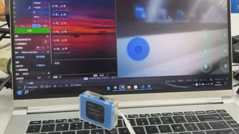

```cpp
#include <Arduino.h>
#include "ai_camera.h"

AiCamera ai_camera;

void setup(void)
{
    Serial.begin(115200);  
    Wire.begin();         
    ai_camrea.Init(&Wire); 
}

void loop(void)
{
    char buffer[128];
    int8_t x, y;

    ai_camera.get_wifi_stream_joystick(x, y);         

    sprintf(buffer, "x:%d, y:%d\n", x, y);
    Serial.print(buffer);

    Serial.println("----------");

    delay(1000);
}
```

###### get_wifi_stream_ssid_password
##### Get network connection information
+ get_wifi_stream_ssid_password(String &ssid, String &password)

Get the connected WiFi name and password.  
Note: Can only be obtained in WiFi image transmission mode.

**Parameter ：**

+ `ssid` –   WiFi Name  
+ `password` –  WiFi Password  

**Usage example:**

```cpp

#include <Arduino.h>
#include "ai_camera.h"

AiCamera ai_camera;

void setup(void)
{
    Serial.begin(115200);  
    Wire.begin();         
    ai_camrea.Init(&Wire); 
}

void loop(void)
{
    char buffer[128];
    String ssid, password;
    ai_camera.get_wifi_stream_ssid_password(ssid, password); 

    sprintf(buffer, "ssid:%s, password:%s\n", ssid.c_str(), password.c_str());
    Serial.print(buffer);

    Serial.println("----------");

    delay(1000);
}
```

###### get_wifi_stream_ip
+ get_wifi_stream_ip(String &ip)

Get the IP address of the connected WiFi.

**Parameter：**

+ `ip` –  the IP address of the connected WiFi

**Usage example:**

```cpp

#include <Arduino.h>
#include "ai_camera.h"

AiCamera ai_camera;

void setup(void)
{
    Serial.begin(115200);  
    Wire.begin();         
    ai_camrea.Init(&Wire); 
}

void loop(void)
{
    char buffer[128];
    String ip;

    ai_camera.get_wifi_stream_ip(ip);                       

    sprintf(buffer, "ip:%s\n", ip.c_str());
    Serial.print(buffer);

    Serial.println("----------");

    delay(1000);
}
```


