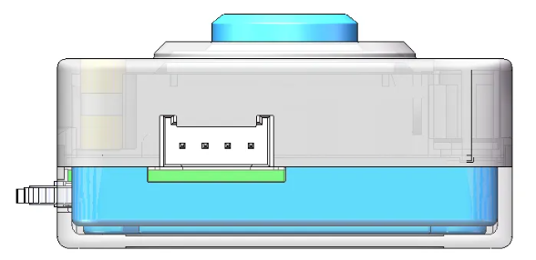

# Communication Protocol
## Grove Interface Pin Definition
<!-- 这是一张图片，ocr 内容为： -->

+ **I²C Mode: **`GND`、`VCC`、`SDA`、`SCL` (from left to right)
+ **UART Mode: **`GND`、`VCC`、`RX`、`TX` (from left to right)

## Communication Description
The module supports the following communication methods:

+ `I²C` (with selectable addresses)
+ `UART` (standard serial parameters)
+ `SPIKE emulated protocol` (compatible with LEGO SPIKE)

Users can select the desired communication mode in the Settings interface, then click Exit to restart the device and apply the configuration.

