# Firmware Flashing
The Type-C port on the side of the module supports both firmware flashing and power supply.

When the vision module is connected to a computer via a Type-C cable, the computer will recognize two serial ports: 

+ The larger-numbered COM port → corresponds to the onboard ESP32.
+ The smaller-numbered COM port → corresponds to the K210 chip.

**Note: The actual COM port numbers may vary depending on the operating system. It is recommended to check them via the Device Manager or a serial terminal tool.**

**Flash Files:**  
Download the required firmware files from the [official website](https://www.icrobot.com/www/cn/index.html#/file/index?type2=ICreate%20AI%20Vision).

## Flashing the K210
Access [GitHub](https://github.com/sipeed/kflash_gui.git) to obtain the kflash_gui flashing tool.  

 Click to get the latest released version.  

<!-- 这是一张图片，ocr 内容为： -->
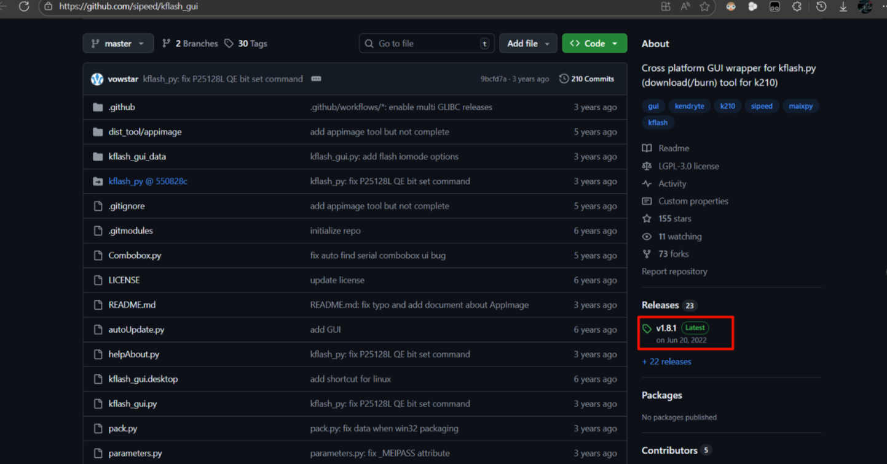

**Select a version suitable for your system to download.**  
For Windows users, you can download `kflash_gui_v1.8.1_windows.7z` (you will need a tool to extract 7Z compressed files, please download and install one from the internet if you don't have it).  

<!-- 这是一张图片，ocr 内容为： -->
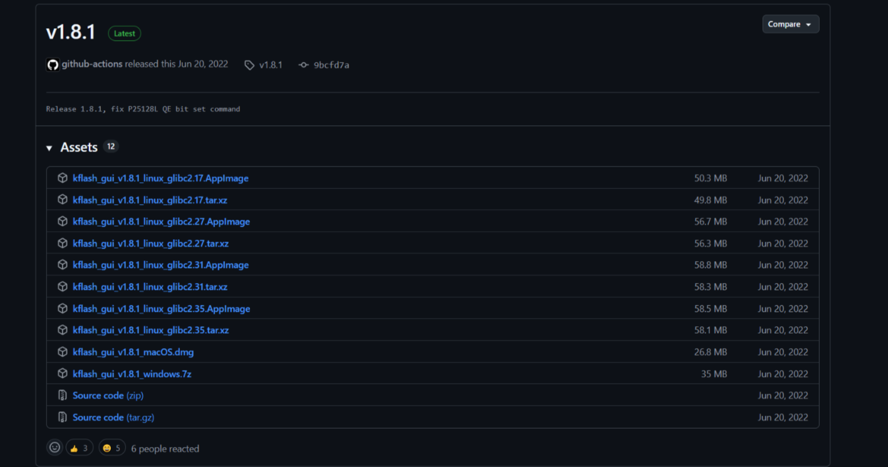

Unzip the downloaded compressed file, and the folder will contain only one executable file, which is the software we need.

<!-- 这是一张图片，ocr 内容为： -->
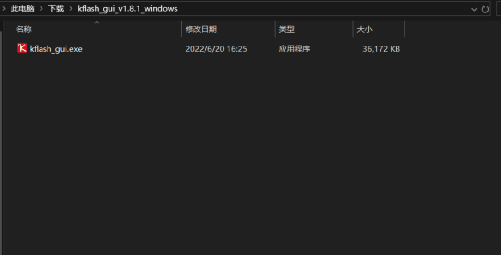

1. **Open the kflash_gui flashing tool** and select **Erase**.  

<!-- 这是一张图片，ocr 内容为： -->
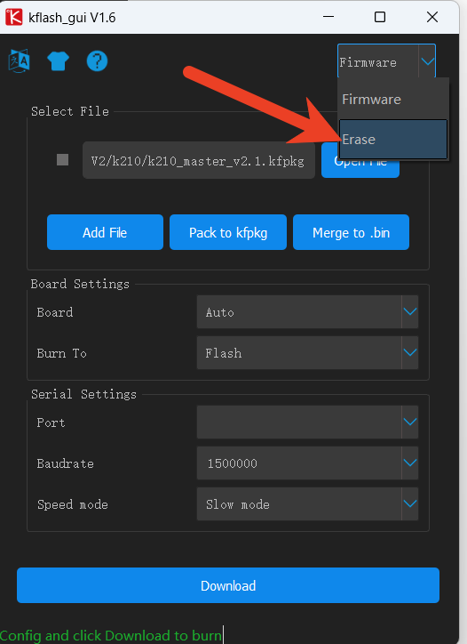

2.  In the erase interface, refer to the specific options shown in the image below. The port should be selected according to the actual port.  

<!-- 这是一张图片，ocr 内容为： -->
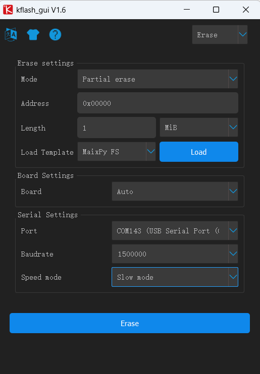

3.  Click **Open File**, and in the dialog that opens, choose the **k210_master_v1.1.kfpkg** file. For the other options, refer to the image below, and select the port according to the actual port. Then, click **Flash** and wait for the flashing process to complete.  

<!-- 这是一张图片，ocr 内容为： -->
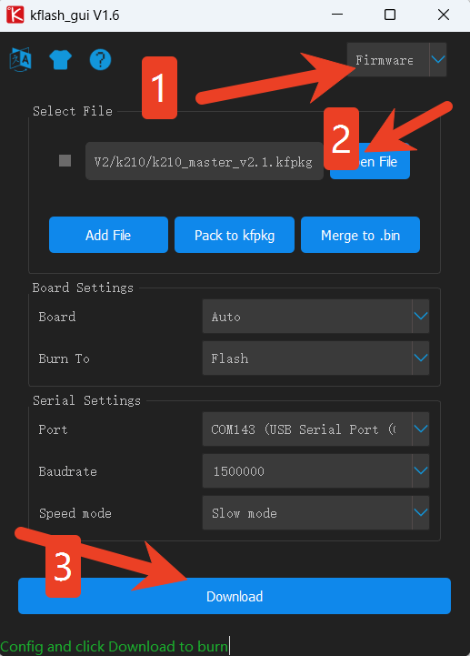

## ESP32 Flashing  
**The onboard chip is ESP32-S3FN8. You can program and flash it using Arduino or the official Espressif tools.  **

1. Configuration Program:

Open the flash_download_tool_3.9.3.exe program, select ChipType as ESP32-S3, and click OK.

<!-- 这是一张图片，ocr 内容为： -->
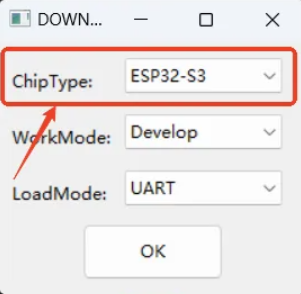

2. Connect the Device:

Use a **Type-C data cable** to connect the K210 Visual Recognition Module to the computer. In the lower-right corner, select the larger **COM port**.  

<!-- 这是一张图片，ocr 内容为： -->
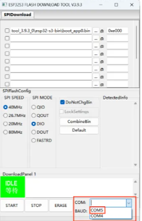

3. Upload the Firmware:  

Click the "..." button, and in the dialog that opens, select the k210_esp32s3_v1.0.0.bin file. Set the address to 0x00 and check the checkbox next to the firmware file.

<!-- 这是一张图片，ocr 内容为： -->
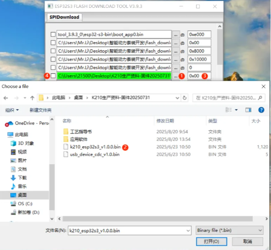

4. Flash the Firmware：

Click **"START"**, wait until the progress bar completes, and you will see a **FINISH** message indicating completion.  

<!-- 这是一张图片，ocr 内容为： -->
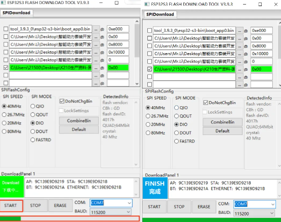

5. Verification: 

Open the Serial Port Debug Assistant and select the larger COM port. If flashing is successful, the returned content will be shown as per the image below.

<!-- 这是一张图片，ocr 内容为： -->
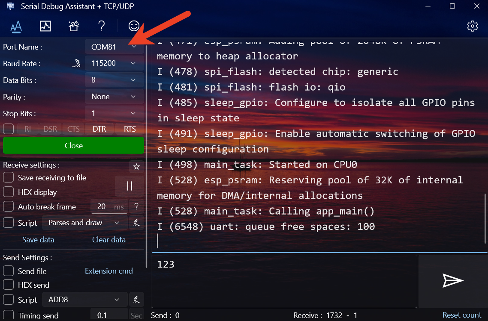

