# Extension – Arduino
## Introduction
The Arduino library is written in C++ and communicates with the K210 AI Vision Sensor via the I²C interface.

Based on this library, users can develop programs that achieve higher efficiency and richer functionalities. This tutorial mainly introduces usage through the `Wire` I²C library, but it is not limited to `Wire`. You may also refer to the `override` example to implement usage in other environments.

## Quick Start
### Hardware Requirements  
| <!-- 这是一张图片，ocr 内容为： -->
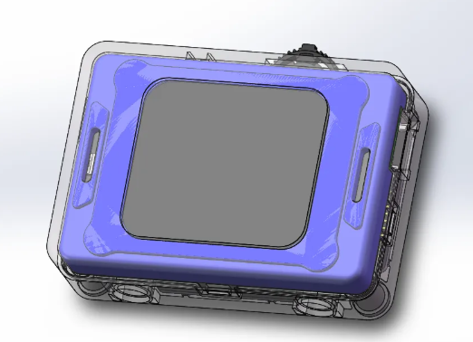 | <!-- 这是一张图片，ocr 内容为： -->
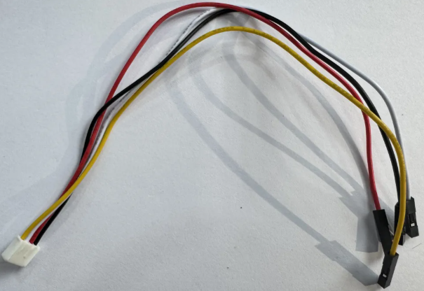 |
| :---: | :---: |
| K210 AI Vision Sensor | Grove to 4-pin Dupont cable |
| <!-- 这是一张图片，ocr 内容为： -->
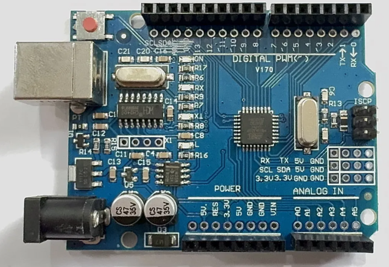 | <!-- 这是一张图片，ocr 内容为： -->
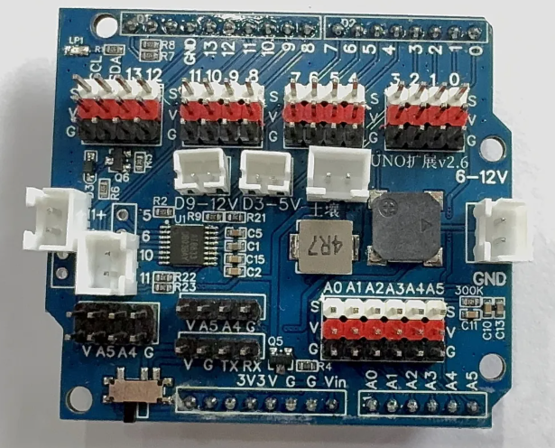 |
| Arduino Uno | Expansion Shield |


Software Requirements

| <!-- 这是一张图片，ocr 内容为： -->
 | <!-- 这是一张图片，ocr 内容为： -->
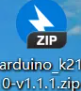 |
| :---: | :---: |
| Arduino IDE | Vision Module API Library |


Refer to the Grove port pin definitions for correct wiring.

### Library Acquisition
You can download the required API library for the vision module from:

#### GitHub：
1. Visit [GitHub](https://github.com/cyc36880/Arduino_k210)
2. Navigate to the Releases section on the lower right.
<!-- 这是一张图片，ocr 内容为： -->
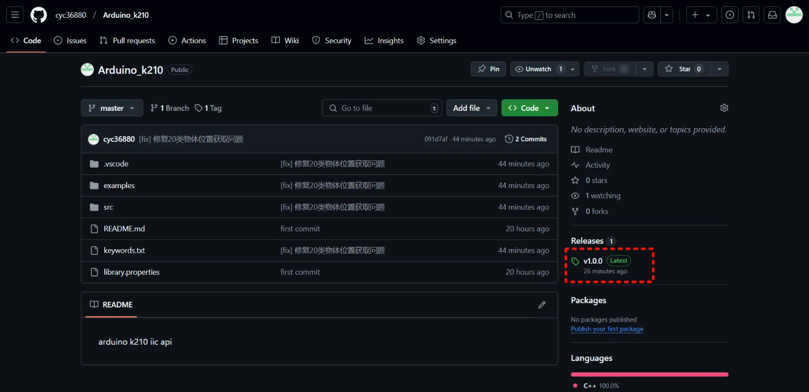

3. Download the latest packaged version.

<!-- 这是一张图片，ocr 内容为： -->
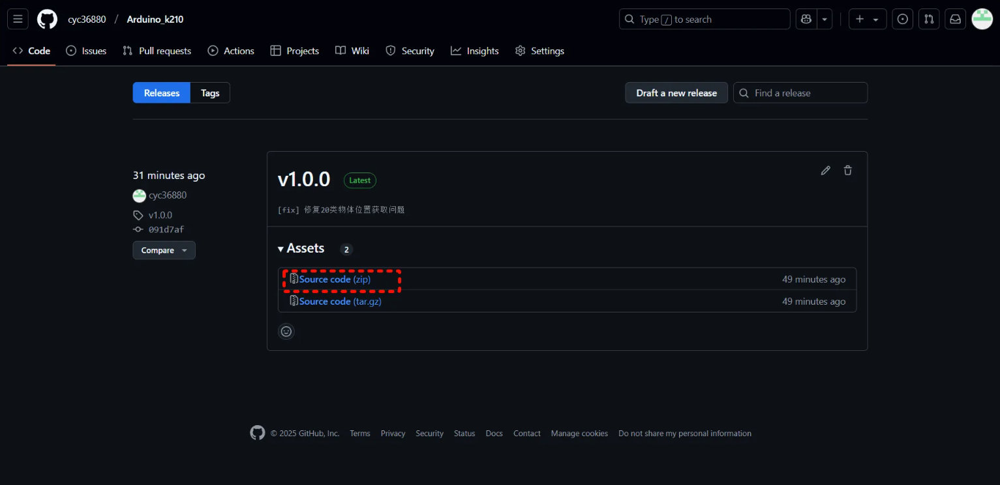

#### Gitee：
1.Visit [Gitee](https://gitee.com/cyc36880/arduino_k210)  
2. Navigate to the Releases section on the lower right.<!-- 这是一张图片，ocr 内容为： -->


3. Download the latest packaged version.

<!-- 这是一张图片，ocr 内容为： -->


### Importing the Library in Arduino IDE
Step 1: Open the Arduino IDE, create a new project, go to the Sketch menu, select Include Library → Add .ZIP Library...
<!-- 这是一张图片，ocr 内容为： -->
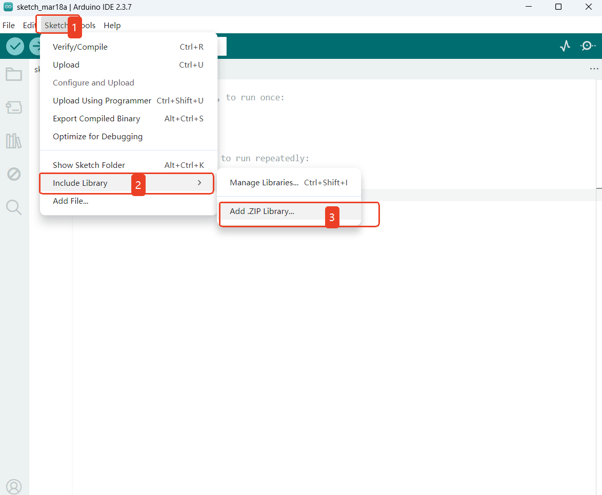

Step 2: Locate the downloaded library file (make sure you have the correct version), select it, and click Open in the bottom-right corner.

<!-- 这是一张图片，ocr 内容为： -->
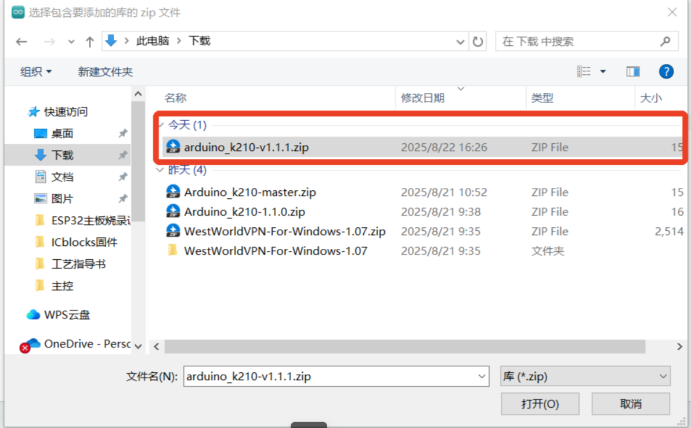

Step 3: In the File menu, navigate to Examples. At the bottom under Examples from Custom Libraries, if you see `ai_camera`, the library has been successfully imported.

<!-- 这是一张图片，ocr 内容为： -->
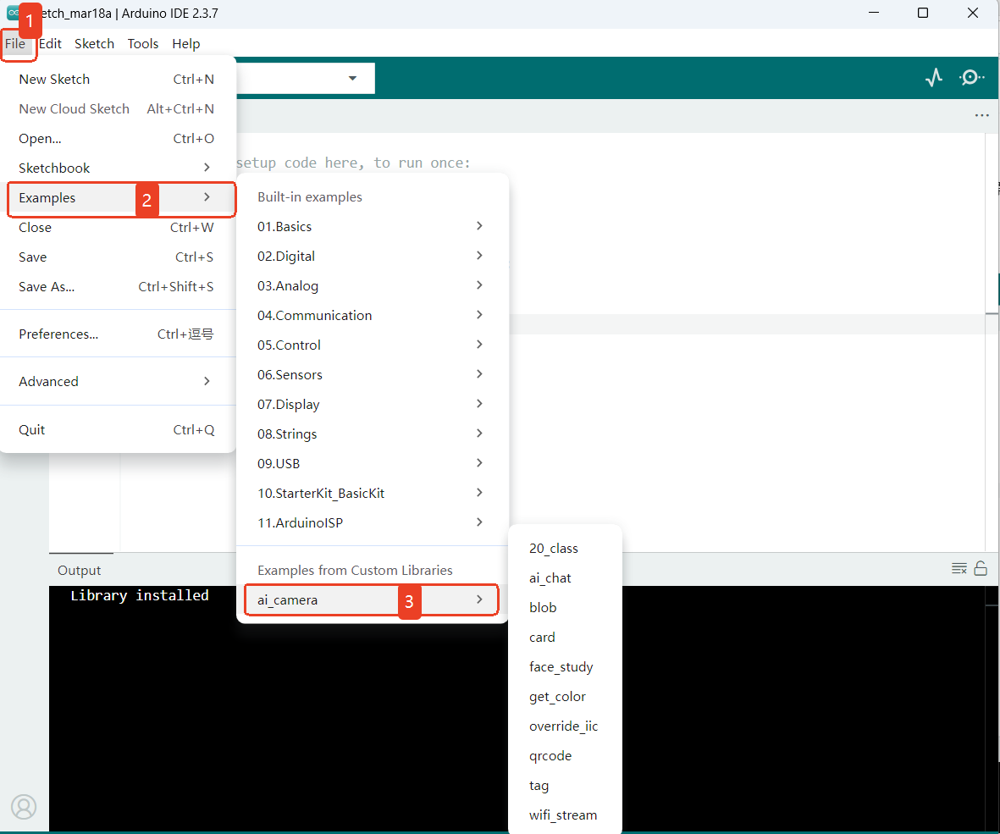

### Examples
The `ai_camera`library provides multiple sample sketches with detailed comments. Together with the API documentation, these examples help you quickly learn how to use the library.

Below is how to open and compile an example to verify your build environment. If the sketch compiles successfully, your environment is set up correctly.


Step 1: The following walkthrough uses 20-Class Object Recognition as the example.

<!-- 这是一张图片，ocr 内容为： -->
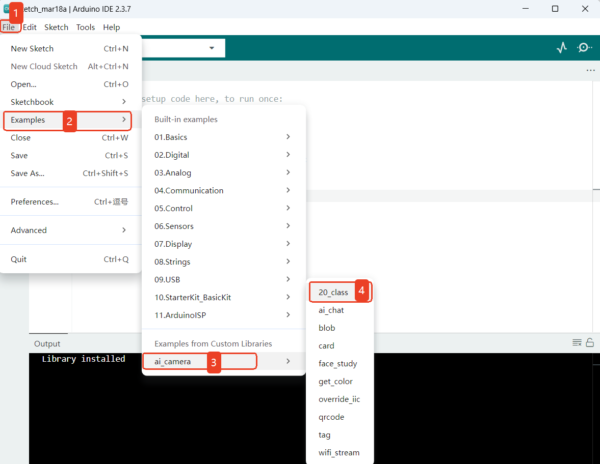

Step 2: Select the development board and the corresponding COM port currently in use, then click OK.

<!-- 这是一张图片，ocr 内容为： -->
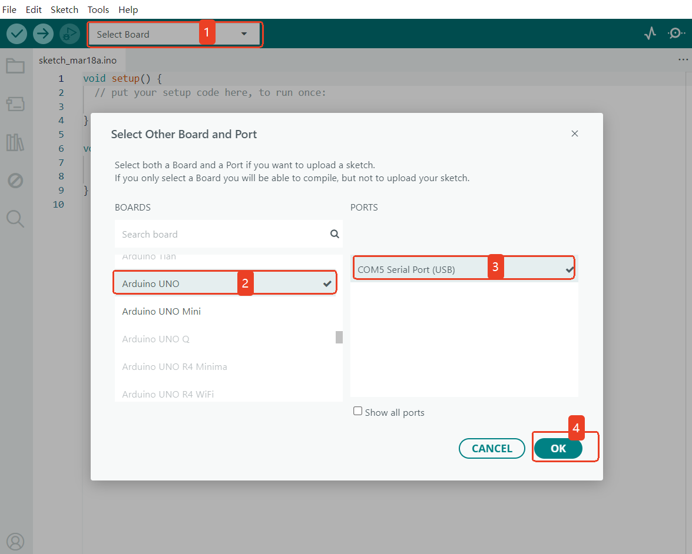
Step 3: Click the Verify/Compile button in the upper-left corner. Wait for the compilation to finish. If successful, the output window  will display messages as shown in the highlighted box.<!-- 这是一张图片，ocr 内容为： -->
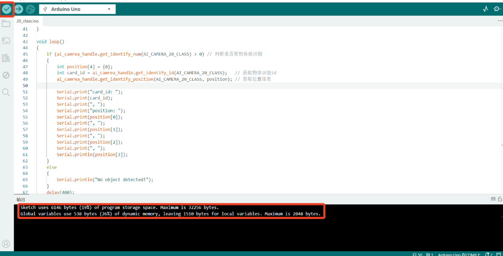
Step 4: Click the Upload button in the upper-left corner. The IDE will first compile, then automatically upload the code to the board. Once uploading is complete, a confirmation message will appear in a popup window as shown in the highlighted box.

<!-- 这是一张图片，ocr 内容为： -->
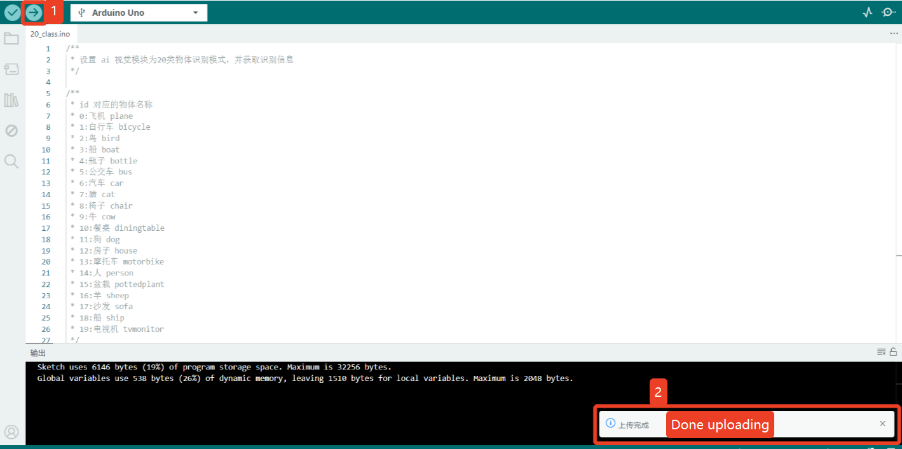
Step 5: Demo Effect

+ The K210 Vision Sensor will recognize objects and label them with their names and position information.
<!-- 这是一张图片，ocr 内容为： -->
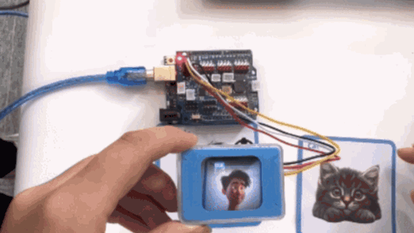
+ Additionally, print the object name and position information to the serial monitor.

card_id maps to the object names (see the figure on the right).

position contains the bounding box: X, Y, W, H.

<!-- 这是一张图片，ocr 内容为： -->
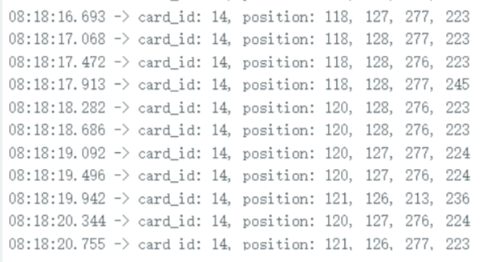
<!-- 这是一张图片，ocr 内容为： -->
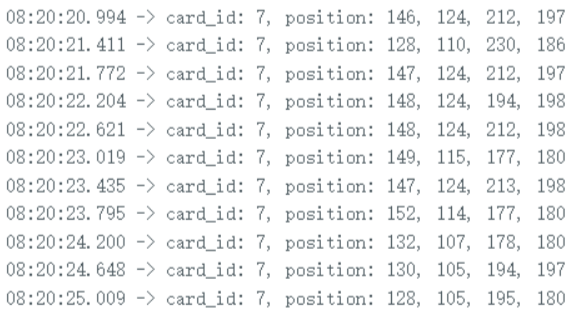
<!-- 这是一张图片，ocr 内容为： -->
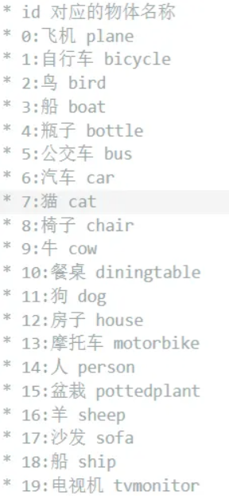
## API
The API is used to operate the Vision Module. Communication with the module follows a specified protocol and requires basic data handling. By using the API, you can abstract away low-level operations and simplify your application logic.

(The examples below take an ESP32 development board as the target platform.)

### Usage Notes  
+ AprilTag generation (Tag Recognition)

You can generate tags using an online [AprilTag generator](https://chaitanyantr.github.io/apriltag.html).

Set Tag Family to`TAG36H11` (this is the family used by the Vision Module).

Set Tag ID as needed (typical range: 0–200).

Print the generated tag and ensure good lighting and focus during testing.

+ QR code generation (QR Code Recognition)

Use any standard QR code generator or tool.

Enter the text/content to be encoded and click Generate.

Ensure sufficient print quality and size so the module can decode reliably.

### Class: AiCamera
The AiCamera class is the fundamental object used to operate the AI Vision Module.

#### Constructor
```cpp
class AiCamera(uint8_t addr=0x24)
```

Creates an AiCamera object.

Parameters:

`addr`→ The I²C address of the Vision Module.

Default value: 0x24

Since the AI Vision Module typically uses a single address, the default setting is usually sufficient.
#### Parameter Macros
```cpp
enum Register
{
    AI_CAMERA_COLOR,            // color detection
    AI_CAMERA_PATCH,            // color block tracking
    AI_CAMERA_TAG,              // AprilTag recognition
    AI_CAMERA_LINE,             // line recognition
    AI_CAMERA_20_CLASS,         // 20-class object recognition
    AI_CAMERA_QRCODE,           // QR code recognition
    AI_CAMERA_FACE_ATTRIBUTE,   // face attributes
    AI_CAMERA_FACE_RE,          // face recognition
    AI_CAMERA_DEEP_LEARN,       // deep learning
    AI_CAMERA_CARD,             // road sign recognition
    AI_CAMERA_WIFI_SERVER,      // wifi stream
};
enum Color
{
    AI_CAMERA_COLOR_RED,     // red
    AI_CAMERA_COLOR_GREEN,   // green
    AI_CAMERA_COLOR_BLUE,    // blue
    AI_CAMERA_COLOR_YELLOW,  // yellow
    AI_CAMERA_COLOR_BLACK,   // black
    AI_CAMERA_COLOR_WHITE,   // white
};

```

+ These macros are used when switching modes, reading/writing data in a specific mode, and configuring color settings of the Vision Module.

#### Function
##### Init
+ Init(int sda=-1, int scl=-1)

Description:

Initializes the AI Vision Module over the I²C interface.

**Parameters:**

+ sda → I²C data line (SDA).

Default: -1 (use the board’s default SDA pin).

+ scl → I²C clock line (SCL).

Default: -1 (use the board’s default SCL pin).

**Example:**

```cpp
#include <Arduino.h>   // Include Arduino header file
#include "ai_camera.h" // Include ai vision module library header file

// Set up ai vision module operation handle
AiCamera ai_camrea_handle;

void setup()
{
    ai_camrea_handle.Init();   // Initialize
}

void loop()
{
}
```

##### begin
+ begin(int sda=-1, int scl=-1)

> ##### Use the same style as Init to define this function, in order to keep it consistent with the Arduino coding style.

##### set_sys_mode
+ set_sys_mode(uint8_t mode);

Set the working mode of the AI visual module.

**Parameter ：**

+ mode – Operating Mode
    - Refer to Parameter Macros.

**Example:**

```cpp
#include <Arduino.h>   // Include Arduino header file
#include "ai_camera.h" // Include ai vision module library header file

// Set up ai vision module operation handle
AiCamera ai_camrea_handle;

void setup()
{
     ai_camrea_handle.Init();   // Initialize
    // Set the mode to QR code recognition mode
    ai_camrea_handle.set_sys_mode(AI_CAMERA_QRCODE); 
}

void loop()
{
}
```
<!-- 这是一张图片，ocr 内容为： -->

