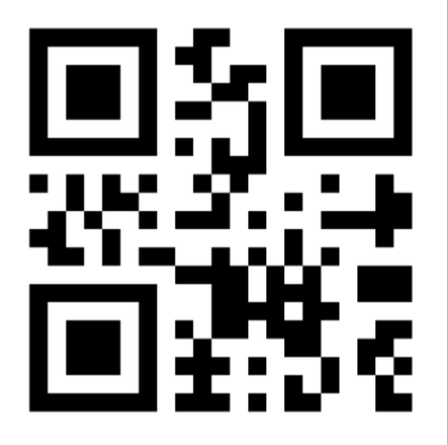
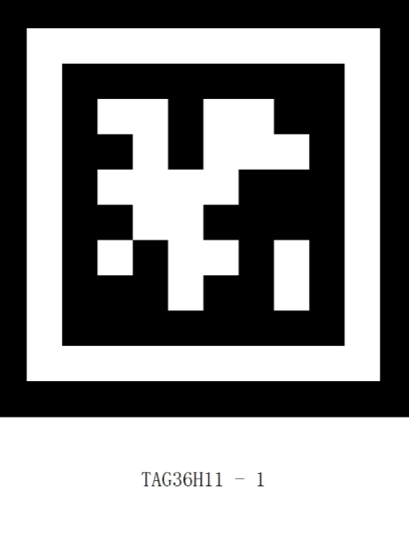
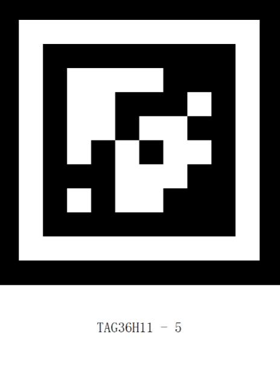
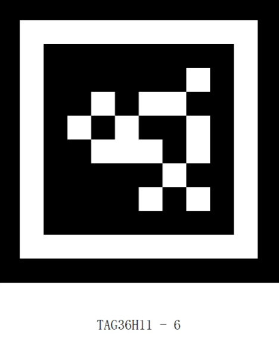
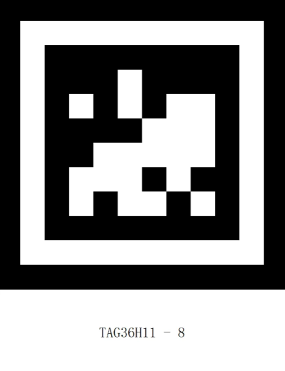

# Extension – Arduino
## Introduction
The Arduino library is written in C++ and communicates with the K210 AI Vision Sensor via the I²C interface.

Based on this library, users can develop programs that achieve higher efficiency and richer functionalities. This tutorial mainly introduces usage through the `Wire` I²C library, but it is not limited to `Wire`. You may also refer to the `override` example to implement usage in other environments.

## Quick Start
### Hardware Requirements  
| <!-- 这是一张图片，ocr 内容为： -->
 | <!-- 这是一张图片，ocr 内容为： -->
 |
| :---: | :---: |
| K210 AI Vision Sensor | Grove to 4-pin Dupont cable |
| <!-- 这是一张图片，ocr 内容为： -->
 | <!-- 这是一张图片，ocr 内容为： -->
 |
| Arduino Uno | Expansion Shield |


Software Requirements

| <!-- 这是一张图片，ocr 内容为： -->
 | <!-- 这是一张图片，ocr 内容为： -->
 |
| :---: | :---: |
| Arduino IDE | Vision Module API Library |


Refer to the Grove port pin definitions for correct wiring.

### Library Acquisition
You can download the required API library for the vision module from:

#### GitHub：
1. Visit [GitHub](https://github.com/cyc36880/Arduino_k210)
2. Navigate to the Releases section on the lower right.
<!-- 这是一张图片，ocr 内容为： -->


3. Download the latest packaged version.

<!-- 这是一张图片，ocr 内容为： -->


#### Gitee：
1.Visit [Gitee](https://gitee.com/cyc36880/arduino_k210)  
2. Navigate to the Releases section on the lower right.<!-- 这是一张图片，ocr 内容为： -->


3. Download the latest packaged version.

<!-- 这是一张图片，ocr 内容为： -->


### Importing the Library in Arduino IDE
Step 1: Open the Arduino IDE, create a new project, go to the Sketch menu, select Include Library → Add .ZIP Library...
<!-- 这是一张图片，ocr 内容为： -->


Step 2: Locate the downloaded library file (make sure you have the correct version), select it, and click Open in the bottom-right corner.

<!-- 这是一张图片，ocr 内容为： -->


Step 3: In the File menu, navigate to Examples. At the bottom under Examples from Custom Libraries, if you see `ai_camera`, the library has been successfully imported.

<!-- 这是一张图片，ocr 内容为： -->


### Examples
The `ai_camera`library provides multiple sample sketches with detailed comments. Together with the API documentation, these examples help you quickly learn how to use the library.

Below is how to open and compile an example to verify your build environment. If the sketch compiles successfully, your environment is set up correctly.


Step 1: The following walkthrough uses 20-Class Object Recognition as the example.

<!-- 这是一张图片，ocr 内容为： -->


Step 2: Select the development board and the corresponding COM port currently in use, then click OK.

<!-- 这是一张图片，ocr 内容为： -->

Step 3: Click the Verify/Compile button in the upper-left corner. Wait for the compilation to finish. If successful, the output window  will display messages as shown in the highlighted box.<!-- 这是一张图片，ocr 内容为： -->

Step 4: Click the Upload button in the upper-left corner. The IDE will first compile, then automatically upload the code to the board. Once uploading is complete, a confirmation message will appear in a popup window as shown in the highlighted box.

<!-- 这是一张图片，ocr 内容为： -->

Step 5: Demo Effect

+ The K210 Vision Sensor will recognize objects and label them with their names and position information.
<!-- 这是一张图片，ocr 内容为： -->

+ Additionally, print the object name and position information to the serial monitor.

card_id maps to the object names (see the figure on the right).

position contains the bounding box: X, Y, W, H.

<!-- 这是一张图片，ocr 内容为： -->

<!-- 这是一张图片，ocr 内容为： -->

<!-- 这是一张图片，ocr 内容为： -->

## API
The API is used to operate the Vision Module. Communication with the module follows a specified protocol and requires basic data handling. By using the API, you can abstract away low-level operations and simplify your application logic.

(The examples below take an ESP32 development board as the target platform.)

### Usage Notes  
+ AprilTag generation (Tag Recognition)

You can generate tags using an online [AprilTag generator](https://chaitanyantr.github.io/apriltag.html).

Set Tag Family to`TAG36H11` (this is the family used by the Vision Module).

Set Tag ID as needed (typical range: 0–200).

Print the generated tag and ensure good lighting and focus during testing.

+ QR code generation (QR Code Recognition)

Use any standard QR code generator or tool.

Enter the text/content to be encoded and click Generate.

Ensure sufficient print quality and size so the module can decode reliably.

### Class: AiCamera
The AiCamera class is the fundamental object used to operate the AI Vision Module.

#### Constructor
```cpp
class AiCamera(uint8_t addr=0x24)
```

Creates an AiCamera object.

Parameters:

`addr`→ The I²C address of the Vision Module.

Default value: 0x24

Since the AI Vision Module typically uses a single address, the default setting is usually sufficient.
#### Parameter Macros
```cpp
enum Register
{
    AI_CAMERA_COLOR,            // color detection
    AI_CAMERA_PATCH,            // color block tracking
    AI_CAMERA_TAG,              // AprilTag recognition
    AI_CAMERA_LINE,             // line recognition
    AI_CAMERA_20_CLASS,         // 20-class object recognition
    AI_CAMERA_QRCODE,           // QR code recognition
    AI_CAMERA_FACE_ATTRIBUTE,   // face attributes
    AI_CAMERA_FACE_RE,          // face recognition
    AI_CAMERA_DEEP_LEARN,       // deep learning
    AI_CAMERA_CARD,             // road sign recognition
    AI_CAMERA_WIFI_SERVER,      // wifi stream
};
enum Color
{
    AI_CAMERA_COLOR_RED,     // red
    AI_CAMERA_COLOR_GREEN,   // green
    AI_CAMERA_COLOR_BLUE,    // blue
    AI_CAMERA_COLOR_YELLOW,  // yellow
    AI_CAMERA_COLOR_BLACK,   // black
    AI_CAMERA_COLOR_WHITE,   // white
};

```

+ These macros are used when switching modes, reading/writing data in a specific mode, and configuring color settings of the Vision Module.

#### Function
##### Init
+ Init(int sda=-1, int scl=-1)

Description:

Initializes the AI Vision Module over the I²C interface.

**Parameters:**

+ sda → I²C data line (SDA).

Default: -1 (use the board’s default SDA pin).

+ scl → I²C clock line (SCL).

Default: -1 (use the board’s default SCL pin).

**Example:**

```cpp
#include <Arduino.h>   // Include Arduino header file
#include "ai_camera.h" // Include ai vision module library header file

// Set up ai vision module operation handle
AiCamera ai_camrea_handle;

void setup()
{
    ai_camrea_handle.Init();   // Initialize
}

void loop()
{
}
```

##### begin
+ begin(int sda=-1, int scl=-1)

> ##### Use the same style as Init to define this function, in order to keep it consistent with the Arduino coding style.

##### set_sys_mode
+ set_sys_mode(uint8_t mode);

Set the working mode of the AI visual module.

**Parameter ：**

+ mode – Operating Mode
    - Refer to Parameter Macros.

**Example:**

```cpp
#include <Arduino.h>   // Include Arduino header file
#include "ai_camera.h" // Include ai vision module library header file

// Set up ai vision module operation handle
AiCamera ai_camrea_handle;

void setup()
{
     ai_camrea_handle.Init();   // Initialize
    // Set the mode to QR code recognition mode
    ai_camrea_handle.set_sys_mode(AI_CAMERA_QRCODE); 
}

void loop()
{
}
```
<!-- 这是一张图片，ocr 内容为： -->

After uploading the code to the development board and resetting the chip, the Vision Module’s operating mode switched from Line Recognition mode to QR Code Recognition mode.

##### get_sys_mode
+ get_sys_mode()

Get the current operating mode of the device

**Return Value:**

AI_CAMERA_COLOR ~ AI_CAMERA_CARD

> Indicates the current mode type. Compare the return value with the Parameter Macros to determine the mode.
>

**Example:**

```cpp
#include <Arduino.h>   // Include Arduino header file
#include "ai_camera.h" // Include ai vision module library header file

// Set up ai vision module operation handle
AiCamera ai_camrea_handle;

void setup()
{
    Serial.begin(115200);      // Initialize serial communication
    ai_camrea_handle.Init();   // Initialize
}

void loop()
{
     int get_mode = ai_camrea_handle.get_sys_mode(); // Get system mode
    if (get_mode == AI_CAMERA_TAG)
    {
        Serial.println("In tag recognition mode");
    }
    else if (get_mode == AI_CAMERA_FACE_ATTRIBUTE)
    {
        Serial.println("In face detection mode");
    }
    else
    {
        Serial.println("Other mode");
    }
    delay(400);
}
```

<!-- 这是一张图片，ocr 内容为： -->

When switching modes using the rotary dial, if you switch to Tag Recognition mode or Face Detection mode, the serial monitor will print the corresponding mode name.


##### get_color_rgb
+ get_color_rgb(int rgb[3])

Retrieves the RGB values from the Color Recognition mode.

**Parameters:**

+ rgb[3] → An integer array of size 3, used as the RGB buffer.

**Example:**

```cpp
#include <Arduino.h>   // Include Arduino header file
#include "ai_camera.h" // Include ai vision module library header file

// Set up ai vision module operation handle
AiCamera ai_camrea_handle;

void setup()
{
    Serial.begin(115200);      // Initialize serial communication
    ai_camrea_handle.Init();   // Initialize
    // Switch mode to color detection mode
    ai_camrea_handle.set_sys_mode(AI_CAMERA_COLOR); 
    delay(1000);                    // Wait for mode switch to complete
}

void loop()
{
    int rgb[3] = {0}; //RGB array data buffer

    ai_camrea_handle.get_color_rgb(rgb); // Get RGB data
    Serial.print("rgb:(");
    Serial.print(rgb[0]);
    Serial.print(" ");
    Serial.print(rgb[1]);
    Serial.print(" ");
    Serial.print(rgb[2]);
    Serial.println(")");

    delay(400);
}
```

<!-- 这是一张图片，ocr 内容为： -->

In the center of the visual module is a white rectangular box, which is used for color extraction.

Below the white box, the screen displays the extracted RGB value in real time, which is consistent with the result of serial port printing output.

##### get_color_rgb
+ get_color_rgb(int &r, int &g, int &b)


**Parameters:**

+ r → Reference to an integer storing the Red value
+ g → Reference to an integer storing the Green value
+ b → Reference to an integer storing the Blue value


** Example:**

```cpp
#include <Arduino.h>   // Include Arduino header file
#include "ai_camera.h" // Include ai vision module library header file

// Set up ai vision module operation handle
AiCamera ai_camrea_handle;

void setup()
{
     Serial.begin(115200);      // Initialize serial communication
    ai_camrea_handle.Init();   // Initialize
    // Switch mode to color detection mode
    ai_camrea_handle.set_sys_mode(AI_CAMERA_COLOR); 
    delay(1000);                    // Wait for mode switch to complete

void loop()
{
    int r, g, b; // 
    ai_camrea_handle.get_color_rgb(r, g, b); // Variables to store RGB values
    Serial.print("rgb:(");
    Serial.print(r);
    Serial.print(" ");
    Serial.print(g);
    Serial.print(" ");
    Serial.print(b);
    Serial.println(")");

    delay(400);
}
```

> Use the reference to the previous function of the same name
>

##### set_find_color
+ set_find_color(uint8_t color_id)

Sets the target color for Color Block Tracking mode.

**Parameters:**

+ color_id →The color to be tracked. Options:
    - AI_CAMERA_COLOR_RED      // Red
    - AI_CAMERA_COLOR_GREEN //  Green  
    - AI_CAMERA_COLOR_BLUE    //  Blue  
    - AI_CAMERA_COLOR_YELLOW // Yellow
    - AI_CAMERA_COLOR_BLACK   //  Black  
    - AI_CAMERA_COLOR_WHITE  // White

** Example:**

```cpp
#include <Arduino.h>   // Include Arduino header file
#include "ai_camera.h" // Include ai vision module library header file
// Set up ai vision module operation handle
AiCamera ai_camrea_handle;

void setup()
{
    Serial.begin(115200);      // Initialize serial communication
    ai_camrea_handle.Init();   // Initialize
    // Switch mode to color blob tracking mode
    ai_camrea_handle.set_sys_mode(AI_CAMERA_PATCH); 
    delay(1000);                    // Wait for mode switch to complete
    ai_camrea_handle.set_find_color(AI_CAMERA_COLOR_GREEN);// Set to track the color green
}

void loop()
{
}
```

<!-- 这是一张图片，ocr 内容为： -->

After uploading the code to the development board and resetting the chip, the Vision Module switches from Color Recognition mode to Color Block Tracking mode, and the top-right indicator updates to show the tracking color as Green.

##### face_study
+ face_study()

Trigger Face Recognition Learning

> It learns only when a face is recognized, otherwise the instruction is invalid
>
> After learning, the ID of the current face is automatically assigned, ranging from 0 to 3. If more than 4 are exceeded, it will be overwritten from 0
>


**Example:**

```cpp
#include <Arduino.h>   // Include Arduino header file
#include "ai_camera.h" // Include ai vision module library header file

// Set up ai vision module operation handle
AiCamera ai_camrea_handle;

void setup()
{
    Serial.begin(115200);      // Initialize serial communication
    ai_camrea_handle.Init();   // Initialize
    // Switch mode to face recognition mode
    ai_camrea_handle.set_sys_mode(AI_CAMERA_FACE_RE); 
    delay(1000);                    // Wait for mode switch to complete
    ai_camrea_handle.face_study();  // Face learning
}

void loop()
{
}
```

<!-- 这是一张图片，ocr 内容为： -->


Upload the code to the development board, and reset the chip when the visual module can recognize the face. The visual module switches from color recognition mode to face recognition mode and learns the recognized face. The white box of the face is switched to orange box, and an ID is assigned to it.

##### deep_learn_study
+ deep_learn_study()

Make deep recognition learning

> Take a series of photos when the photo is longer than 5s or the category exceeds 4, and enter recognition mode
>


**Example:**

```cpp
#include <Arduino.h>   // Include Arduino header file
#include "ai_camera.h" // Include ai vision module library header file

// Set up ai vision module operation handle
AiCamera ai_camrea_handle;

void setup()
{
    Serial.begin(115200);      // Initialize serial communication
    ai_camrea_handle.Init();   // Initialize
    // Switch mode to deep learning mode
    ai_camrea_handle.set_sys_mode(AI_CAMERA_DEEP_LEARN); 
    delay(1000);                          // Wait for mode switch to complete
    ai_camrea_handle.deep_learn_study();  // Deep learning study
}

void loop()
{
}
```
<!-- 这是一张图片，ocr 内容为： -->


Upload the code to the development board, reset the chip, and switch the vision module to deep learning mode and carry out deep learning.

##### get_face_attributes
+ get_face_attributes(int &is_male, int &is_mouth_open, int &is_smail, int &is_glasses, uint8_t index=0)

Obtain face attributes
**Parameters:**

+ is_male → Whether the face is male
+ is_mouth_open → Whether the mouth is open
+ is_glasses → Whether glasses are worn
+ index → The index of the detected face (default: the first face)

**Example:**
```cpp
#include <Arduino.h>    // Include Arduino header file
#include "ai_camera.h"  // Include ai vision module library header file

// Set up ai vision module operation handle
AiCamera ai_camrea_handle;
void setup() 
{
    Serial.begin(115200); // Initialize serial communication
    ai_camrea_handle.begin();    // Initialize
    ai_camrea_handle.set_sys_mode(AI_CAMERA_FACE_ATTRIBUTE); // Set mode to face attribute recognition mode
    delay(1000); // Wait for mode switch to complete
}
void loop() 
{
    // Check if a face is detected
    if (ai_camrea_handle.get_identify_num(AI_CAMERA_FACE_ATTRIBUTE) > 0)
 {
        //Get face attributes
        int is_male, is_mouth_open, is_smail, is_glasses;
        ai_camrea_handle.get_face_attributes(is_male, is_mouth_open, is_smail, is_glasses);
        Serial.print("is_male: ");
        Serial.print(is_male);
        Serial.print(", is_mouth_open: ");
        Serial.print(is_mouth_open);
        Serial.print(", is_smail: ");
        Serial.print(is_smail);
        Serial.print(", is_glasses: ");
        Serial.println(is_glasses);
    }
else
    {
        Serial.println("No face detected.");
    }

    delay(400);
}
```
##### get_identify_num
+ get_identify_num(uint8_t features, uint8_t total=0)

Get the number of identifications or whether the identification was made


**Parameters:**
+ features → Feature selection
    - AI_CAMERA_PATCH   # Color Block Tracking
    - AI_CAMERA_TAG     # Tag Recognition
    - AI_CAMERA_LINE    # Line Recognition
    - AI_CAMERA_20_CLASS# 20-Class Object Recognition
    - AI_CAMERA_QRCODE  # QR Code Recognition
    - AI_CAMERA_FACE_ATTRIBUTE # Face Attribute Recognition
    - AI_CAMERA_FACE_RE # Face Recognition
    - AI_CAMERA_DEEP_LEARN # Deep Learning
    - AI_CAMERA_CARD # Card Recognition
+ total → Total number of recognized objects

  > In Face Recognition mode:
>
> total = 0 (default) → Returns the number of learned faces detected.
>
> total = 1 → Returns the total number of faces detected on screen (both learned and unlearned).
>
> In other modes: This parameter is ignored.
>
**Return Value:**

+ In Color Block Tracking, Line Recognition, QR Code Recognition, and Deep Learning modes:

Returns 1 if an object is recognized.

Returns 0 if no object is recognized.

+ In Tag Recognition, 20-Class Object Recognition, Face Attribute, and Card Recognition modes:
  Returns the number of objects recognized.

> In Face Recognition mode:
>
> Default returns the number of learned faces recognized.
>
> If total = 1, returns the total number of faces (learned + unlearned).
>

**Example:**
```cpp
#include <Arduino.h>   // Include Arduino header file
#include "ai_camera.h" // Include ai vision module library header file

// Set up ai vision module operation handle
AiCamera ai_camrea_handle;

void setup()
{
    Serial.begin(115200);      // Initialize serial communication
    ai_camrea_handle.Init();   // Initialize
    // Switch mode to color patch tracking mode
    ai_camrea_handle.set_sys_mode(AI_CAMERA_PATCH); 
    delay(1000);                          // Wait for mode switch to complete
    ai_camrea_handle.set_find_color(AI_CAMERA_COLOR_GREEN);// Set to track the color green
}
void loop()
{
    // Check if a color patch is found
    if (ai_camrea_handle.get_identify_num(AI_CAMERA_PATCH) > 0)
    {
        Serial.println("find patch");
    }
    else
    {
        Serial.println("no find patch");
    }
    delay(400);
}
```
<!-- 这是一张图片，ocr 内容为： -->


When the visual module recognizes a green object, it boxes it out and prints "find patch" on the serial port. If no green object is recognized, it prints "no find patch" on the serial port.


##### get_qrcode_content
+ get_qrcode_content()
Get the content identified by the QR code


**Return Value:**

Returns a string (std::string type).
**Example:**
<!-- 这是一张图片，ocr 内容为： -->


A QR code with the content "hello".

```cpp
#include <Arduino.h>   // Include Arduino header file
#include "ai_camera.h" // Include ai vision module library header file

// Set up ai vision module operation handle
AiCamera ai_camrea_handle;
void setup()
{
    Serial.begin(115200);      // Initialize serial communication
    ai_camrea_handle.Init();   // Initialize
    // Switch mode to QR code recognition mode
    ai_camrea_handle.set_sys_mode(AI_CAMERA_QRCODE); 
    delay(1000);              // Wait for mode switch to complete
}
void loop()
{
    // Check if a QR code is found
    if (ai_camrea_handle.get_identify_num(AI_CAMERA_QRCODE) > 0)
    {
        //  Get QR code content
        std::string qrcode_content = ai_camrea_handle.get_qrcode_content(); 
        Serial.print("qrocde content: ");
        Serial.println(qrcode_content);
    }
 else
    {
        Serial.println("no find qrcode");
    }
    delay(400);
}
```
<!-- 这是一张图片，ocr 内容为： -->


When the visual module recognizes the QR code generated by the QR code generation tool with the content "hello", it prints "qrcode content: hello" through the serial port. If the QR code is not recognized, it prints "no find qrcode" through the serial port.
##### get_identify_id
+ get_identify_id(uint8_t features, uint8_t index=0)

Get the ID of the object being recognized

> Interpretation of id in Different Modes
>
> + Color Block Tracking 
>
> id = 1 ~ 6, representing Red, Green, Blue, Yellow, Black, White.
>
> You can use the color macros defined in class AiCamera to judge.
>
> (Note: this value reflects the set color id, regardless of whether the block is detected.)
>
> + Tag Recognition 
> + id = 0 ~ …, corresponds to the tag ID defined when generating the AprilTag
> + 20-Class Object Recognition
>
> id = 0 ~ 19, representing:
>
> "airplane", "bicycle", "bird", "boat", "bottle", "bus", "car", "cat", "chair", "cow", "dining table", "dog", "house", "motorbike", "person", "potted plant", "sheep", "sofa", "train", "tv monitor".
>
> + Face Recognition / Deep Learning
>
> id = 0 ~ 3, automatically assigned in order when learning.
>
> + Card Recognition 
>
> id = 0 ~ 6, representing:
>
> Green Light, Left Turn, Stop, Red Light, Right Turn, Horn, Target.
>
**Parameters:**

+ features — Function selection

AI_CAMERA_PATCH — Color Block Tracking (single)

AI_CAMERA_TAG — Tag Recognition (single)

AI_CAMERA_20_CLASS — 20-Class Object Recognition (multi)

AI_CAMERA_FACE_RE — Face Recognition (multi)

AI_CAMERA_DEEP_LEARN — Deep Learning (single)

AI_CAMERA_CARD — Card Recognition (multi)

+ index — Index of the recognized object
    - Range: 0 ~ 3
    - Only meaningful in multi-object recognition modes (20-Class, Face, Card).

**Return Value:**

id of the recognized object.

Meaning depends on the selected mode (see explanation above).

<font style="color:rgb(38, 38, 38);">Example 1: Judge the Recognized Tag ID</font>
| <!-- 这是一张图片，ocr 内容为： -->
 | <!-- 这是一张图片，ocr 内容为： -->
 | <!-- 这是一张图片，ocr 内容为： -->
 |
| --- | --- | --- |
| <!-- 这是一张图片，ocr 内容为： -->
 | <!-- 这是一张图片，ocr 内容为： -->
 | <!-- 这是一张图片，ocr 内容为： -->
 |
| <!-- 这是一张图片，ocr 内容为： -->
 | <!-- 这是一张图片，ocr 内容为： -->
 | <!-- 这是一张图片，ocr 内容为： -->
 |
<font style="color:rgb(38, 38, 38);">ID tags from 0 to 8.</font>

<font style="color:rgb(38, 38, 38);"></font>

```cpp
#include <Arduino.h>   // Include Arduino header file
#include "ai_camera.h" // Include ai vision module library header file

// Set up ai vision module operation handle
AiCamera ai_camrea_handle;

void setup()
{
    Serial.begin(115200);      // Initialize serial communication
    ai_camrea_handle.Init();   // Initialize
    // Switch mode to tag recognition mode
    ai_camrea_handle.set_sys_mode(AI_CAMERA_TAG); 
    delay(1000);               // Wait for mode switch to complete
}

void loop()
{
    // Check if a tag is found
    if (ai_camrea_handle.get_identify_num(AI_CAMERA_TAG) > 0)
    {
        // Get tag ID
        int target_id = ai_camrea_handle.get_identify_id(AI_CAMERA_TAG);
        Serial.print("tag id: ");
        Serial.println(target_id);
    }
    else
    {
        Serial.println("no find tag");
    }
    delay(400);
}
```
<!-- 这是一张图片，ocr 内容为： -->

When the visual module does not recognize the tag, it prints "no find tag" on the serial port. When the tag is recognized, it prints the ID of the tag.

****

**Example 2: Judge Recognized 20-Class Objects**
