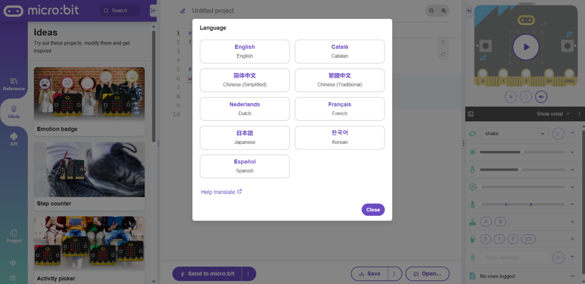
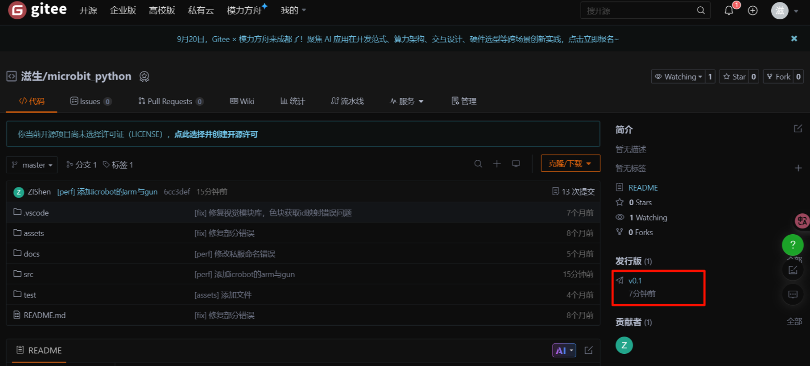
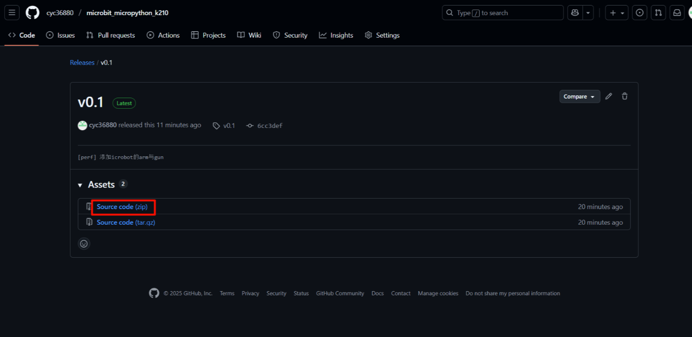
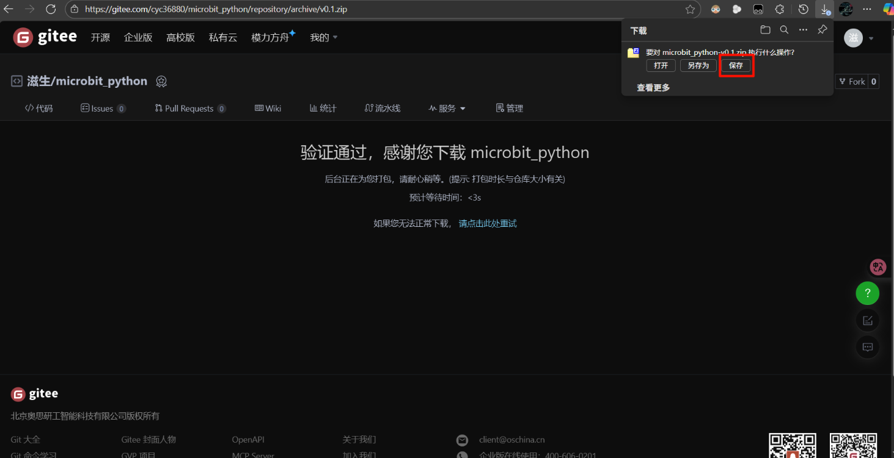
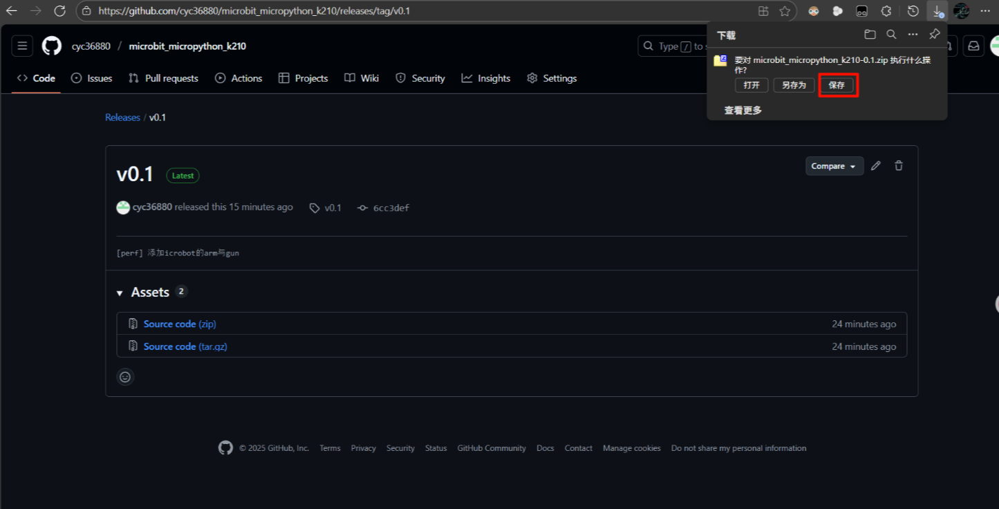
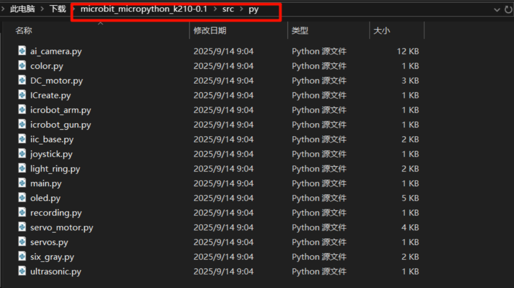

# Extension-Micro:Python
## micro:bit Python User Guide
### Interface Overview
Click the link [micro:bit Python Editor](https://python.microbit.org/v/3/project) to enter the online editor. When entering for the first time, the interface looks like this:

<!-- 这是一张图片，ocr 内容为： -->

| No. | Name | Function |
| --- | --- | --- |
| ① | Function Panel | Project management |
| ② | Send Code | Send scripts to the connected micro:bit |
| ③ | Code Editor | Edit user code |
| ④ | Save | Save the project as a .hex file to your computer |
| ⑤ | Open | Open a local file |
| ⑥ | Status Display | Show the current status of the micro:bit |

**Language Switching**

**Step 1: Click the gear icon in the lower-left corner and select the Language button.**
<!-- 这是一张图片，ocr 内容为： -->

**Step 2: In the pop-up window, select your desired language.**

<!-- 这是一张图片，ocr 内容为： -->
_**  
**_**Note: It is recommended to use micro:bit V2.0 or above. Lower versions have insufficient memory and may not function properly.**

_****_

### Quick Start
#### Usage Notes:
+ Due to memory limitations, you cannot directly import all library files.
+ Only import the libraries required for your project. Remove unused libraries to optimize memory usage

#### Downloading Files
Visit [GitHub](https://github.com/cyc36880/microbit_micropython_k210.git) to download the Python driver files.

For users in Mainland China, visit [Gitee](https://github.com/cyc36880/microbit_micropython.git).

1. Choose a hosting platform and select the release version (download the latest version if unsure).
| gitee | github |
| --- | --- |
| <!-- 这是一张图片，ocr 内容为： -->
 | <!-- 这是一张图片，ocr 内容为： -->
 |

2. Click Download ZIP and wait for the browser to start downloading.

| gitee | github |
| --- | --- |
| <!-- 这是一张图片，ocr 内容为： -->
 | <!-- 这是一张图片，ocr 内容为： -->
 |

3. Save the file to your computer.

| gitee | github |
| --- | --- |
| <!-- 这是一张图片，ocr 内容为： -->
 | <!-- 这是一张图片，ocr 内容为： -->
 |
| | |

4. Unzip the file and locate the required Python files.

<!-- 这是一张图片，ocr 内容为： -->

When using the libraries, you should at least import the following files:

`color.py`、`DC_motor.py`、`iic_base.py`

These files form the foundation for other device driver libraries. Without them, the system will not function properly.

#### Importing Files
##### Single File Import
1. Click the Open button (lower-left or lower-right).
