# Supported Devices
## MakeCode Usage Instructions  
The **AI Vision Module** can be used with the **micro:bit** kit. For a quick start with the MakeCode programming platform, refer to the **User Guide** document.  

## Module Command Usage Instructions  
###  Introduction
<!-- 这是一张图片，ocr 内容为： -->
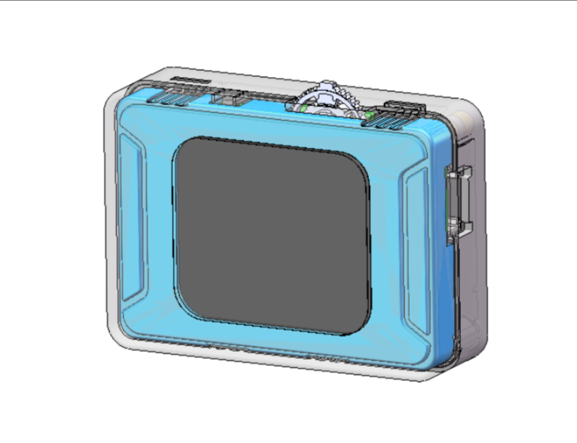

The AI Vision Module utilizes the high-performance K210 chip as the core processing unit and integrates a wide range of machine vision algorithms and functions. Users can flexibly invoke multiple built-in AI capabilities through the physical dial on the top of the module, including color capture, color block tracking, Apriltag label recognition, line detection, recognition of 20 common object types, QR code recognition, face detection and recognition, deep learning inference, traffic sign recognition, and real-time Wi-Fi image transmission.

On the right side of the module, there is a Grove multifunctional interface, which supports communication protocols such as I²C or UART through a graphical configuration interface, making it easier to connect with various external sensors and actuators. This significantly enhances the system's expandability and usability. The module is compatible with the CANMV open-source framework, allowing users to train and deploy image models based on custom datasets, offering high flexibility and customization for visual applications in specific scenarios.

It is recommended to use the micro:bit V2.0 or higher versions as the main control board. Lower versions have insufficient memory, which may cause issues with functionality.

The extension file used for MakeCode is [AI Vision_micro:bit_V0.1.0.hex](https://www.icrobot.com/www/cn/index.html#/file/index). It is recommended to download it in advance.

### Function Introduction  
The **Vision Sensor** can be powered and operated through its two interfaces (HY2.0-4P / Type-C). The **micro:bit** can use the **HY2.0-4P interface** for both power supply and communication with the vision module.

Each AI function of the vision module corresponds to an independent interface (excluding the settings interface). Users can directly operate the module using the dial button on the module, without relying on port control.

By toggling the dial button left or right, you can switch between different function interfaces. Once a specific interface is entered, the corresponding AI function will be automatically enabled. Some functions also support more detailed control through the button (the specific operation depends on the current function). Please refer to the descriptions in the **AI Functions** section.

_The images shown below are for reference only; the actual display may vary depending on the sensor's interface._

#### Top Status Bar and Bottom Navigation Bar  
<!-- 这是一张图片，ocr 内容为： -->
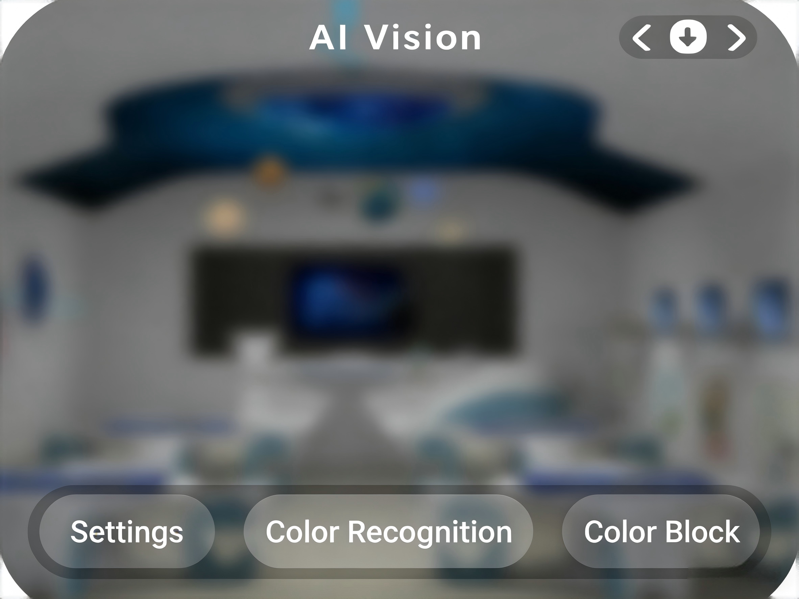

To optimize the interface display, the top and bottom status bars will automatically hide after 5 seconds of inactivity.  

+ **Re-display the Status Bar**:    
Any interaction with the dial button (e.g., click or rotate) will wake up and display the status bar.  
    - **Note**: This action only wakes up the interface and does not trigger any function switch or setting change.  
+ **Restore Operation**:    
 Once the status bar is displayed, you can normally use the buttons for function control.  
**Design Purpose**: To keep the interface clean while avoiding accidental touches that might interfere with the current task.  

**Interface Layout Description:  **

1. **Bottom Navigation Bar  **
    - **Center Highlighted Icon**: Indicates the currently active function.
    - **Left and Right Icons**: Represent the "previous" and "next" functions that can be switched (via rotating the dial left or right).
2. **Top Status Area  **
    - The displayed content dynamically changes with the current function.
    - Specific information will depend on the actual function being used.

> **Interaction Logic**:  
When the dial button is rotated left or right, the **highlighted icon** in the bottom navigation bar will switch accordingly, and the top content will update to display the exclusive information of the target function.  
>

#### Settings Interface  
<!-- 这是一张图片，ocr 内容为： -->
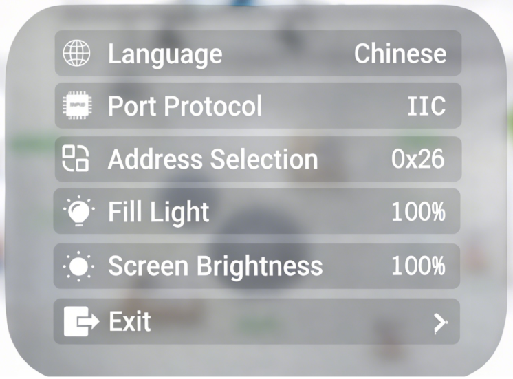

+  The **Settings Interface** is used to configure the module's basic parameters, such as language, port protocol, and more. When you first enter this interface, you need to press the button to activate the settings function.
+ By default, the language setting option is selected (highlighted), and you can switch to other settings (such as port protocol) by rotating the button left or right.
+ After making the necessary changes, you need to click the **Exit** button to save the settings. Some settings require a reboot to take effect, and the device will automatically restart.  

#####  Language Settings
When this option is selected, press the button to toggle between **Chinese** and **English**.  

##### Port Protocol
The protocol for communication with the K210 is influenced by the Control Chip option. Refer to the Communication Protocol section for more details. You can set the protocol by pressing the button.

**K210 Mode**

+ **IIC Protocol**
+ **UART Protocol**
+ **SPIKE Compatibility Mode**

**ESP32 Mode**

+ **IIC Protocol**

When set to the **SPIKE Protocol**, the device must be connected to a SPIKE device via an adapter board; otherwise, the visual module will not function. For additional details, refer to the **SPIKE Compatibility Mode** section under the **Communication Protocol** chapter.  

##### Address Selection  
The selected address is the **IIC address** for the K210. The available options are **0x24**, **0x25**, and **0x26**. Use the button to set the address.  

##### Fill Light  
This option is used to configure the fill light at the back of the module. When the fill light option is selected, the menu expands to include the fill light switch, brightness settings, and the return option. Select the option and press the button to adjust the fill light parameters. A rectangular box will appear to choose one of the options. You can rotate the button left or right to select an option, then press the button again to change the parameter.  

+ **Fill Light Status**:  
There are two states: **On** and **Off**. The fill light will only be turned on when set to "On"; otherwise, it remains off.  
+ **Fill Light Brightness**:  
This setting adjusts the brightness of the fill light, with a range from **0% to 100%** in 10% increments. Finer adjustments are not possible.
+ **Return**:  
Exit the fill light settings.

**Screen Brightness**  
This option adjusts the screen brightness, with a range from **20% to 100%** in 20% increments. Finer adjustments are not available.  

##### **Exit**
Exit the settings and save the changes. 

After making changes in the settings interface, you must click **Exit** to save the settings. The specific rules are as follows:  

1. **General Settings** (e.g., language, etc.)
    - Changes are saved directly after modification, and no reboot is required.
2. **Key Parameters **(e.g., control chip, port protocol, address selection)
    - If the values differ from those when initially entering the settings interface,
    - Clicking **Exit** will automatically reboot the module to apply the new configuration.

> **Note**: If you do not click **Exit** and directly power off the device, the settings will be lost!  
>

##### Flashing  
 The **Type-C interface** on the side of the module supports both firmware flashing and power supply functions.  [Flashing](https://icreate-help-center.yuque.com/dxifg8/isnecf/ezic46bzqtiducs0?singleDoc#%20《烧录》)

### Usage Instructions  
#### Connection Method  
| <!-- 这是一张图片，ocr 内容为： -->
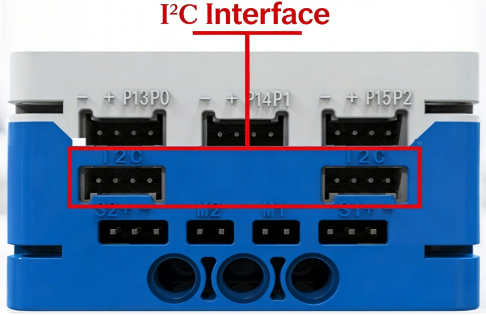 | <!-- 这是一张图片，ocr 内容为： -->
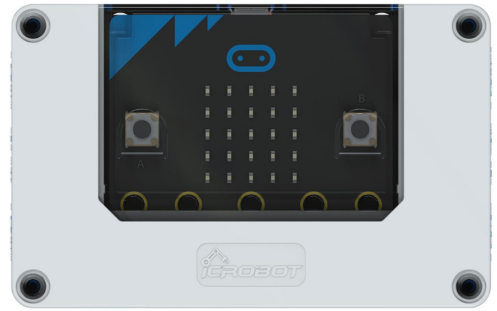 | <!-- 这是一张图片，ocr 内容为： -->
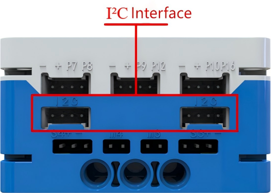 |
| :---: | :---: | :---: |
| Side View   |  Front View |  Side View |
|  Connection Diagram for Six-Channel Color and Grayscale Sensors   | | |

This diagram shows how to connect the six-channel color and grayscale sensors to the K210 AI Vision Module. 

### Coding Programming  
The **K210 AI Vision Module** starts up when the **micro:bit** is powered on and enters the default color recognition mode after booting. When programming, it is recommended not to switch the module's mode immediately after powering on, as the module requires about 5 seconds for initialization.

Instead, it is recommended to use triggers such as buttons (as shown in the diagram below) to switch the module’s AI recognition mode after the initialization period.

  
<!-- 这是一张图片，ocr 内容为： -->
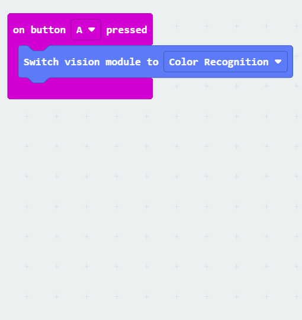

The "Current Mode" programming block can return a number (0~9) to represent the AI model currently running on the K210 AI Vision Module. 

<!-- 这是一张图片，ocr 内容为： -->
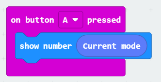

You can programmatically control the module's built-in fill light, with the brightness range from 0 to 100, and also read the current fill light brightness. 

<!-- 这是一张图片，ocr 内容为： -->
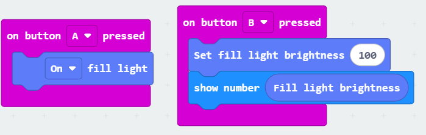

#### Color Recognition  
<!-- 这是一张图片，ocr 内容为： -->
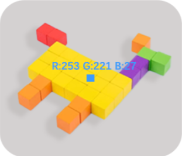

+ A rectangular area is displayed at the center of the screen, and the module will calculate the RGB average value of the pixels within this area.
+ The color displayed on the screen represents the average RGB value of that area, making it easier for standardized recognition.

  
<!-- 这是一张图片，ocr 内容为： -->
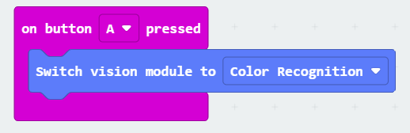

  
The **color recognition** programming block can read the average color value within the recognition box, providing feedback in RGB format. The RGB values range from **0 to 255**.  

<!-- 这是一张图片，ocr 内容为： -->
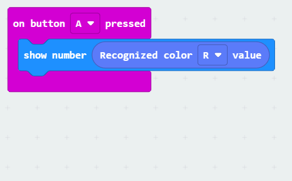

#### Color Block Tracking  
+ Press the button to enter the color selection mode.
+ Rotate the button left or right to select the tracking object from six built-in colors (Red, Green, Blue, Yellow, Black, White).
+ If the last option is selected, align the rectangular frame at the center of the screen with the target color and press the button again to lock the current color as the tracking target.

<!-- 这是一张图片，ocr 内容为： -->
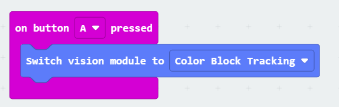

**Color Block Tracking Mode** will search for the largest specified color area in the line of sight and return the location information of the color block.

+ **X**: Represents the X-coordinate of the tracked color block.
+ **Y**: Represents the Y-coordinate of the tracked color block.
+ **W**: Represents the width of the tracked color block.
+ **H**: Represents the height of the tracked color block.

  
<!-- 这是一张图片，ocr 内容为： -->
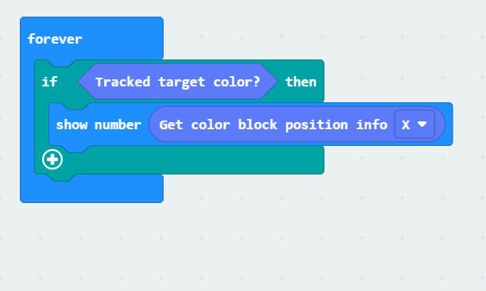

####  Apriltag Recognition  
<!-- 这是一张图片，ocr 内容为： -->
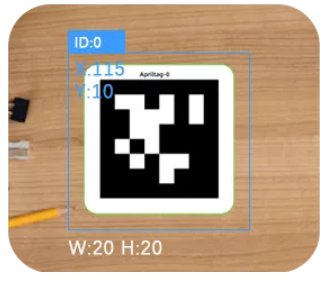

+ Supports recognition of two formats of AprilTag codes: **TAG36H11** and **TAG16H5**.
+ Point the camera at the tag, and the screen will automatically frame and display the corresponding **X**, **Y**, **W**, **H**, and the tag's code value.

<!-- 这是一张图片，ocr 内容为： -->
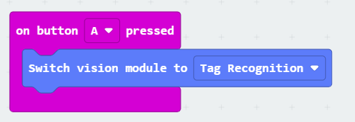

**Tag Recognition Mode** will search for all detectable AprilTag codes in the line of sight and display the location information of the tag along with the number represented by the AprilTag code.

+ **X**: Represents the X-coordinate of the tracked tag.
+ **Y**: Represents the Y-coordinate of the tracked tag.
+ **W**: Represents the width of the tracked tag.
+ **H**: Represents the height of the tracked tag.

<!-- 这是一张图片，ocr 内容为： -->
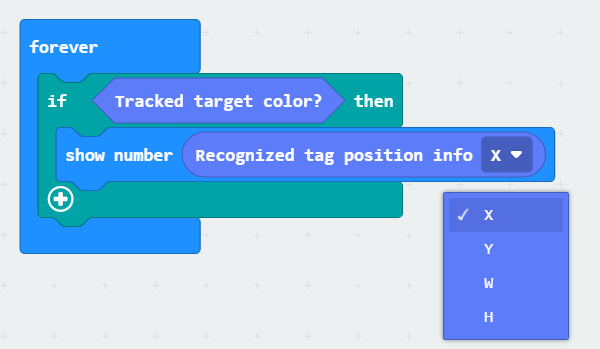  

#### Line Recognition  
<!-- 这是一张图片，ocr 内容为： -->
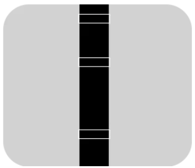

+ Used to recognize black lines on a white background.
+ The screen will identify and frame the line contours in the upper, middle, and lower regions of the screen based on the content.
+ **Recommended environment**: No other interference in the frame.

<!-- 这是一张图片，ocr 内容为： -->
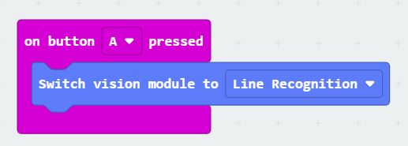

**Line Recognition Mode** will search for detected black lines in the line of sight and fit them into the corresponding upper, middle, and lower selection boxes, displaying the line's location information.  

+ **X**: Represents the X-coordinate of the tracked line.
+ **Y**: Represents the Y-coordinate of the tracked line.
+ **W**: Represents the width of the tracked line.
+ **H**: Represents the height of the tracked line.

<!-- 这是一张图片，ocr 内容为： -->
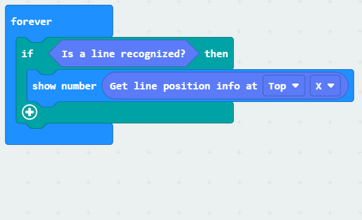

#### 20-Class Object Recognition  
<!-- 这是一张图片，ocr 内容为： -->

+ The module can recognize the following 20 common objects:  

> "Airplane", "Bicycle", "Bird", "Boat", "Bottle", "Bus", "Car", "Cat", "Chair", "Cow", "Dining Table", "Dog", "House", "Motorcycle", "Person", "Potted Plant", "Sheep", "Sofa", "Train", "Television".  
>

+ Point the module at the object you want to recognize. The recognition results will be framed on the screen, and the object name will be displayed.
+ The module supports recognizing up to 4 objects simultaneously.

<!-- 这是一张图片，ocr 内容为： -->
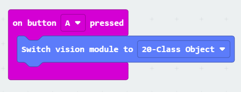

**20-Class Object Recognition Mode** will search for AI model-recognizable objects in the line of sight, identifying and framing up to 4 objects at a time. The recognition results will display the object type and location information.

+ **X**: Represents the X-coordinate of the recognized object.
+ **Y**: Represents the Y-coordinate of the recognized object.
+ **W**: Represents the width of the recognized object.
+ **H**: Represents the height of the recognized object.

<!-- 这是一张图片，ocr 内容为： -->
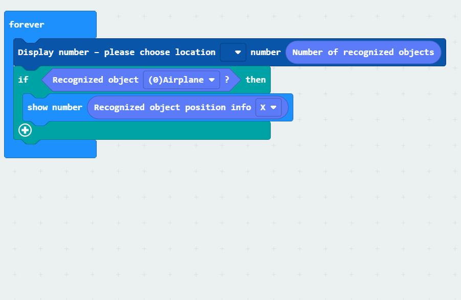

#### QR Code Recognition  
<!-- 这是一张图片，ocr 内容为： -->
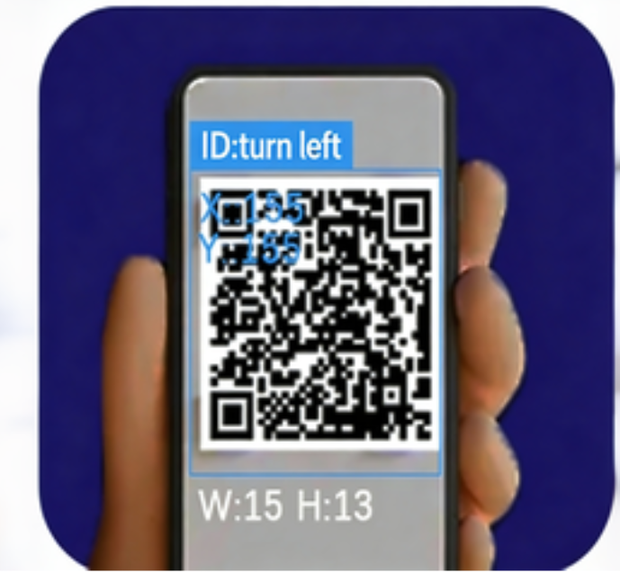

+ Supports recognition of standard square QR codes composed of black and white blocks. Only one QR code can be recognized at a time.
+ After pointing the camera at the QR code, the screen will frame the QR code and display the decoded content, along with the QR code's **X**, **Y**, **W**, and **H**.

<!-- 这是一张图片，ocr 内容为： -->
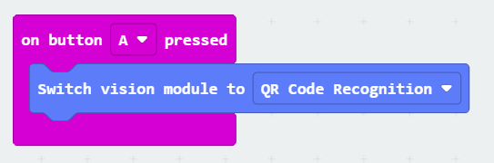

**QR Code Recognition Mode** will search for all detectable QR codes in the line of sight and display the QR code's location information and decoded message.

+ **X**: Represents the X-coordinate of the tracked QR code.
+ **Y**: Represents the Y-coordinate of the tracked QR code.
+ **W**: Represents the width of the tracked QR code.
+ **H**: Represents the height of the tracked QR code.

<!-- 这是一张图片，ocr 内容为： -->
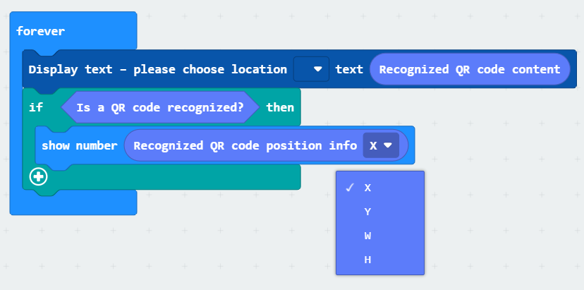

#### Face Attribute Recognition  
<!-- 这是一张图片，ocr 内容为： -->
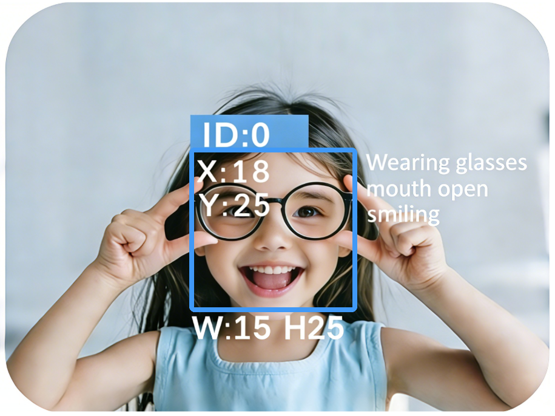

+ Point the camera at a face, and it will recognize three attributes: whether the mouth is open, whether the person is smiling, and whether they are wearing glasses.
+ Up to 4 faces can be recognized at a time, with each face displaying the corresponding attribute results.

<!-- 这是一张图片，ocr 内容为： -->
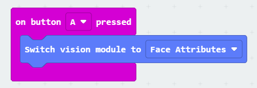

**Face Attribute Recognition Mode** will detect faces in the line of sight and display the detection location, face ID, and face attribute information.

+ **X**: Represents the X-coordinate of the detected face.
+ **Y**: Represents the Y-coordinate of the detected face.
+ **W**: Represents the width of the detected face.
+ **H**: Represents the height of the detected face.

<!-- 这是一张图片，ocr 内容为： -->
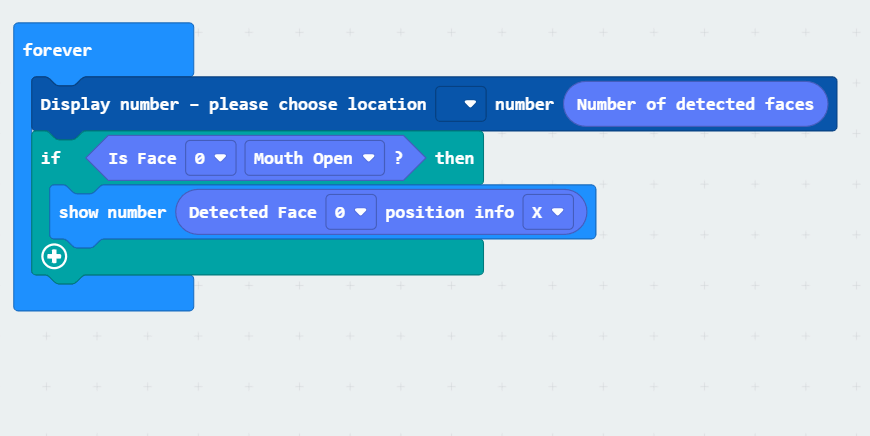

#### Face ID Recognition  
<!-- 这是一张图片，ocr 内容为： -->
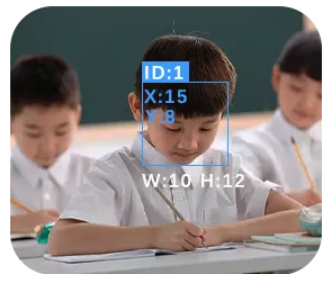

+ When a face is recognized for the first time and has not been learned, it will be highlighted with a white bounding box.
+ After framing the face, press the button to start learning and assign an ID (0–3). The module supports saving the learned data even after power-off.
+ Up to **4 faces** can be learned.
+ Long-press the button to bring up a confirmation dialog to clear the learned face data. After confirmation, all learned records will be erased.
+ The learned face data is retained after power-off. If not cleared, the previously learned faces will be loaded upon the next power-up.

<!-- 这是一张图片，ocr 内容为： -->
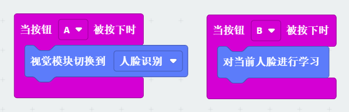

**Face Recognition Mode** will detect faces in the line of sight and display the recognized location, face ID, and face attribute information.

+ **X**: Represents the X-coordinate of the recognized face.
+ **Y**: Represents the Y-coordinate of the recognized face.
+ **W**: Represents the width of the recognized face.
+ **H**: Represents the height of the recognized face.

<!-- 这是一张图片，ocr 内容为： -->
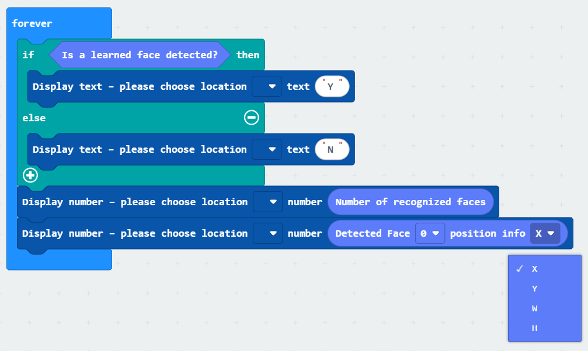

#### Deep Learning  
<!-- 这是一张图片，ocr 内容为： -->
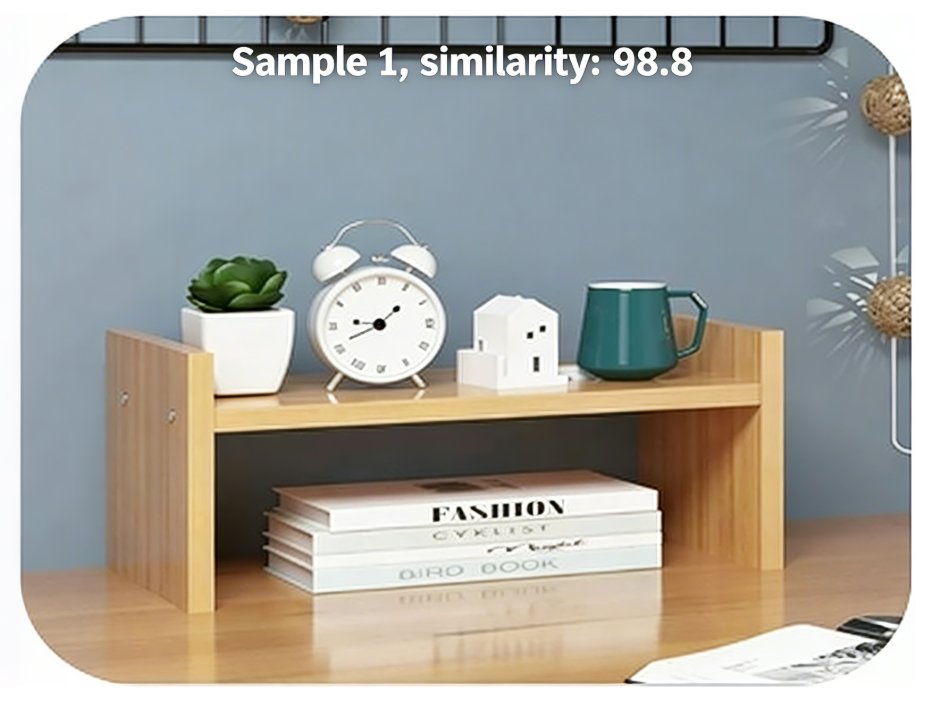

+ Supports learning up to **2 types of targets**, with **2 images** required for each type.
+ Press the button to start learning the current category. The current category number will be displayed in the top-left corner, and the number of images taken will be shown in the top-right corner.
+ If no further button presses are made within **5 seconds** after learning category 0, the system will automatically switch to recognition mode.
+ After reaching the maximum number of categories for learning, either a **5-second wait** or a button press will switch to recognition mode.
+ Once in recognition mode, the function mode cannot be switched. A prompt will appear asking to reset learning first. To reset, long-press the button and select **Confirm** in the popup to reset the learning data.
+ Deep learning data is **not retained after power-off**. The learning process will need to be repeated on the next power-up.

<!-- 这是一张图片，ocr 内容为： -->
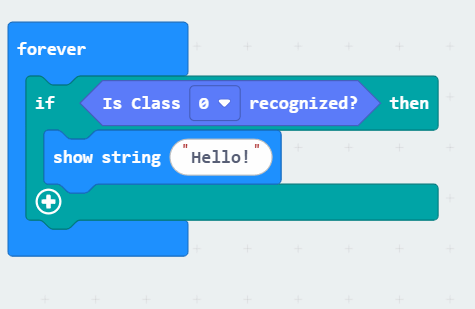

#### Card Road Sign Recognition  
<!-- 这是一张图片，ocr 内容为： -->
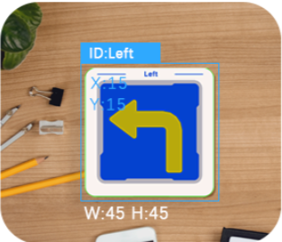

+ Supports recognition of the following **6 traffic icons**:  

> + Green light
> + Left turn
> + Stop
> + Red light
> + Right turn
> + Horn
> + Target
>

+ Point the camera at the card, and the module will automatically frame it and display the corresponding name on the screen.

<!-- 这是一张图片，ocr 内容为： -->
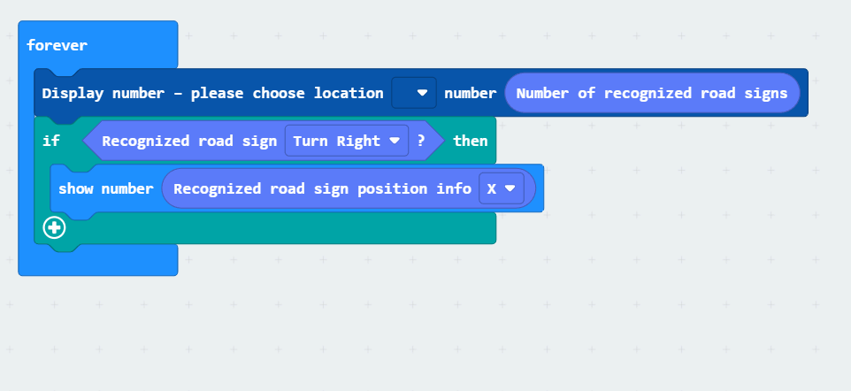

#### Wi-Fi Stream
+ Before use, ensure you have a **2.4GHz Wi-Fi network** and follow the network configuration steps outlined below.
+ Once successfully connected, the screen will display the **SSID**, **password**, and the assigned **IP address**.
+ In the same local area network, you can access the image stream transmission by visiting the **IP address** in any mobile phone or computer browser.
+ You can exit the image transmission mode by either pressing the **reset button** or powering off.

**Example Program**:  

Transmit data to an **OLED display** through the image transmission button.  

<!-- 这是一张图片，ocr 内容为： -->
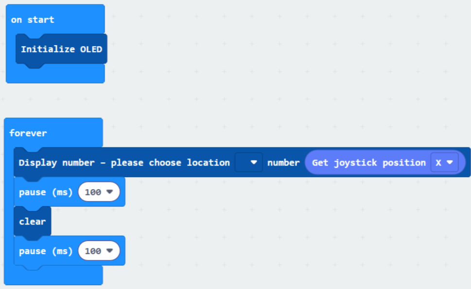

Demonstration:

<!-- 这是一张图片，ocr 内容为： -->

#### Dialogue Mode
**Example Program**: 

Display the corresponding status of the **K210 module** on the **core board's LED matrix**. 

 <!-- 这是一张图片，ocr 内容为： -->
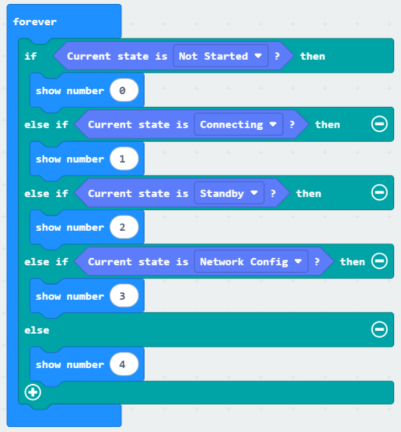

Demonstration:

<!-- 这是一张图片，ocr 内容为： -->

